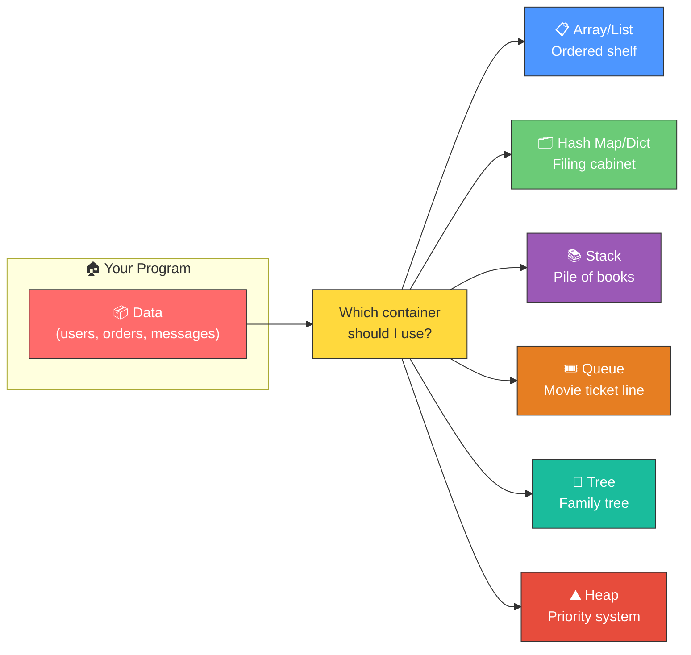
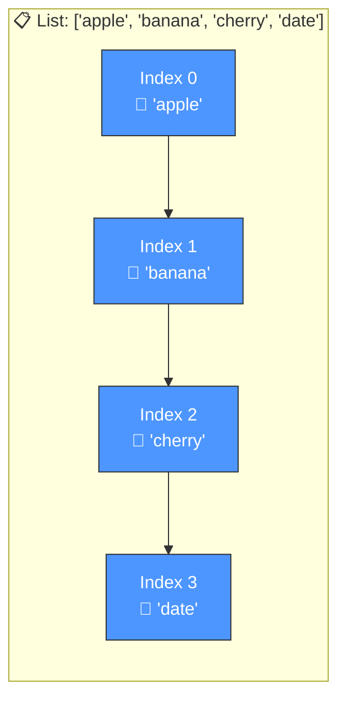
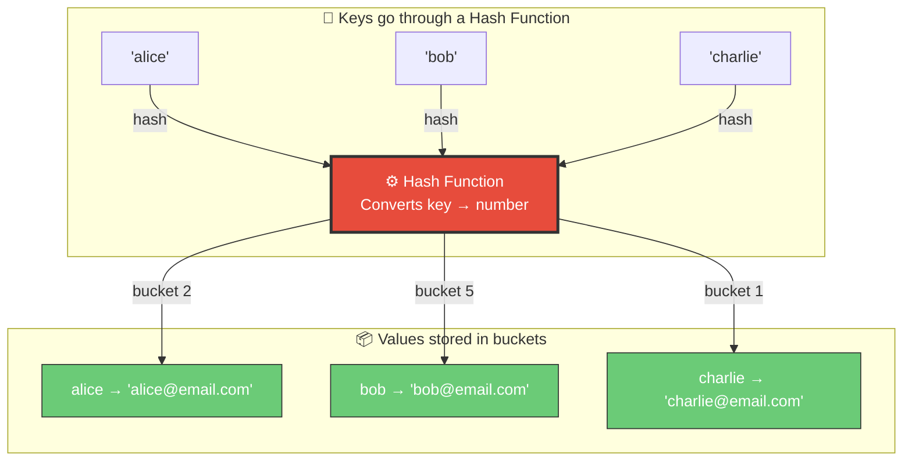
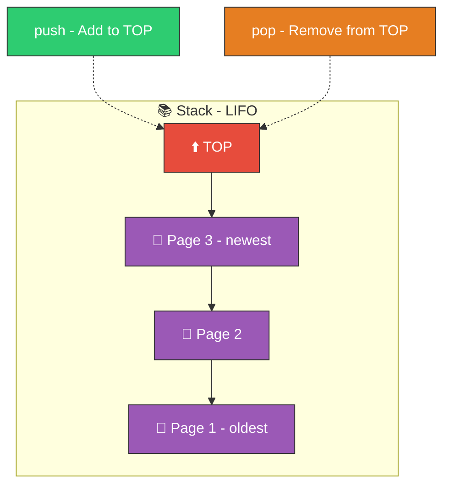
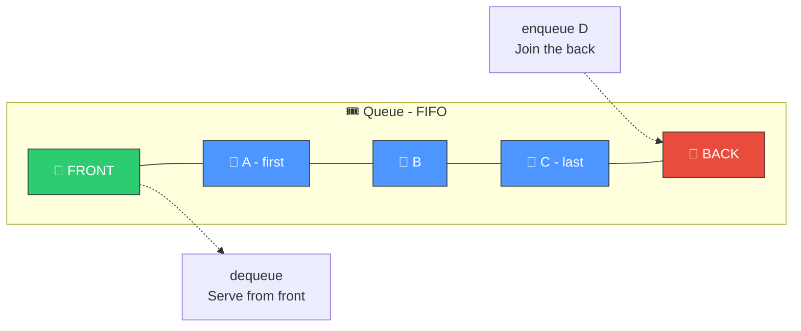
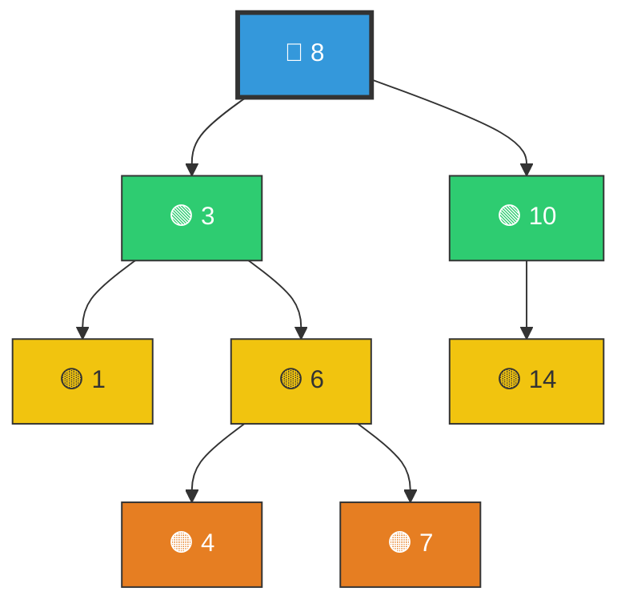
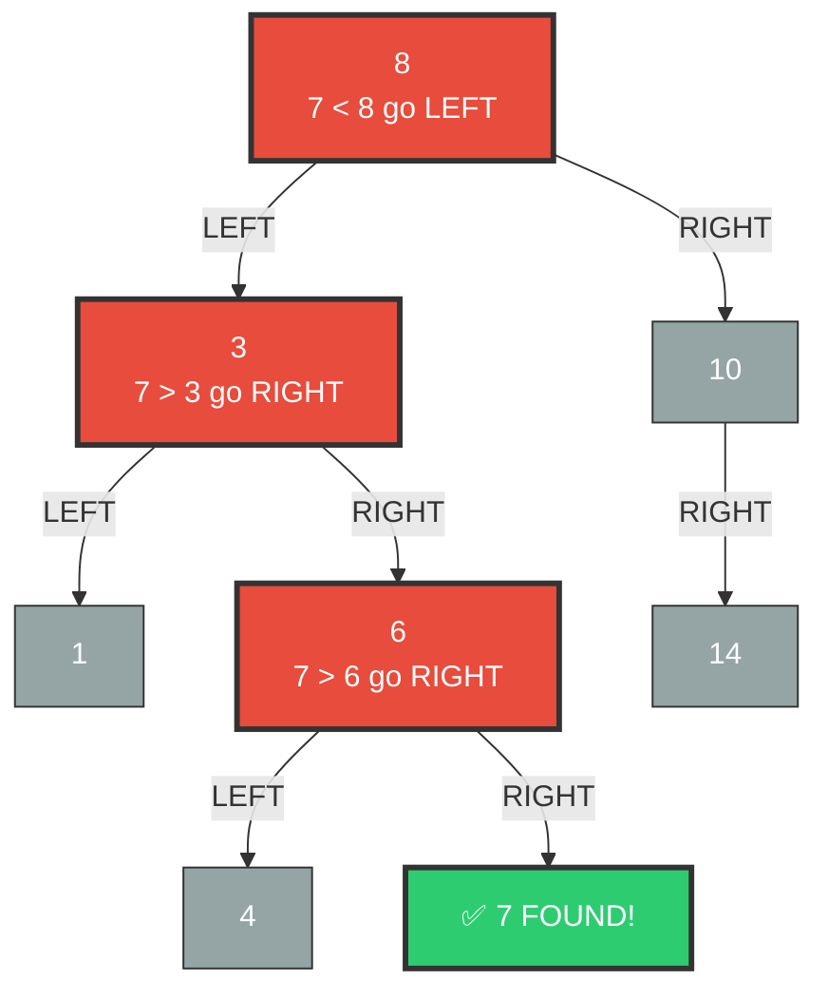
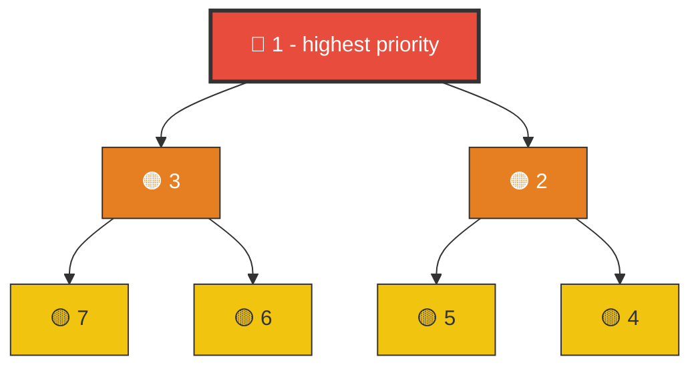
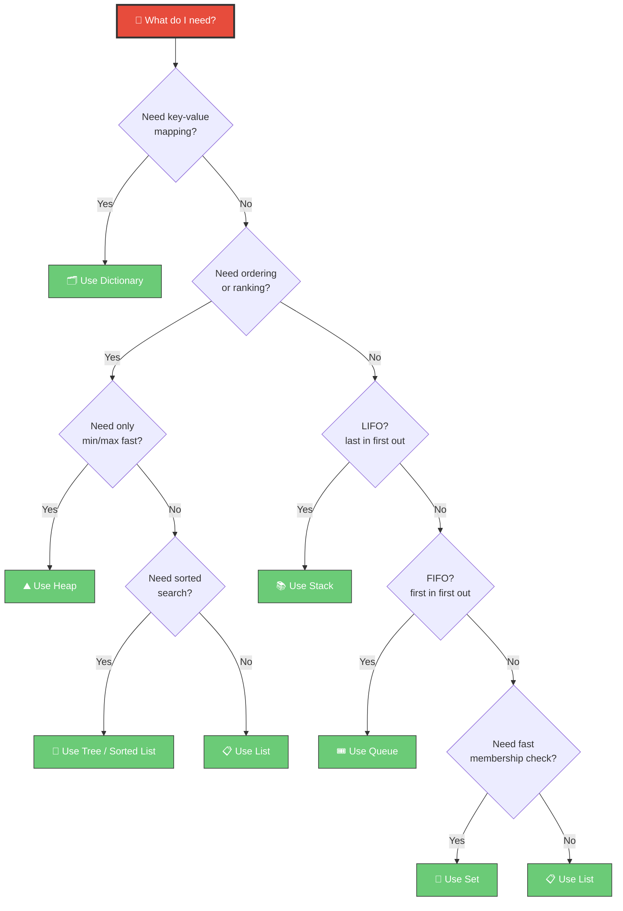

# 📘 Topic 1.1 — Data Structures & When to Use Them

> **Why this matters**: Data structures are the **containers** that hold your data. Choosing the wrong one is like using a suitcase to carry water — it technically holds stuff, but it's the wrong tool. The right data structure makes your code **10x-100x faster**.

---

## 🧠 The Big Picture — What Are Data Structures?

Think of data structures as **different types of shelves** in a warehouse:



---

## 1️⃣ Arrays & Lists — The Ordered Shelf

### 🎯 Real-World Analogy
> Imagine a **row of lockers** numbered 0, 1, 2, 3... You can instantly go to locker #5, but if you want to insert a new locker between #2 and #3, you have to **shift everything after it**.

### 📊 How It Looks in Memory



### 🐍 Python Code

```python
# ✅ Creating a list
fruits = ["apple", "banana", "cherry", "date"]

# ✅ Access by index — INSTANT (O(1))
print(fruits[2])  # "cherry" — goes directly to position 2

# ✅ Append at end — FAST (O(1))
fruits.append("elderberry")

# ⚠️ Insert in middle — SLOW (O(n)) — shifts everything!
fruits.insert(1, "blueberry")
# Now: ["apple", "blueberry", "banana", "cherry", "date", "elderberry"]

# ⚠️ Search by value — SLOW (O(n)) — checks one by one
"cherry" in fruits  # True, but had to scan through the list

# ✅ List comprehension — Pythonic way to transform
prices = [10, 20, 30, 40]
discounted = [p * 0.9 for p in prices]  # [9.0, 18.0, 27.0, 36.0]
```

### ✅ Use Lists When:
- You need **ordered** data
- You access elements by **position/index**
- You mostly **append** to the end
- Example: list of recent orders, playlist of songs

### ❌ Don't Use Lists When:
- You need to **search** frequently (use a dict/set instead)
- You **insert/delete** in the middle often (use a linked list)

---

## 2️⃣ Hash Map / Dictionary — The Filing Cabinet

### 🎯 Real-World Analogy
> Imagine a **filing cabinet** where each drawer has a **label** (key). You say "give me the drawer labeled 'John'" and you get it **instantly**. No searching through drawers one by one.

### 📊 How It Works Inside



> **The hash function** is the magic. It converts any key into a number (bucket position) in constant time. That's why lookup is **O(1)** — you never scan through everything!

### 🐍 Python Code

```python
# ✅ Creating a dictionary
user = {
    "name": "Alice",
    "age": 28,
    "email": "alice@example.com"
}

# ✅ Access by key — INSTANT (O(1))
print(user["name"])  # "Alice"

# ✅ Safe access with .get()
print(user.get("phone", "N/A"))  # "N/A" — no crash!

# ✅ Add/Update — INSTANT (O(1))
user["phone"] = "+1234567890"

# ✅ Check if key exists — INSTANT (O(1))
if "email" in user:
    print("Has email!")

# ✅ Loop through items
for key, value in user.items():
    print(f"{key}: {value}")

# 🔥 Real-world example: Counting word frequency
text = "the cat sat on the mat the cat"
word_count = {}
for word in text.split():
    word_count[word] = word_count.get(word, 0) + 1
# Result: {'the': 3, 'cat': 2, 'sat': 1, 'on': 1, 'mat': 1}
```

### ✅ Use Dicts When:
- You need **instant lookup** by a key
- You're mapping relationships (user_id → user_data)
- You're **counting** or **grouping** things
- Example: caching, configuration, JSON-like data

### ❌ Don't Use Dicts When:
- You need **ordered ranking** (use a sorted list or heap)
- Keys are sequential integers (just use a list)

---

## 3️⃣ Stack — The Pile of Books

### 🎯 Real-World Analogy
> A **stack of plates** in a cafeteria. You can only add or remove from the **top**. Last plate placed = first plate taken. **LIFO: Last In, First Out.**

### 📊 Visual



### 🐍 Python Code

```python
# In Python, a list works perfectly as a stack!
stack = []

# Push (add to top)
stack.append("page_1")
stack.append("page_2")
stack.append("page_3")
# Stack: ["page_1", "page_2", "page_3"]  ← top

# Pop (remove from top)
top = stack.pop()  # "page_3"
# Stack: ["page_1", "page_2"]

# Peek (look at top without removing)
top = stack[-1]  # "page_2"

# 🔥 Real-world example: Undo/Redo system
class TextEditor:
    def __init__(self):
        self.text = ""
        self.undo_stack = []

    def type(self, new_text):
        self.undo_stack.append(self.text)  # Save current state
        self.text += new_text

    def undo(self):
        if self.undo_stack:
            self.text = self.undo_stack.pop()  # Restore previous state

editor = TextEditor()
editor.type("Hello ")     # text: "Hello "
editor.type("World!")      # text: "Hello World!"
editor.undo()              # text: "Hello "  ← magic!
```

### ✅ Use Stacks When:
- **Undo/Redo** functionality
- **Browser back button** (history of pages)
- **Parsing expressions** (matching parentheses)
- **DFS** (Depth-First Search) in graphs

---

## 4️⃣ Queue — The Movie Ticket Line

### 🎯 Real-World Analogy
> A **line at a movie theater**. First person in line = first person served. **FIFO: First In, First Out.**

### 📊 Visual



### 🐍 Python Code

```python
from collections import deque  # Double-ended queue — efficient!

# Create a queue
queue = deque()

# Enqueue (add to back)
queue.append("customer_1")
queue.append("customer_2")
queue.append("customer_3")

# Dequeue (remove from front) — O(1)!
first = queue.popleft()  # "customer_1"
# ⚠️ Don't use list.pop(0) — that's O(n)! deque.popleft() is O(1)

# 🔥 Real-world example: Task processing queue
task_queue = deque()
task_queue.append({"type": "send_email", "to": "alice@mail.com"})
task_queue.append({"type": "resize_image", "file": "photo.jpg"})
task_queue.append({"type": "send_email", "to": "bob@mail.com"})

while task_queue:
    task = task_queue.popleft()
    print(f"Processing: {task['type']}")
# Processes in order: send_email → resize_image → send_email
```

### ✅ Use Queues When:
- **Task scheduling** (process jobs in order)
- **BFS** (Breadth-First Search) in graphs
- **Message queues** in backend systems (RabbitMQ, Kafka)
- **Print queue** (documents print in order submitted)

---

## 5️⃣ Trees — The Family Tree

### 🎯 Real-World Analogy
> A **company org chart**. CEO at the top, managers below, employees below them. Each person has one boss (parent) and can manage multiple people (children).

### 📊 Binary Search Tree (BST) Visual



> **The BST rule**: Everything to the **left** is smaller. Everything to the **right** is bigger. This means searching is like a **guessing game** — you eliminate half the tree each step! That's **O(log n)**.

### 📊 How Search Works (Finding 7)



> Only visited **3 nodes** out of 8 to find 7. In a list, you'd check up to **all 8**!

### ✅ Use Trees When:
- **Hierarchical data** (file system, org chart, HTML DOM)
- **Fast search** on sorted data (BST → O(log n))
- **Databases** use B-Trees for indexing
- **Autocomplete** features (Trie — a special tree)

---

## 6️⃣ Heap — The Priority System

### 🎯 Real-World Analogy
> A **hospital emergency room**. Patients aren't served first-come-first-served — the most **critical patient** is always treated first, regardless of arrival time.

### 📊 Min-Heap Visual (smallest on top)



### 🐍 Python Code

```python
import heapq  # Python's built-in heap module (min-heap)

# Create a heap
tasks = []
heapq.heappush(tasks, (3, "low priority task"))
heapq.heappush(tasks, (1, "🔥 URGENT task"))
heapq.heappush(tasks, (2, "medium priority task"))

# Pop always gives the SMALLEST (highest priority)
print(heapq.heappop(tasks))  # (1, "🔥 URGENT task")
print(heapq.heappop(tasks))  # (2, "medium priority task")
print(heapq.heappop(tasks))  # (3, "low priority task")

# 🔥 Real-world example: Find the 3 cheapest products
products = [99, 15, 42, 7, 83, 23, 56, 3, 67]
top_3_cheapest = heapq.nsmallest(3, products)  # [3, 7, 15]
```

### ✅ Use Heaps When:
- **Priority queues** (task scheduling by priority)
- Finding **top K** or **bottom K** elements
- **Dijkstra's algorithm** (shortest path)
- **Merge K sorted lists**

---

## 🧭 The Decision Flowchart — Which Data Structure Should I Use?



---

## ⚡ Speed Comparison — Big-O at a Glance

| Operation | List | Dict | Set | Stack | Queue (deque) | Heap |
|-----------|------|------|-----|-------|---------------|------|
| **Access by index** | ✅ O(1) | ❌ N/A | ❌ N/A | ✅ O(1) top | ❌ N/A | ❌ N/A |
| **Search by value** | 🐌 O(n) | ✅ O(1) | ✅ O(1) | 🐌 O(n) | 🐌 O(n) | 🐌 O(n) |
| **Insert at end** | ✅ O(1) | ✅ O(1) | ✅ O(1) | ✅ O(1) | ✅ O(1) | ⚡ O(log n) |
| **Insert at start** | 🐌 O(n) | ✅ O(1) | ✅ O(1) | ❌ N/A | ✅ O(1) | ❌ N/A |
| **Delete** | 🐌 O(n) | ✅ O(1) | ✅ O(1) | ✅ O(1) top | ✅ O(1) front | ⚡ O(log n) |
| **Get min/max** | 🐌 O(n) | 🐌 O(n) | 🐌 O(n) | 🐌 O(n) | 🐌 O(n) | ✅ O(1) |

> **Rule of thumb**: If you see yourself writing `if x in my_list` inside a loop, you probably need a **set** or **dict** instead. That single change can turn an O(n²) algorithm into O(n)!

---

## 🏋️ Practice Exercises

Try these yourself, then ask me to review your solution!

### Exercise 1: Two Sum (Easy)
> Given a list of numbers and a target, find two numbers that add up to the target. Return their indices.
> **Hint**: Which data structure gives you O(1) lookup?
```python
# Input:  nums = [2, 7, 11, 15], target = 9
# Output: [0, 1]  because nums[0] + nums[1] = 2 + 7 = 9
```

### Exercise 2: Valid Parentheses (Easy)
> Given a string of brackets `()[]{}`, check if they're properly matched.
> **Hint**: Which data structure follows LIFO?
```python
# Input:  "({[]})"  → True
# Input:  "({[}])"  → False
```

### Exercise 3: Recent Calls Counter (Easy)
> Count how many requests happened in the last 3000 milliseconds.
> **Hint**: Which data structure follows FIFO?

### Exercise 4: Top K Frequent Words (Medium)
> Given a list of words, return the K most frequent ones.
> **Hint**: Combine a dict with a heap.

### Exercise 5: LRU Cache (Hard)
> Design a cache that evicts the least recently used item when full.
> **Hint**: Combine a dict with a doubly-linked list (or use `OrderedDict`).

---

## 🎤 Interview Corner

> **Q: "When would you choose a dict over a list?"**
>
> **Great answer**: "When I need O(1) lookups by a key instead of scanning through the entire collection. For example, if I'm building a user session store, I'd use `{session_id: user_data}` so I can instantly find any user's session without iterating."

> **Q: "What's the difference between a stack and a queue?"**
>
> **Great answer**: "A stack is LIFO — like the browser back button, the last page you visited is the first you go back to. A queue is FIFO — like a print queue, the first document submitted prints first. I use stacks for DFS and undo systems, queues for BFS and task processing."

> **Q: "Why not just use lists for everything?"**
>
> **Great answer**: "Lists are O(n) for search and membership checks. If I'm checking `if user_id in users_list` inside a loop of 10,000 items, that's O(n²) = 100 million operations. Switching to a set makes it O(n) = 10,000 operations. Choosing the right data structure is often the easiest performance win."

---

## ✅ Key Takeaway

> **The fastest way to speed up your code isn't clever algorithms — it's picking the right data structure.** A dict/set lookup is **1000x faster** than scanning a list when you have 1000 items.

---

**Next up → [Topic 1.2: Algorithm Thinking & Big-O Notation](../1.2-Algorithms-BigO/)**
