# 📘 Topic 1.2 — Algorithm Thinking & Big-O Notation

> **Why this matters**: Two developers can solve the same problem — one's code runs in **1 second**, the other takes **3 hours**. The difference? They chose different algorithms. Big-O is the language that lets you **predict** which one is faster *before you even run the code*.

---

## 🧠 What Is Big-O? — The Speedometer for Code

### 🎯 Real-World Analogy

> Imagine you're looking for a friend in a crowd:
> - **O(1)**: Your friend is wearing a **bright red hat**. You spot them instantly. Crowd size doesn't matter.
> - **O(n)**: You scan **every single face** one by one. Bigger crowd = longer search.
> - **O(n²)**: You compare **every person with every other person** to find twins. Nightmare in a big crowd.

### 📊 The Growth Chart — How Algorithms Scale


> **Key Insight**: At n = 1,000,000 items, an O(n²) algorithm does **1 TRILLION** operations. An O(n) algorithm does just **1 million**. That's a **1,000,000x** difference!

---

## 🟢 O(1) — Constant Time: "I Don't Care How Big It Is"

### 📊 Visual

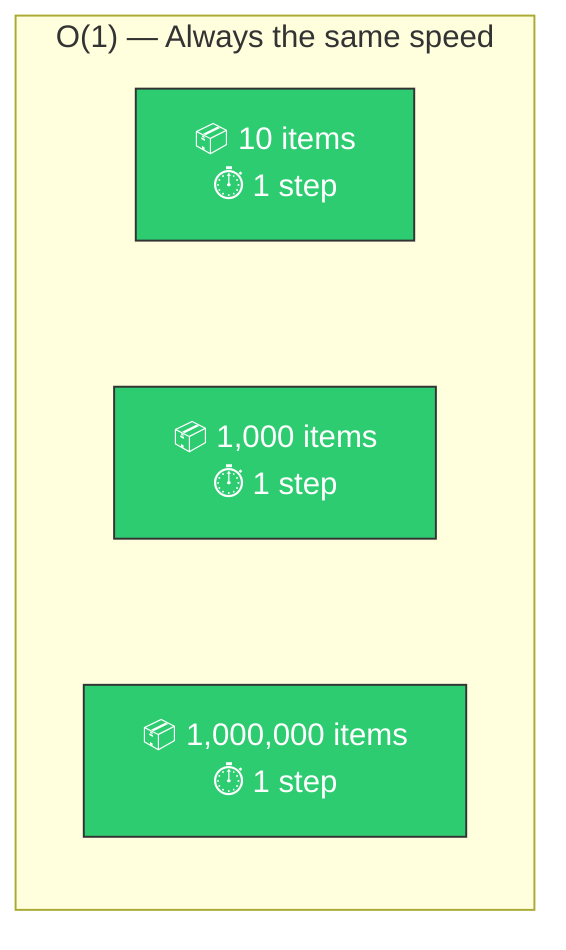

### 🎯 Analogy
> Opening a **book to page 50**. Whether the book has 100 pages or 10,000 pages, flipping to page 50 takes the same time.

### 🐍 Python Examples

```python
# All O(1) — instant regardless of size

my_list = [10, 20, 30, 40, 50]
my_dict = {"name": "Alice", "age": 28}

# ✅ Access by index
first = my_list[0]              # O(1)

# ✅ Dict lookup
name = my_dict["name"]          # O(1)

# ✅ Append to list
my_list.append(60)              # O(1)

# ✅ Check dict key
exists = "name" in my_dict      # O(1)

# ✅ Get length
size = len(my_list)             # O(1)

# ✅ Push/pop from stack
my_list.pop()                   # O(1)
```

---

## 🔵 O(log n) — Logarithmic: "I Cut the Problem in Half Each Step"

### 📊 Visual — Binary Search in Action

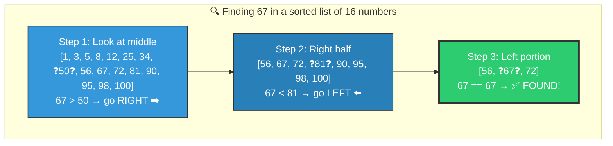

> **16 items → only 3 steps!** Each step eliminates **half** the remaining data.
> - 1,000 items → ~10 steps
> - 1,000,000 items → ~20 steps
> - 1,000,000,000 items → ~30 steps

### 🎯 Analogy
> The **dictionary word game**: "I'm thinking of a word. Is it before or after 'M'?"
> Each guess eliminates half the dictionary. You find any word in ~17 guesses out of 100,000 words!

### 🐍 Python — Binary Search

```python
def binary_search(sorted_list, target):
    """Find target in a sorted list. Returns index or -1."""
    left, right = 0, len(sorted_list) - 1
    steps = 0

    while left <= right:
        steps += 1
        mid = (left + right) // 2

        if sorted_list[mid] == target:
            print(f"  Found {target} at index {mid} in {steps} steps!")
            return mid
        elif sorted_list[mid] < target:
            left = mid + 1     # Target is in right half
        else:
            right = mid - 1    # Target is in left half

    print(f"  {target} not found after {steps} steps")
    return -1


# Test it!
numbers = list(range(0, 1000, 2))  # [0, 2, 4, 6, ..., 998]
binary_search(numbers, 678)  # Found in ~9 steps out of 500 items!
```

---

## 🟡 O(n) — Linear: "I Check Everything Once"

### 📊 Visual

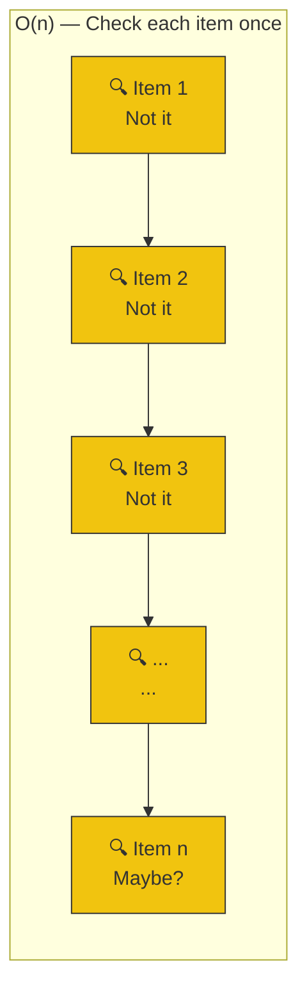

### 🎯 Analogy
> **Reading a guest list** to find if your name is on it. You start from the top and read each name. 100 guests? Check up to 100 names.

### 🐍 Python Examples

```python
# All O(n) — touch each element once

numbers = [4, 2, 7, 1, 9, 3, 8, 5, 6]

# ✅ Linear search
def find_number(nums, target):
    for i, num in enumerate(nums):
        if num == target:
            return i
    return -1

# ✅ Find maximum
def find_max(nums):
    max_val = nums[0]
    for num in nums:           # Visit each element once
        if num > max_val:
            max_val = num
    return max_val

# ✅ Sum all elements
total = sum(numbers)           # O(n) — adds each number once

# ✅ Filter
evens = [x for x in numbers if x % 2 == 0]  # O(n)

# ⚠️ "in" on a list is O(n)!
if 7 in numbers:               # Scans up to all elements
    print("Found 7!")
```

---

## 🟠 O(n log n) — Linearithmic: "I Sort Things Efficiently"

### 📊 Visual — Merge Sort: Divide and Conquer

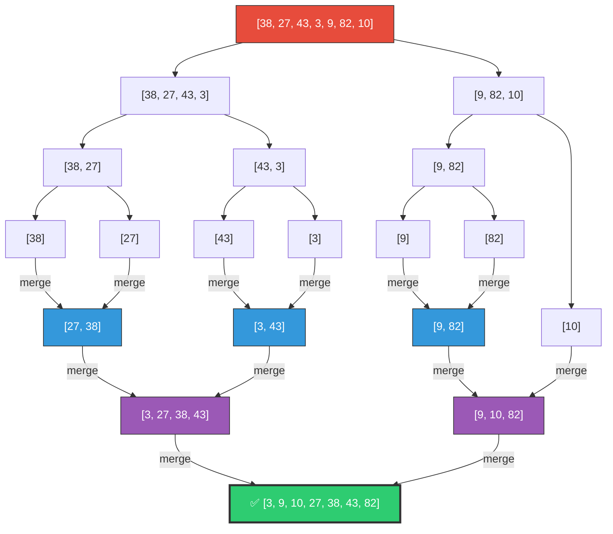

> **Why O(n log n)?**
> - **log n levels** of splitting (each split halves the data)
> - **n work** at each level (merging all elements)
> - Total: n × log n

### 🎯 Analogy
> **Sorting exams**: Split the pile in half, split again, sort tiny piles, then merge them back in order. Much faster than comparing every paper to every other paper!

### 🐍 Python

```python
# Python's built-in sort is Timsort — O(n log n)
numbers = [38, 27, 43, 3, 9, 82, 10]

sorted_nums = sorted(numbers)           # Returns new sorted list
numbers.sort()                           # Sorts in-place

# Both are O(n log n) — very efficient!
```

---

## 🔴 O(n²) — Quadratic: "I Compare Everything with Everything"

### 📊 Visual — Why It's So Slow

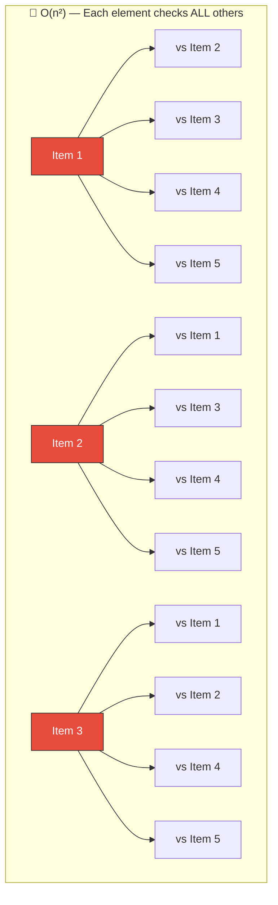

> 5 items = 25 comparisons. 1,000 items = 1,000,000 comparisons. **It explodes!**

### 🎯 Analogy
> **Handshake problem**: At a party of 100 people, if everyone shakes hands with everyone else, that's ~5,000 handshakes. At 1,000 people, it's ~500,000!

### 🐍 Python — Spot the O(n²) Traps!

```python
# ❌ TRAP 1: Nested loops
def has_duplicate_slow(nums):
    """O(n²) — compares every pair"""
    for i in range(len(nums)):
        for j in range(i + 1, len(nums)):
            if nums[i] == nums[j]:
                return True
    return False


# ✅ FIX: Use a set!
def has_duplicate_fast(nums):
    """O(n) — checks each element once"""
    seen = set()
    for num in nums:
        if num in seen:        # O(1) lookup in set!
            return True
        seen.add(num)
    return False


# ❌ TRAP 2: "in" on a list inside a loop
def common_elements_slow(list_a, list_b):
    """O(n²) — 'in' on list is O(n), and it's inside a loop"""
    result = []
    for item in list_a:
        if item in list_b:     # O(n) for each check!
            result.append(item)
    return result


# ✅ FIX: Convert to set first
def common_elements_fast(list_a, list_b):
    """O(n) — 'in' on set is O(1)"""
    set_b = set(list_b)        # O(n) once
    result = []
    for item in list_a:
        if item in set_b:      # O(1) for each check!
            result.append(item)
    return result
```

---

## 🧮 The Big-O Rules — How to Calculate

### Rule 1: Drop Constants

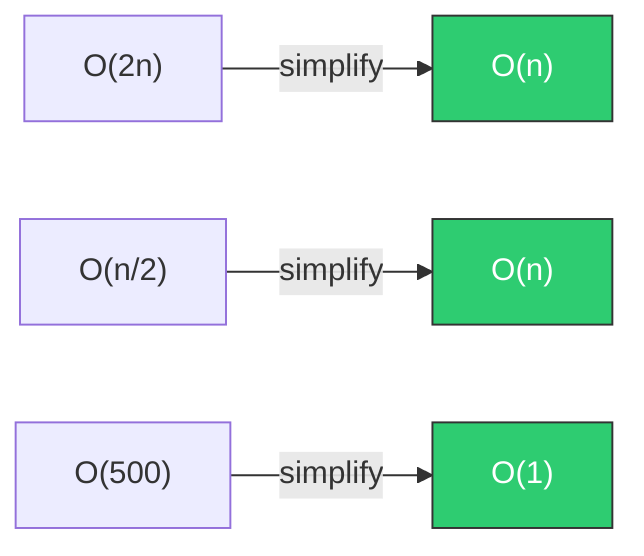

> We care about the **growth pattern**, not the exact number. Whether you loop through the list 1 time or 3 times, it's still O(n).

### Rule 2: Drop Smaller Terms

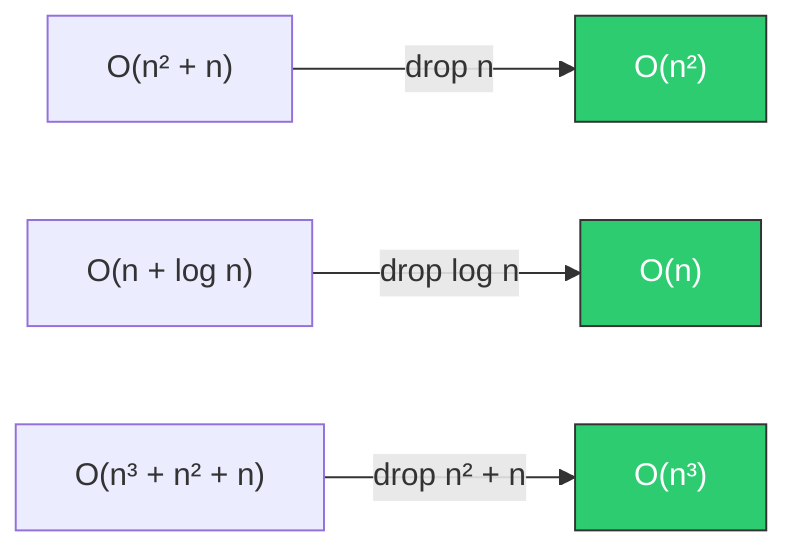

> At large n, the biggest term **dominates**. n² + n ≈ n² when n is a million.

### Rule 3: Different Inputs = Different Variables

```python
# This is O(a * b), NOT O(n²)!
def print_pairs(list_a, list_b):
    for a in list_a:        # O(a)
        for b in list_b:    # O(b)
            print(a, b)
# Only O(n²) if list_a and list_b are the same size
```

### 🧩 Quick Analysis Cheat Sheet

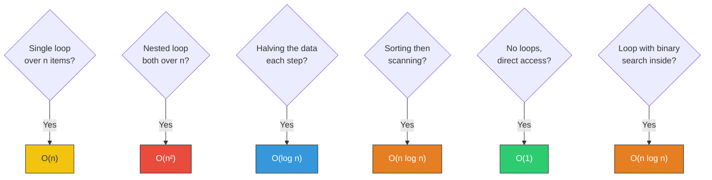

---

## 🔥 Common Algorithm Patterns

### Pattern 1: Two Pointers

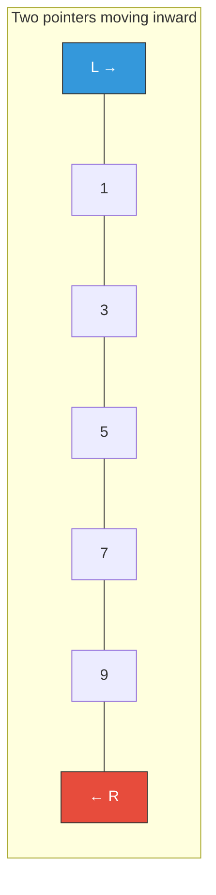

```python
def two_sum_sorted(nums, target):
    """Find two numbers that add to target in a SORTED list. O(n)"""
    left, right = 0, len(nums) - 1

    while left < right:
        current_sum = nums[left] + nums[right]
        if current_sum == target:
            return [left, right]
        elif current_sum < target:
            left += 1          # Need bigger sum → move left pointer right
        else:
            right -= 1         # Need smaller sum → move right pointer left

    return []

# [1, 3, 5, 7, 9], target=12 → [1, 4] because 3 + 9 = 12
```

### Pattern 2: Sliding Window

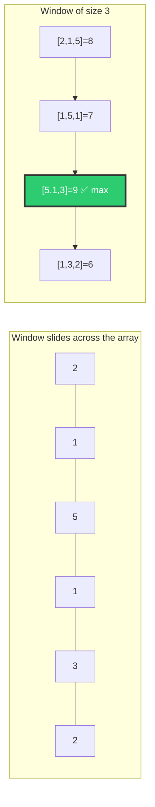

```python
def max_sum_subarray(nums, k):
    """Find max sum of any k consecutive elements. O(n)"""
    # Calculate first window
    window_sum = sum(nums[:k])
    max_sum = window_sum

    # Slide the window: add new element, remove old one
    for i in range(k, len(nums)):
        window_sum += nums[i] - nums[i - k]    # Slide!
        max_sum = max(max_sum, window_sum)

    return max_sum

# [2, 1, 5, 1, 3, 2], k=3 → 9 (subarray [5, 1, 3])
```

### Pattern 3: Frequency Counter

```python
from collections import Counter

def are_anagrams(word1, word2):
    """Check if two words are anagrams. O(n)"""
    return Counter(word1) == Counter(word2)

# "listen" and "silent" → True
# "hello" and "world" → False

# Counter("listen") → {'l':1, 'i':1, 's':1, 't':1, 'e':1, 'n':1}
# Counter("silent") → {'s':1, 'i':1, 'l':1, 'e':1, 'n':1, 't':1}
# Same counts = anagram!
```

---

## ⏱️ Space Complexity — Memory Matters Too!

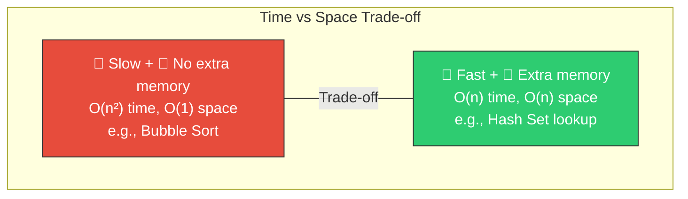

```python
# O(1) space — uses no extra memory proportional to input
def find_max(nums):
    max_val = nums[0]         # Just one variable, regardless of input size
    for num in nums:
        max_val = max(max_val, num)
    return max_val

# O(n) space — creates a new collection proportional to input
def remove_duplicates(nums):
    return list(set(nums))    # The set can be as large as nums
```

---

## 📋 The Complete Big-O Reference

| Big-O | Name | Example | 1K items | 1M items | Verdict |
|-------|------|---------|----------|----------|---------|
| O(1) | Constant | Dict lookup | 1 | 1 | 🟢 Perfect |
| O(log n) | Logarithmic | Binary search | 10 | 20 | 🟢 Excellent |
| O(n) | Linear | Single loop | 1,000 | 1,000,000 | 🟡 Good |
| O(n log n) | Linearithmic | Sorting | 10,000 | 20,000,000 | 🟡 Acceptable |
| O(n²) | Quadratic | Nested loops | 1,000,000 | 1,000,000,000,000 | 🔴 Bad |
| O(2ⁿ) | Exponential | All subsets | 2^1000 💀 | ∞ | 💀 Terrible |
| O(n!) | Factorial | All permutations | 💀 | ☠️ | ☠️ Never |

---

## 🏋️ Practice Exercises

### Exercise 1: What's the Big-O? (Analyze These)

```python
# a) What's the Big-O?
def mystery_a(n):
    for i in range(n):
        print(i)

# b) What's the Big-O?
def mystery_b(n):
    for i in range(n):
        for j in range(n):
            print(i, j)

# c) What's the Big-O?
def mystery_c(n):
    i = n
    while i > 0:
        print(i)
        i = i // 2

# d) What's the Big-O?
def mystery_d(nums):
    nums.sort()                  # ?
    return nums[0]               # ?

# e) What's the Big-O?
def mystery_e(nums):
    seen = set()
    for num in nums:             # ?
        if num in seen:          # ?
            return True
        seen.add(num)
    return False
```

### Exercise 2: Optimize This! (Turn O(n²) → O(n))

```python
# This is O(n²). Can you make it O(n)?
def find_pair_with_sum(nums, target):
    for i in range(len(nums)):
        for j in range(i + 1, len(nums)):
            if nums[i] + nums[j] == target:
                return [i, j]
    return []
```

### Exercise 3: Binary Search Practice

```python
# Implement binary search to find the first number >= target
# Input: [1, 3, 5, 7, 9, 11], target=6 → Output: index 3 (value 7)
```

---

## 🎤 Interview Corner

> **Q: "What's the time complexity of this code?"**
> This is the **#1 most asked** follow-up in coding interviews. Practice analyzing every piece of code you write!

> **Q: "Can you optimize this from O(n²) to O(n)?"**
> **Strategy**: 90% of the time, the answer is **use a hash map/set** to trade space for time.

> **Q: "What's the difference between time and space complexity?"**
> **Great answer**: "Time complexity measures how the number of operations grows with input. Space complexity measures how much extra memory we use. Often there's a trade-off — we can use extra memory (like a hash set) to make the algorithm faster."

---

## ✅ Key Takeaways

| Lesson | Remember |
|--------|----------|
| Big-O measures **growth rate** | Not exact time, but how it **scales** |
| Drop constants and small terms | O(2n + 5) → O(n) |
| Nested loops = multiply | Loop in loop = O(n × n) = O(n²) |
| Halving = logarithmic | Binary search = O(log n) |
| Hash maps fix O(n²) | If you see nested search, use a dict/set |
| Space-time trade-off | Use more memory → get faster algorithms |

---

**Next up → [Topic 1.3: How the Internet Actually Works](../1.3-How-Internet-Works/)**
