# 📘 Topic 1.2 — Algorithm Thinking & Big-O Notation

> **Code Implementation**: See [code.py](./code.py) for runnable Python implementation

> **Why this matters**: Two developers can solve the same problem — one's code runs in **1 second**, the other takes **3 hours**. The difference? They chose different algorithms. Big-O is the language that lets you **predict** which one is faster *before you even run the code*.

---

## 🧠 What Is Big-O? — The Speedometer for Code

### 🎯 Real-World Analogy

> Imagine you're looking for a friend in a crowd:
> - **O(1)**: Your friend is wearing a **bright red hat**. You spot them instantly. Crowd size doesn't matter.
> - **O(n)**: You scan **every single face** one by one. Bigger crowd = longer search.
> - **O(n²)**: You compare **every person with every other person** to find twins. Nightmare in a big crowd.

### 📊 The Growth Chart — How Algorithms Scale

Each row below shows how many **operations** an algorithm needs as the input grows. Watch how the bad ones explode!

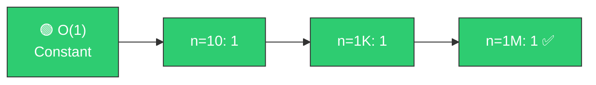

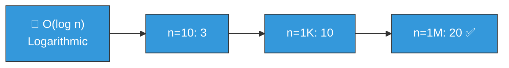

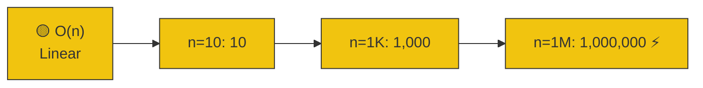

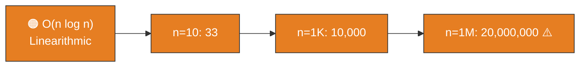

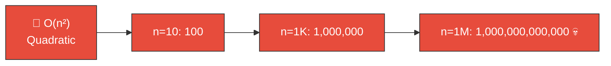

### Summary Table

| Big-O | Name | n = 10 | n = 1,000 | n = 1,000,000 | Verdict |
|-------|------|--------|-----------|---------------|---------|
| 🟢 O(1) | Constant | 1 | 1 | 1 | ✅ Perfect |
| 🔵 O(log n) | Logarithmic | 3 | 10 | 20 | ✅ Excellent |
| 🟡 O(n) | Linear | 10 | 1,000 | 1,000,000 | ⚡ Good |
| 🟠 O(n log n) | Linearithmic | 33 | 10,000 | 20,000,000 | ⚠️ Acceptable |
| 🔴 O(n²) | Quadratic | 100 | 1,000,000 | 1,000,000,000,000 | 💀 Terrible |

> **Key Insight**: At n = 1,000,000 items, an O(n²) algorithm does **1 TRILLION** operations. An O(n) algorithm does just **1 million**. That's a **1,000,000x** difference!

---

## 🟢 O(1) — Constant Time: "I Don't Care How Big It Is"

### 📊 Visual

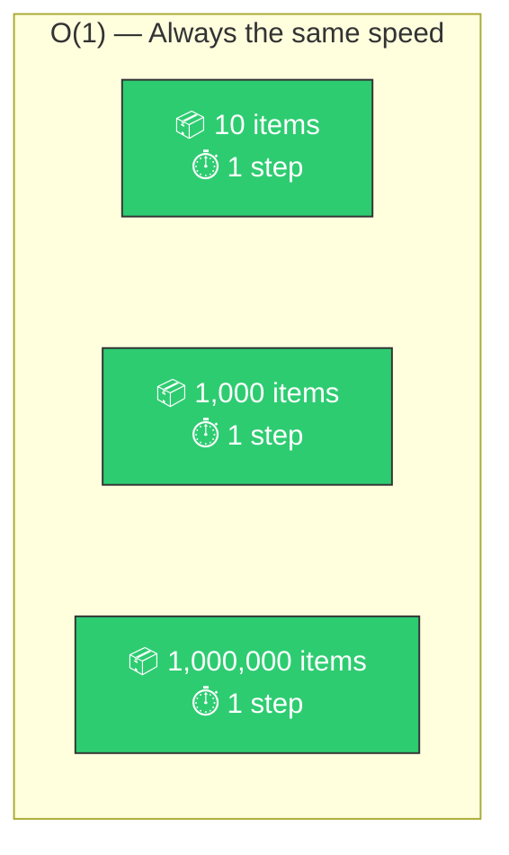

### 🎯 Analogy
> Opening a **book to page 50**. Whether the book has 100 pages or 10,000 pages, flipping to page 50 takes the same time.

### 💻 Pseudo Code Examples

```text
// All O(1) — instant regardless of size

my_list = [10, 20, 30, 40, 50]
my_dictionary = {"name": "Alice", "age": 28}

// ✅ Access by index
first = my_list[0]              // O(1)

// ✅ Dictionary lookup
name = my_dictionary["name"]    // O(1)

// ✅ Append to list
my_list.APPEND(60)              // O(1)

// ✅ Check dictionary key
exists = HAS_KEY(my_dictionary, "name") // O(1)

// ✅ Get length
size = LENGTH(my_list)          // O(1)

// ✅ Push/pop from stack
my_list.POP()                   // O(1)
```

---

## 🔵 O(log n) — Logarithmic: "I Cut the Problem in Half Each Step"

### 📊 Visual — Binary Search in Action

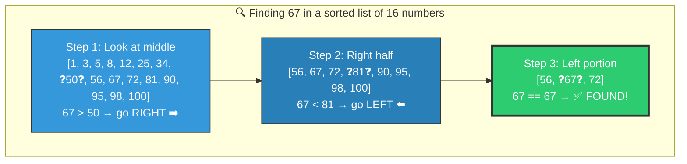

> **16 items → only 3 steps!** Each step eliminates **half** the remaining data.
> - 1,000 items → ~10 steps
> - 1,000,000 items → ~20 steps
> - 1,000,000,000 items → ~30 steps

### 🎯 Analogy
> The **dictionary word game**: "I'm thinking of a word. Is it before or after 'M'?"
> Each guess eliminates half the dictionary. You find any word in ~17 guesses out of 100,000 words!

### 💻 Pseudo Code — Binary Search

```text
FUNCTION binary_search(sorted_list, target):
    // Find target in a sorted list. Returns index or -1.
    left = 0
    right = LENGTH(sorted_list) - 1
    steps = 0

    WHILE left <= right:
        steps = steps + 1
        mid = (left + right) / 2

        IF sorted_list[mid] == target:
            PRINT "Found target at index", mid, "in", steps, "steps!"
            RETURN mid
        ELSE IF sorted_list[mid] < target:
            left = mid + 1     // Target is in right half
        ELSE:
            right = mid - 1    // Target is in left half

    PRINT "Target not found after", steps, "steps"
    RETURN -1
```

---

## 🟡 O(n) — Linear: "I Check Everything Once"

### 📊 Visual

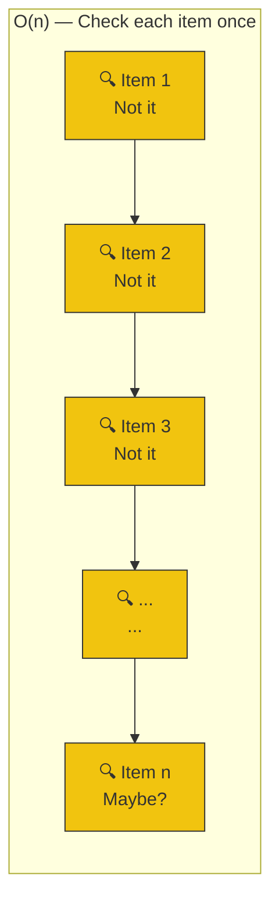

### 🎯 Analogy
> **Reading a guest list** to find if your name is on it. You start from the top and read each name. 100 guests? Check up to 100 names.

### 💻 Pseudo Code Examples

```text
// All O(n) — touch each element once

numbers = [4, 2, 7, 1, 9, 3, 8, 5, 6]

// ✅ Linear search
FUNCTION find_number(nums, target):
    FOR i = 0 TO LENGTH(nums) - 1:
        IF nums[i] == target:
            RETURN i
    RETURN -1

// ✅ Find maximum
FUNCTION find_max(nums):
    max_val = nums[0]
    FOR EACH num IN nums:       // Visit each element once
        IF num > max_val:
            max_val = num
    RETURN max_val

// ✅ Sum all elements
FUNCTION sum_all(nums):
    total = 0
    FOR EACH num IN nums:
        total = total + num
    RETURN total                  // O(n) — adds each number once
```

---

## 🟠 O(n log n) — Linearithmic: "I Sort Things Efficiently"

### 📊 Visual — Merge Sort: Divide and Conquer

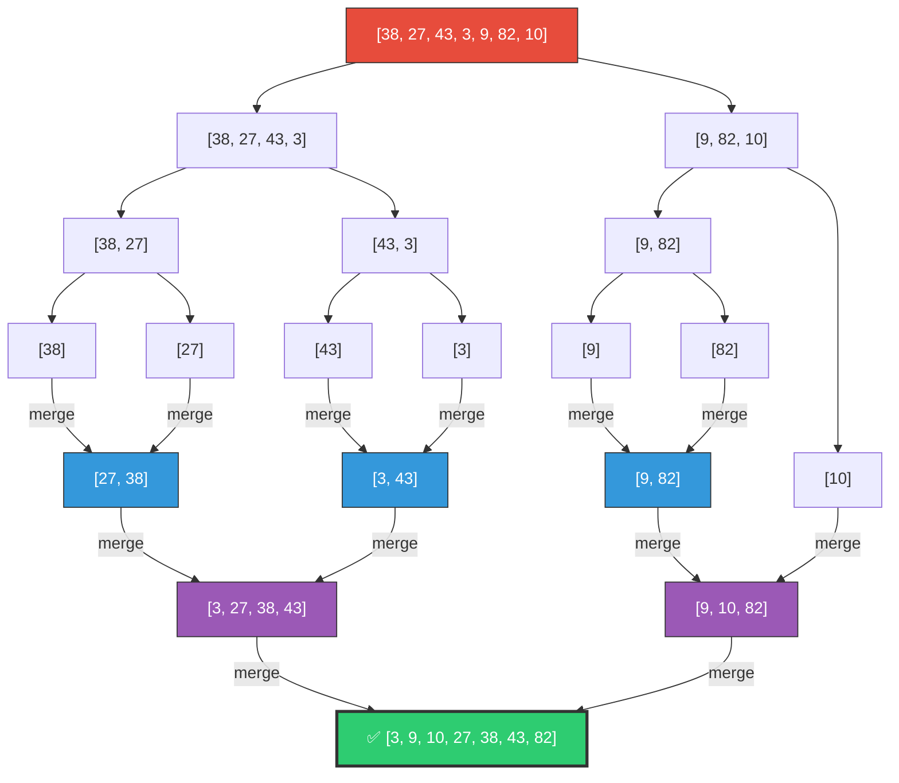

> **Why O(n log n)?**
> - **log n levels** of splitting (each split halves the data)
> - **n work** at each level (merging all elements)
> - Total: n × log n

### 🎯 Analogy
> **Sorting exams**: Split the pile in half, split again, sort tiny piles, then merge them back in order. Much faster than comparing every paper to every other paper!

### 💻 Pseudo Code

```text
// Most efficient modern sorting algorithms are O(n log n)
numbers = [38, 27, 43, 3, 9, 82, 10]

sorted_nums = SORT(numbers)           // Returns new sorted list

// Both are O(n log n) — very efficient!
```

---

## 🔴 O(n²) — Quadratic: "I Compare Everything with Everything"

### 📊 Visual — Why It's So Slow

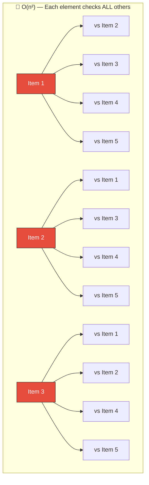

> 5 items = 25 comparisons. 1,000 items = 1,000,000 comparisons. **It explodes!**

### 🎯 Analogy
> **Handshake problem**: At a party of 100 people, if everyone shakes hands with everyone else, that's ~5,000 handshakes. At 1,000 people, it's ~500,000!

### 💻 Pseudo Code — Spot the O(n²) Traps!

```text
// ❌ TRAP 1: Nested loops
FUNCTION has_duplicate_slow(nums):
    // O(n²) — compares every pair
    FOR i = 0 TO LENGTH(nums) - 1:
        FOR j = i + 1 TO LENGTH(nums) - 1:
            IF nums[i] == nums[j]:
                RETURN True
    RETURN False


// ✅ FIX: Use a Hash Set!
FUNCTION has_duplicate_fast(nums):
    // O(n) — checks each element once
    seen = NEW HASH_SET()
    FOR EACH num IN nums:
        IF seen.CONTAINS(num): // O(1) lookup in set!
            RETURN True
        seen.ADD(num)
    RETURN False


// ❌ TRAP 2: Linear search inside a loop
FUNCTION common_elements_slow(list_a, list_b):
    // O(n²) — search in list is O(n), and it's inside a loop
    result = NEW LIST()
    FOR EACH item IN list_a:
        IF list_b.CONTAINS(item): // O(n) for each check!
            result.APPEND(item)
    RETURN result


// ✅ FIX: Convert to set first
FUNCTION common_elements_fast(list_a, list_b):
    // O(n) — lookup in set is O(1)
    set_b = NEW HASH_SET(list_b)  // O(n) once
    result = NEW LIST()
    FOR EACH item IN list_a:
        IF set_b.CONTAINS(item):  // O(1) for each check!
            result.APPEND(item)
    RETURN result
```

---

## 🧮 The Big-O Rules — How to Calculate

### Rule 1: Drop Constants

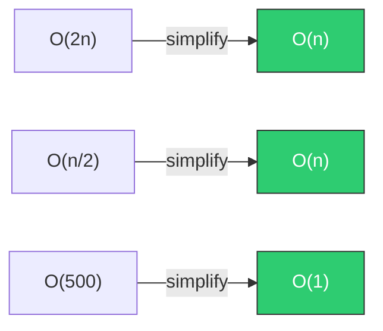

> We care about the **growth pattern**, not the exact number. Whether you loop through the list 1 time or 3 times, it's still O(n).

### Rule 2: Drop Smaller Terms

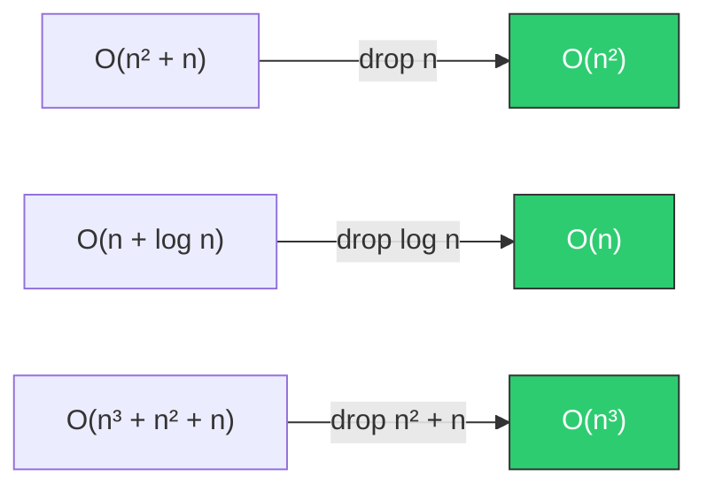

> At large n, the biggest term **dominates**. n² + n ≈ n² when n is a million.

### Rule 3: Different Inputs = Different Variables

```text
// This is O(a * b), NOT O(n²)!
FUNCTION print_pairs(list_a, list_b):
    FOR EACH a IN list_a:        // O(a)
        FOR EACH b IN list_b:    // O(b)
            PRINT a, b
// Only O(n²) if list_a and list_b are the same size
```

### 🧩 Quick Analysis Cheat Sheet

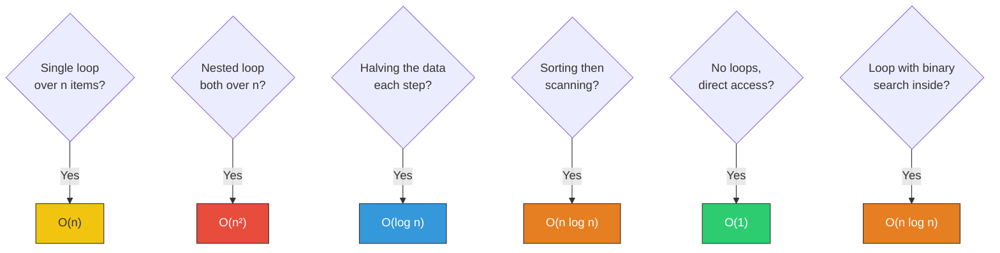

---

## 🔥 Common Algorithm Patterns

### Pattern 1: Two Pointers

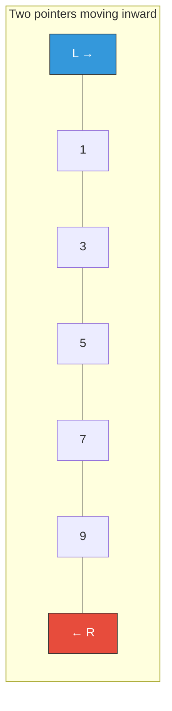

```text
FUNCTION two_sum_sorted(nums, target):
    // Find two numbers that add to target in a SORTED list. O(n)
    left = 0
    right = LENGTH(nums) - 1

    WHILE left < right:
        current_sum = nums[left] + nums[right]
        IF current_sum == target:
            RETURN [left, right]
        ELSE IF current_sum < target:
            left = left + 1    // Need bigger sum → move left pointer right
        ELSE:
            right = right - 1  // Need smaller sum → move right pointer left

    RETURN []

// [1, 3, 5, 7, 9], target=12 → [1, 4] because 3 + 9 = 12
```

### Pattern 2: Sliding Window

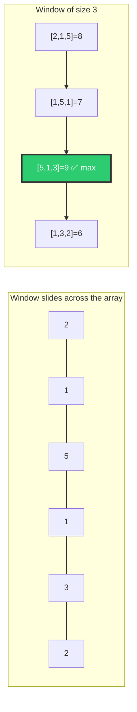

```text
FUNCTION max_sum_subarray(nums, k):
    // Find max sum of any k consecutive elements. O(n)
    // Calculate first window
    window_sum = 0
    FOR i = 0 TO k - 1:
        window_sum = window_sum + nums[i]
    max_sum = window_sum

    // Slide the window: add new element, remove old one
    FOR i = k TO LENGTH(nums) - 1:
        window_sum = window_sum + nums[i] - nums[i - k]    // Slide!
        max_sum = MAX(max_sum, window_sum)

    RETURN max_sum

// [2, 1, 5, 1, 3, 2], k=3 → 9 (subarray [5, 1, 3])
```

### Pattern 3: Frequency Counter

```text
FUNCTION are_anagrams(word1, word2):
    // Check if two words are anagrams. O(n)
    count_map1 = GET_CHARACTER_COUNTS(word1)
    count_map2 = GET_CHARACTER_COUNTS(word2)
    RETURN count_map1 == count_map2

// "listen" and "silent" → True
// "hello" and "world" → False

// GET_CHARACTER_COUNTS("listen") → {'l':1, 'i':1, 's':1, 't':1, 'e':1, 'n':1}
// GET_CHARACTER_COUNTS("silent") → {'s':1, 'i':1, 'l':1, 'e':1, 'n':1, 't':1}
// Same counts = anagram!
```

---

## ⏱️ Space Complexity — Memory Matters Too!

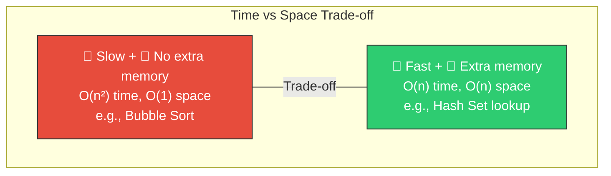

```text
// O(1) space — uses no extra memory proportional to input
FUNCTION find_max(nums):
    max_val = nums[0]         // Just one variable, regardless of input size
    FOR EACH num IN nums:
        max_val = MAX(max_val, num)
    RETURN max_val

// O(n) space — creates a new collection proportional to input
FUNCTION remove_duplicates(nums):
    unique_set = NEW HASH_SET()
    FOR EACH num IN nums:
        unique_set.ADD(num)
    RETURN unique_set.TO_LIST() // The list can be as large as nums
```

---

## 📋 The Complete Big-O Reference

| Big-O | Name | Example | 1K items | 1M items | Verdict |
|-------|------|---------|----------|----------|---------|
| O(1) | Constant | Dict lookup | 1 | 1 | 🟢 Perfect |
| O(log n) | Logarithmic | Binary search | 10 | 20 | 🟢 Excellent |
| O(n) | Linear | Single loop | 1,000 | 1,000,000 | 🟡 Good |
| O(n log n) | Linearithmic | Sorting | 10,000 | 20,000,000 | 🟡 Acceptable |
| O(n²) | Quadratic | Nested loops | 1,000,000 | 1,000,000,000,000 | 🔴 Bad |
| O(2ⁿ) | Exponential | All subsets | 2^1000 💀 | ∞ | 💀 Terrible |
| O(n!) | Factorial | All permutations | 💀 | ☠️ | ☠️ Never |

---

## 🏋️ Practice Exercises

### Exercise 1: What's the Big-O? (Analyze These)

```text
// a) What's the Big-O?
FUNCTION mystery_a(n):
    FOR i = 0 TO n - 1:
        PRINT i

// b) What's the Big-O?
FUNCTION mystery_b(n):
    FOR i = 0 TO n - 1:
        FOR j = 0 TO n - 1:
            PRINT i, j

// c) What's the Big-O?
FUNCTION mystery_c(n):
    i = n
    WHILE i > 0:
        PRINT i
        i = i / 2

// d) What's the Big-O?
FUNCTION mystery_d(nums):
    SORT(nums)                   // ?
    RETURN nums[0]               // ?

// e) What's the Big-O?
FUNCTION mystery_e(nums):
    seen = NEW HASH_SET()
    FOR EACH num IN nums:        // ?
        IF seen.CONTAINS(num):   // ?
            RETURN True
        seen.ADD(num)
    RETURN False
```

### Exercise 2: Optimize This! (Turn O(n²) → O(n))

```text
// This is O(n²). Can you make it O(n)?
FUNCTION find_pair_with_sum(nums, target):
    FOR i = 0 TO LENGTH(nums) - 1:
        FOR j = i + 1 TO LENGTH(nums) - 1:
            IF nums[i] + nums[j] == target:
                RETURN [i, j]
    RETURN []
```

### Exercise 3: Binary Search Practice

```text
// Implement binary search to find the first number >= target
// Input: [1, 3, 5, 7, 9, 11], target=6 → Output: index 3 (value 7)
```

---

## 🎤 Interview Corner

> **Q: "What's the time complexity of this code?"**
> This is the **#1 most asked** follow-up in coding interviews. Practice analyzing every piece of code you write!

> **Q: "Can you optimize this from O(n²) to O(n)?"**
> **Strategy**: 90% of the time, the answer is **use a hash map/set** to trade space for time.

> **Q: "What's the difference between time and space complexity?"**
> **Great answer**: "Time complexity measures how the number of operations grows with input. Space complexity measures how much extra memory we use. Often there's a trade-off — we can use extra memory (like a hash set) to make the algorithm faster."

---

## ✅ Key Takeaways

| Lesson | Remember |
|--------|----------|
| Big-O measures **growth rate** | Not exact time, but how it **scales** |
| Drop constants and small terms | O(2n + 5) → O(n) |
| Nested loops = multiply | Loop in loop = O(n × n) = O(n²) |
| Halving = logarithmic | Binary search = O(log n) |
| Hash maps fix O(n²) | If you see nested search, use a dict/set |
| Space-time trade-off | Use more memory → get faster algorithms |

---

**Next up → [Topic 1.3: How the Internet Actually Works](../1.3-How-Internet-Works/)**
