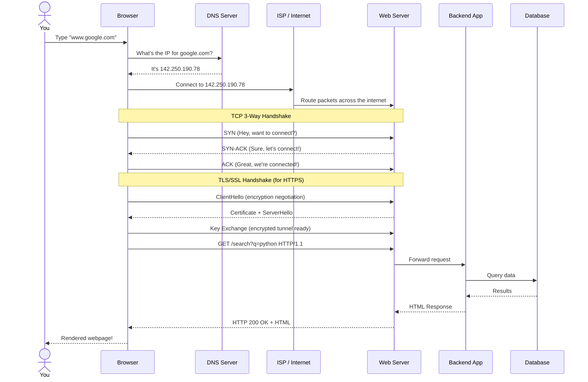
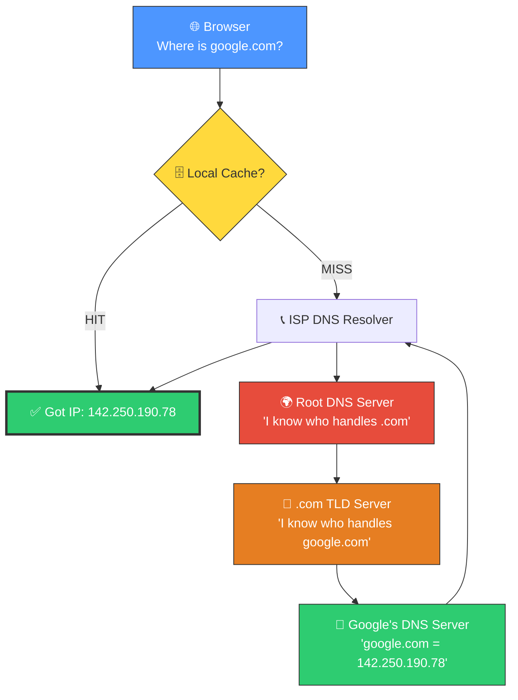
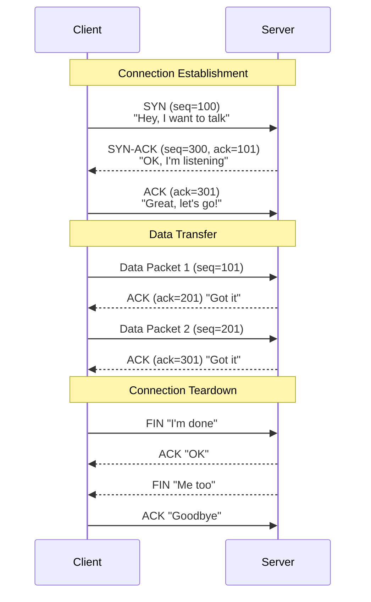
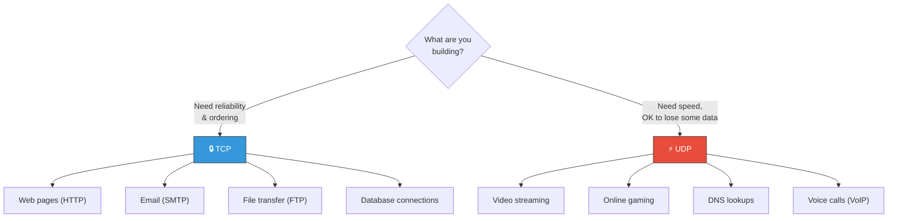
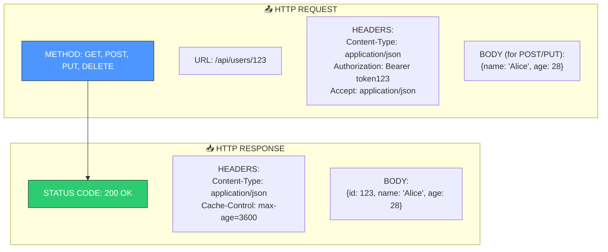
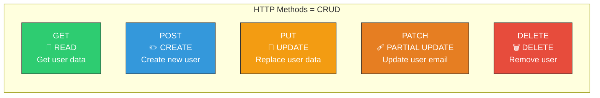
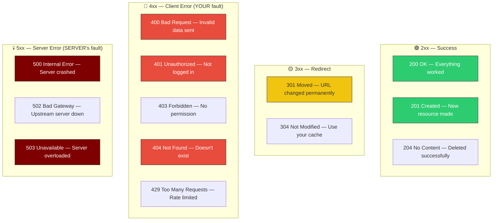
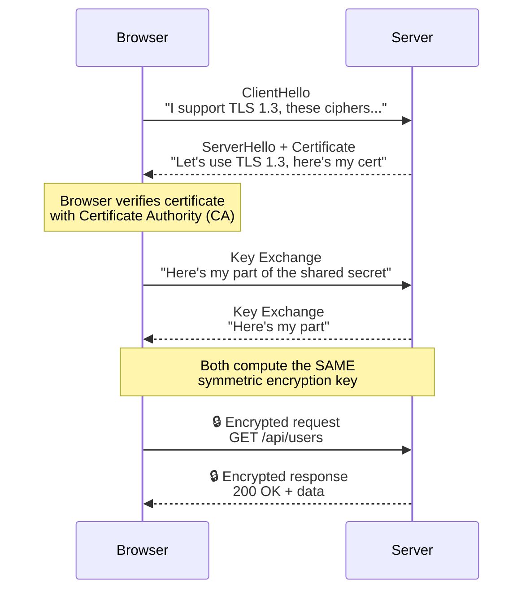
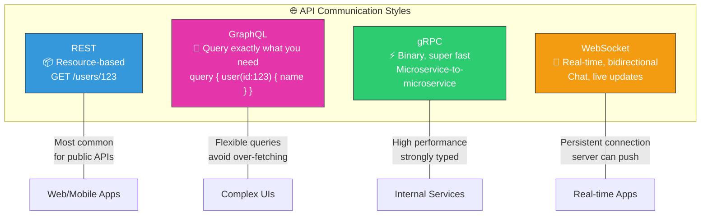
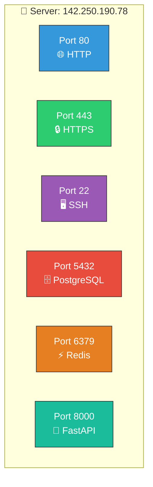

# 📘 Topic 1.3 — How the Internet Actually Works

> **Why this matters**: As a backend developer, every line of code you write will eventually serve a request that traveled through **DNS, TCP, HTTP, and multiple servers**. If you don't understand this journey, you'll write slow, insecure, broken APIs without knowing why.

> **Code Implementation**: See [code.py](./code.py) for runnable Python implementation

---

## 🧠 The Big Picture — What Happens When You Type a URL?



> This entire process happens in **~200-500 milliseconds**. Let's break down each step.

---

## 1️⃣ DNS — The Internet's Phone Book

### 🎯 Analogy
> You know your friend's name ("google.com") but not their address (IP). DNS is like calling **directory assistance** — you give a name, they give you the number.

### 📊 DNS Resolution Flow



### Pseudo Code

```
FUNCTION resolve_dns(domain):
    // Step 1: Check local cache
    IF domain IN local_cache:
        RETURN local_cache[domain]

    // Step 2: Ask ISP's recursive resolver
    resolver = ISP_DNS_RESOLVER

    // Step 3: Resolver walks the DNS tree
    root_server = resolver.ask_root("Where is .com?")
    tld_server  = root_server.ask("Where is google.com?")
    ip_address  = tld_server.ask("What is google.com's IP?")

    // Step 4: Cache it for next time (TTL = Time To Live)
    local_cache[domain] = ip_address  // expires after TTL
    RETURN ip_address
```

### Key Concepts

| Concept | What It Means |
|---------|--------------|
| **A Record** | Maps domain → IPv4 address (e.g., google.com → 142.250.190.78) |
| **CNAME** | Maps domain → another domain (e.g., www.google.com → google.com) |
| **TTL** | How long to cache the result (e.g., 300 seconds) |
| **NS Record** | Points to the authoritative name server for a domain |

---

## 2️⃣ TCP — The Reliable Delivery Truck

### 🎯 Analogy
> TCP is like sending a **registered letter**. You get confirmation it arrived, it arrives in order, and if a piece is missing, it's resent. UDP is like shouting across a room — fast but no guarantee anyone heard.

### 📊 TCP 3-Way Handshake



### Pseudo Code

```
FUNCTION tcp_connect(client, server):
    // 3-Way Handshake
    client.send(SYN, seq=random_number)
    response = server.receive()       // Server responds with SYN-ACK
    client.send(ACK, ack=response.seq + 1)

    // Connection established! Now send data
    WHILE has_data_to_send:
        packet = next_packet()
        client.send(packet)

        IF NOT received_ack(timeout=2s):
            client.resend(packet)     // TCP guarantees delivery!

    // Teardown
    client.send(FIN)
    server.send(ACK)
    server.send(FIN)
    client.send(ACK)
```

### TCP vs UDP — When to Use Which



| Feature | TCP | UDP |
|---------|-----|-----|
| **Reliable?** | Yes — resends lost packets | No — fire and forget |
| **Ordered?** | Yes — packets arrive in order | No — can arrive out of order |
| **Speed** | Slower (handshake overhead) | Faster (no handshake) |
| **Use Case** | HTTP, Email, Databases | Video, Gaming, DNS |

---

## 3️⃣ HTTP / HTTPS — The Language of the Web

### 🎯 Analogy
> HTTP is the **language** that browsers and servers speak. Like a restaurant: the browser is the customer, the HTTP request is the order, and the HTTP response is the food.

### 📊 Anatomy of an HTTP Request



### HTTP Methods — The CRUD Operations



### Pseudo Code — How a Server Handles Requests

```
FUNCTION handle_request(request):
    // Step 1: Parse the request
    method = request.method      // GET, POST, PUT, DELETE
    path   = request.url         // /api/users/123
    headers = request.headers    // Authorization, Content-Type
    body   = request.body        // JSON data (for POST/PUT)

    // Step 2: Authentication
    token = headers["Authorization"]
    user = verify_token(token)
    IF user IS NULL:
        RETURN Response(status=401, body="Unauthorized")

    // Step 3: Route to the right handler
    IF method == "GET" AND path == "/api/users/{id}":
        user_data = database.find_user(id)
        IF user_data IS NULL:
            RETURN Response(status=404, body="User not found")
        RETURN Response(status=200, body=user_data)

    ELSE IF method == "POST" AND path == "/api/users":
        new_user = database.create_user(body)
        RETURN Response(status=201, body=new_user)

    ELSE IF method == "DELETE" AND path == "/api/users/{id}":
        database.delete_user(id)
        RETURN Response(status=204, body=null)

    ELSE:
        RETURN Response(status=404, body="Route not found")
```

### HTTP Status Codes — What They Mean



---

## 4️⃣ HTTPS & TLS — The Encrypted Tunnel

### 🎯 Analogy
> HTTP is like sending a **postcard** — anyone can read it. HTTPS is like putting your message in a **locked box** where only the receiver has the key.

### 📊 TLS Handshake Flow



### Pseudo Code

```
FUNCTION tls_handshake(client, server):
    // Step 1: Client says hello
    client_hello = {
        tls_version: "1.3",
        supported_ciphers: ["AES-256-GCM", "ChaCha20"],
        random: generate_random_bytes()
    }
    client.send(client_hello)

    // Step 2: Server responds with certificate
    server_hello = {
        chosen_cipher: "AES-256-GCM",
        certificate: server.ssl_certificate,
        random: generate_random_bytes()
    }
    server.send(server_hello)

    // Step 3: Client verifies certificate
    is_valid = verify_with_CA(server_hello.certificate)
    IF NOT is_valid:
        ABORT "Certificate not trusted!"

    // Step 4: Key exchange (Diffie-Hellman)
    shared_secret = diffie_hellman_exchange(client, server)

    // Step 5: Both derive the same symmetric key
    session_key = derive_key(shared_secret)

    // Now all communication is encrypted with session_key!
    RETURN encrypted_connection(session_key)
```

---

## 5️⃣ REST vs GraphQL vs gRPC vs WebSocket

### 📊 Comparison



| Feature | REST | GraphQL | gRPC | WebSocket |
|---------|------|---------|------|-----------|
| **Protocol** | HTTP | HTTP | HTTP/2 | TCP |
| **Data Format** | JSON | JSON | Protobuf (binary) | Any |
| **Speed** | Good | Good | Fastest | Real-time |
| **Over-fetching** | Common | Never | Never | N/A |
| **Best For** | Public APIs | Complex UIs | Microservices | Chat, Gaming |
| **Learning Curve** | Easy | Medium | Hard | Medium |

### Pseudo Code — REST vs GraphQL

```
// ═══ REST: Multiple requests to get what you need ═══
// Problem: You want user name + their posts + their followers

GET /api/users/123           → { id: 123, name: "Alice", email: "...", age: 28, ... }
GET /api/users/123/posts     → [{ title: "...", body: "..." }, ...]
GET /api/users/123/followers → [{ id: 456, name: "Bob" }, ...]

// 3 requests! And you got extra fields you don't need (over-fetching)


// ═══ GraphQL: ONE request, get exactly what you need ═══
POST /graphql
{
    query {
        user(id: 123) {
            name                    // Only the fields you want
            posts { title }         // Only title, not body
            followers { name }      // Only name, not id
        }
    }
}
// 1 request! No over-fetching!
```

---

## 6️⃣ Ports — The Apartment Numbers

### 🎯 Analogy
> An IP address is like a **building address**. A port is like an **apartment number**. Multiple services (apartments) can live on the same server (building).



### Common Ports to Know

| Port | Service | What It Does |
|------|---------|-------------|
| 80 | HTTP | Unencrypted web traffic |
| 443 | HTTPS | Encrypted web traffic |
| 22 | SSH | Remote server access |
| 5432 | PostgreSQL | Database connections |
| 3306 | MySQL | Database connections |
| 27017 | MongoDB | Database connections |
| 6379 | Redis | Cache/message broker |
| 8000/8080 | Dev servers | FastAPI, Spring Boot, etc. |

---

## 🏋️ Practice Exercises

### Exercise 1: Trace the Request
> Describe every step that happens when you type `https://api.github.com/users/torvalds` in your browser. Include DNS, TCP, TLS, and HTTP.

### Exercise 2: Status Code Quiz
> What status code should your API return for:
> - User tries to log in with wrong password?
> - User requests their own profile successfully?
> - User tries to access admin panel without permission?
> - Server's database connection crashes?

### Exercise 3: REST vs GraphQL
> Your app has Users, Posts, and Comments. A mobile app needs to show a user profile with their 5 latest posts and comment count per post. Design the REST endpoints AND the GraphQL query. Which is better here and why?

---

## 🎤 Interview Corner

> **Q: "What happens when you type google.com in the browser?"**
> This is the **#1 most asked** system design warmup question. Walk through: DNS → TCP → TLS → HTTP → Server → Response → Rendering.

> **Q: "What's the difference between HTTP and HTTPS?"**
> "HTTPS adds TLS encryption on top of HTTP. It prevents man-in-the-middle attacks, ensures data integrity, and verifies the server's identity through certificates."

> **Q: "When would you choose WebSockets over REST?"**
> "When the server needs to push data to the client without being asked — like chat messages, live notifications, stock price tickers, or multiplayer game state."

---

## ✅ Key Takeaways

| Concept | Remember |
|---------|----------|
| **DNS** | Translates domain names to IP addresses |
| **TCP** | Reliable, ordered delivery with handshake |
| **UDP** | Fast, unreliable, for video/gaming |
| **HTTP** | Request-response protocol with methods & status codes |
| **HTTPS/TLS** | Encrypted HTTP using certificates |
| **REST** | Resource-based, most common API style |
| **Ports** | Different services on the same machine |

---

**Next up → [Topic 1.4: Database Fundamentals](../1.4-Database-Fundamentals/)**
