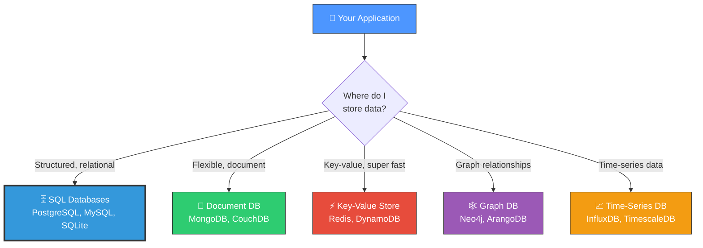
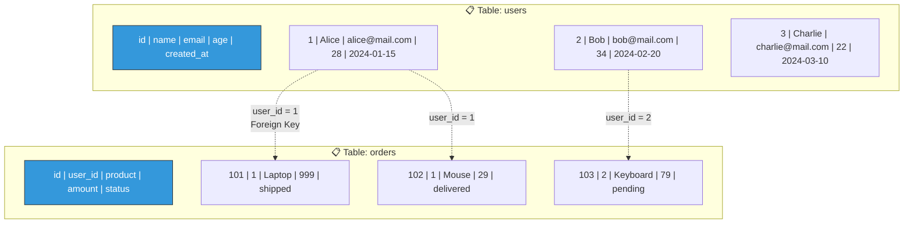
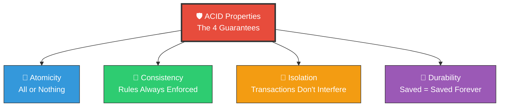
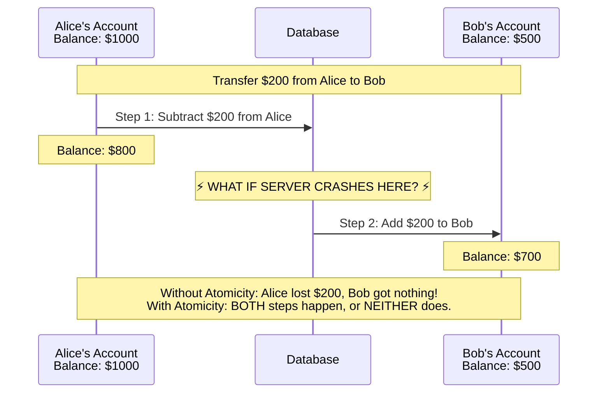
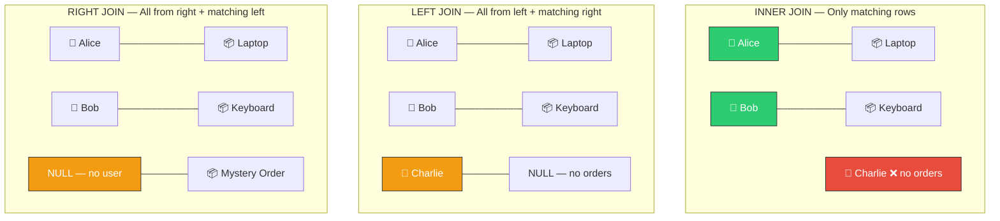
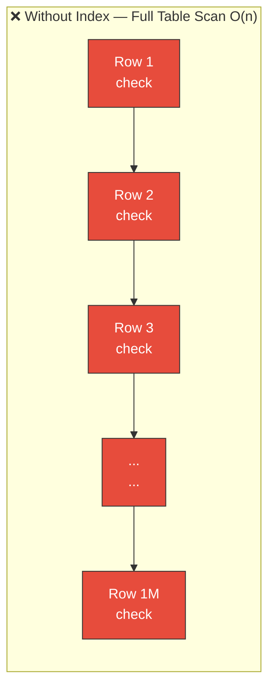
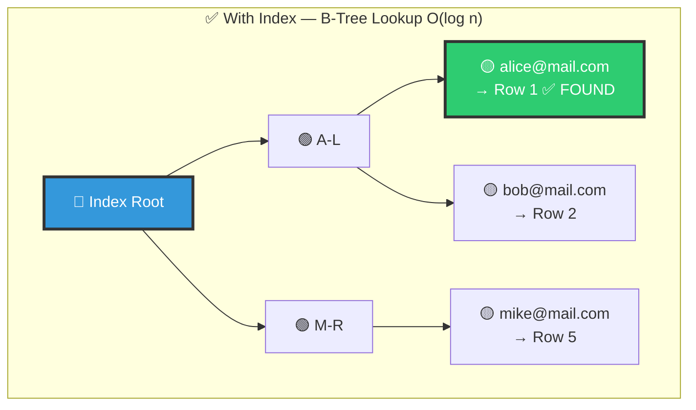
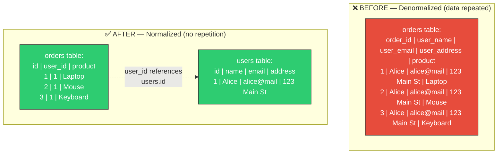
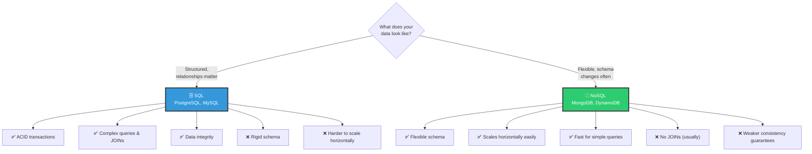
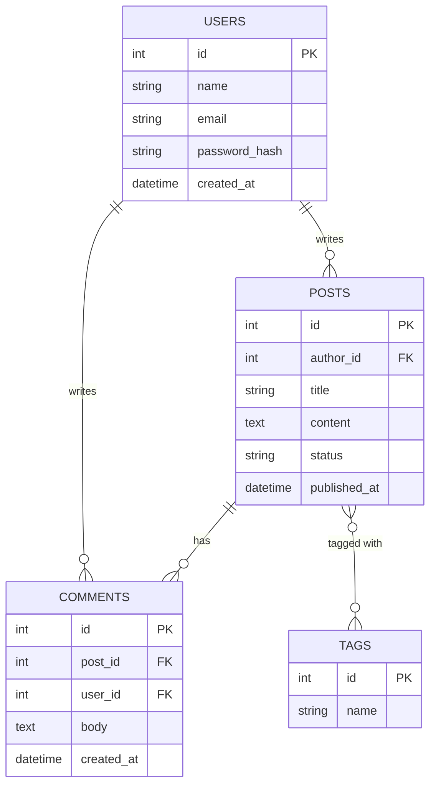

# 📘 Topic 1.4 — Database Fundamentals

> **Why this matters**: Every backend application stores data. Choosing the **wrong database**, writing **bad queries**, or designing a **poor schema** can make your app crawl at 100 users — or crash at 1,000. Databases are the backbone of every system you'll ever build.

> **Code Implementation**: See [code.py](./code.py) for runnable Python implementation with SQLite

---

## 🧠 The Big Picture — What Is a Database?



---

## 1️⃣ SQL — The Structured World

### 🎯 Analogy
> A SQL database is like a **spreadsheet on steroids**. Data lives in **tables** (sheets) with **rows** (records) and **columns** (fields). But unlike a spreadsheet, it enforces rules, handles millions of rows, and lets thousands of users access it simultaneously.

### 📊 How a Table Looks



### Core SQL Operations — CRUD

```
// ═══ CREATE — Insert new data ═══
INSERT INTO users (name, email, age)
VALUES ("Alice", "alice@mail.com", 28)

// ═══ READ — Query data ═══
SELECT name, email
FROM users
WHERE age > 25
ORDER BY name

// ═══ UPDATE — Modify existing data ═══
UPDATE users
SET age = 29
WHERE name = "Alice"

// ═══ DELETE — Remove data ═══
DELETE FROM users
WHERE id = 3
```

---

## 2️⃣ ACID — The Four Guarantees

> Every reliable database promises these four properties. Break any one, and your data becomes unreliable.



### 🎯 The Bank Transfer Analogy



### Pseudo Code — Transaction with ACID

```
FUNCTION transfer_money(from_account, to_account, amount):
    // Start a transaction — groups operations together
    transaction = BEGIN_TRANSACTION()

    TRY:
        // Step 1: Check balance
        balance = SELECT balance FROM accounts WHERE id = from_account
        IF balance < amount:
            ROLLBACK(transaction)       // Cancel everything
            RETURN "Insufficient funds"

        // Step 2: Subtract from sender
        UPDATE accounts
        SET balance = balance - amount
        WHERE id = from_account

        // Step 3: Add to receiver
        UPDATE accounts
        SET balance = balance + amount
        WHERE id = to_account

        COMMIT(transaction)             // Save ALL changes
        RETURN "Transfer successful"

    CATCH error:
        ROLLBACK(transaction)           // Undo ALL changes
        RETURN "Transfer failed: " + error
```

### ACID Explained Simply

| Property | What It Means | Real-World Example |
|----------|--------------|-------------------|
| **Atomicity** | All operations succeed, or ALL are rolled back | Bank transfer: both debit AND credit happen, or neither |
| **Consistency** | Data always follows the rules (constraints) | Account balance can never go negative |
| **Isolation** | Concurrent transactions don't see each other's partial work | Two people buying the last item — only one succeeds |
| **Durability** | Once committed, data survives crashes & power outages | Your saved order stays saved even if server reboots |

---

## 3️⃣ Joins — Connecting Tables Together

### 🎯 Analogy
> Joins are like **matching puzzle pieces**. You have users in one table and orders in another. A JOIN connects them by the matching key (user_id) so you can see "Alice bought a Laptop".

### 📊 Types of Joins



### Pseudo Code — Join Queries

```
// ═══ INNER JOIN — Only users who HAVE orders ═══
SELECT users.name, orders.product, orders.amount
FROM users
INNER JOIN orders ON users.id = orders.user_id

// Result:
// Alice  | Laptop   | 999
// Alice  | Mouse    | 29
// Bob    | Keyboard | 79
// (Charlie excluded — no orders)


// ═══ LEFT JOIN — ALL users, even those without orders ═══
SELECT users.name, orders.product
FROM users
LEFT JOIN orders ON users.id = orders.user_id

// Result:
// Alice   | Laptop
// Alice   | Mouse
// Bob     | Keyboard
// Charlie | NULL      ← included with NULL


// ═══ Aggregate with JOIN — Total spending per user ═══
SELECT users.name, SUM(orders.amount) AS total_spent
FROM users
LEFT JOIN orders ON users.id = orders.user_id
GROUP BY users.name
ORDER BY total_spent DESC

// Result:
// Alice   | 1028
// Bob     | 79
// Charlie | 0
```

---

## 4️⃣ Indexing — Making Queries 1000x Faster

### 🎯 Analogy
> An index is like the **index at the back of a textbook**. Without it, to find "ACID properties" you'd read every page (full table scan). With the index, you look up "ACID → page 47" and jump directly there.

### 📊 Without Index vs With Index





### Pseudo Code — Creating Indexes

```
// Create an index on the email column
CREATE INDEX idx_users_email ON users(email)

// Now this query uses the index — O(log n) instead of O(n)
SELECT * FROM users WHERE email = "alice@mail.com"
// Before index: scans ALL 1,000,000 rows (slow)
// After index:  jumps directly via B-tree (fast)


// Composite index — for queries filtering on multiple columns
CREATE INDEX idx_orders_user_status ON orders(user_id, status)

// This query benefits from the composite index
SELECT * FROM orders WHERE user_id = 1 AND status = "shipped"


// ⚠️ WHEN NOT TO INDEX:
// - Columns you rarely filter/search on
// - Tables with very few rows (index overhead not worth it)
// - Columns that change very frequently (index must be updated too)
```

### Index Rules of Thumb

| Rule | Why |
|------|-----|
| **Index columns in WHERE clauses** | That's where filtering happens |
| **Index foreign keys** | JOINs use them to connect tables |
| **Index columns in ORDER BY** | Avoids sorting after scan |
| **Don't over-index** | Every INSERT/UPDATE must update ALL indexes |
| **Composite index order matters** | `(user_id, status)` helps `WHERE user_id=1`, but NOT `WHERE status="shipped"` alone |

---

## 5️⃣ Normalization — Eliminating Data Duplication

### 🎯 Analogy
> Imagine you write your home address on **every order form** at a store. If you move, you have to update 50 forms. Normalization says: write your address in ONE place, and have orders reference it.

### 📊 Before vs After Normalization



### The Normal Forms (Simplified)

| Normal Form | Rule | Example |
|-------------|------|---------|
| **1NF** | No repeated groups, each cell has ONE value | ❌ `hobbies: "reading, gaming"` → ✅ separate rows |
| **2NF** | Every non-key column depends on the FULL primary key | If key is `(order_id, product_id)`, price depends on product, not order |
| **3NF** | No column depends on another non-key column | ❌ `city` depends on `zip_code`, not on the primary key directly |

### Pseudo Code — Normalization Example

```
// ❌ BAD: Denormalized — user info repeated in every order
TABLE orders_denormalized:
    order_id    | user_name | user_email      | user_city | product  | price
    1           | Alice     | alice@mail.com  | New York  | Laptop   | 999
    2           | Alice     | alice@mail.com  | New York  | Mouse    | 29
    3           | Bob       | bob@mail.com    | London    | Keyboard | 79

// Problems:
// 1. Alice's email appears 2 times — if she changes it, update everywhere!
// 2. Wasted storage — same data copied again and again
// 3. Risk of inconsistency — what if one row has old email?


// ✅ GOOD: Normalized — each fact stored ONCE
TABLE users:
    id | name  | email          | city
    1  | Alice | alice@mail.com | New York
    2  | Bob   | bob@mail.com   | London

TABLE orders:
    id | user_id | product  | price
    1  | 1       | Laptop   | 999
    2  | 1       | Mouse    | 29
    3  | 2       | Keyboard | 79

// Alice changes email? Update ONE row in users table. Done!
```

---

## 6️⃣ SQL vs NoSQL — The Great Debate



### SQL Document Example

```
// SQL: Structured with fixed schema
TABLE users:
    id      INTEGER PRIMARY KEY
    name    VARCHAR(100) NOT NULL
    email   VARCHAR(100) UNIQUE NOT NULL
    age     INTEGER CHECK (age > 0)

// Every row MUST follow this structure. No exceptions.
```

### NoSQL Document Example

```
// NoSQL (Document DB): Flexible, each document can differ
COLLECTION users:

    DOCUMENT 1: {
        "_id": "abc123",
        "name": "Alice",
        "email": "alice@mail.com",
        "age": 28,
        "hobbies": ["reading", "coding"]     ← nested array, no problem!
    }

    DOCUMENT 2: {
        "_id": "def456",
        "name": "Bob",
        "email": "bob@mail.com",
        "address": {                          ← nested object, no problem!
            "city": "London",
            "zip": "SW1A 1AA"
        }
        // No "age" field — that's OK in NoSQL!
    }
```

### When to Use Which

| Use SQL When... | Use NoSQL When... |
|----------------|-------------------|
| Data has clear **relationships** (users → orders → payments) | Data structure **changes frequently** |
| You need **complex queries** with JOINs, aggregations | You need to **scale massively** (millions of writes/sec) |
| **Data integrity** is critical (banking, healthcare) | Data is **document-like** (user profiles, product catalogs) |
| You need **ACID transactions** | You need **low latency** at huge scale |
| Your schema is **stable** and well-defined | You're storing **unstructured data** (logs, events, IoT) |

---

## 7️⃣ Schema Design — Think Before You Build

### 📊 Designing a Blog Platform Database



### Pseudo Code — Schema Design Process

```
// Step 1: Identify your ENTITIES (nouns in the requirements)
// "Users can write Posts. Posts have Comments. Posts have Tags."
// Entities: Users, Posts, Comments, Tags

// Step 2: Identify RELATIONSHIPS
// Users → Posts:    One-to-Many   (one user writes many posts)
// Posts → Comments: One-to-Many   (one post has many comments)
// Users → Comments: One-to-Many   (one user writes many comments)
// Posts → Tags:     Many-to-Many  (one post has many tags, one tag on many posts)

// Step 3: Design tables with keys

CREATE TABLE users (
    id          INTEGER PRIMARY KEY AUTO_INCREMENT,
    name        VARCHAR(100) NOT NULL,
    email       VARCHAR(255) UNIQUE NOT NULL,
    password    VARCHAR(255) NOT NULL,
    created_at  TIMESTAMP DEFAULT CURRENT_TIMESTAMP
)

CREATE TABLE posts (
    id           INTEGER PRIMARY KEY AUTO_INCREMENT,
    author_id    INTEGER NOT NULL,
    title        VARCHAR(200) NOT NULL,
    content      TEXT,
    status       VARCHAR(20) DEFAULT "draft",   // "draft", "published"
    published_at TIMESTAMP,
    FOREIGN KEY (author_id) REFERENCES users(id)
)

CREATE TABLE comments (
    id         INTEGER PRIMARY KEY AUTO_INCREMENT,
    post_id    INTEGER NOT NULL,
    user_id    INTEGER NOT NULL,
    body       TEXT NOT NULL,
    created_at TIMESTAMP DEFAULT CURRENT_TIMESTAMP,
    FOREIGN KEY (post_id) REFERENCES posts(id),
    FOREIGN KEY (user_id) REFERENCES users(id)
)

// Many-to-Many requires a JUNCTION TABLE
CREATE TABLE post_tags (
    post_id INTEGER NOT NULL,
    tag_id  INTEGER NOT NULL,
    PRIMARY KEY (post_id, tag_id),
    FOREIGN KEY (post_id) REFERENCES posts(id),
    FOREIGN KEY (tag_id)  REFERENCES tags(id)
)

CREATE TABLE tags (
    id   INTEGER PRIMARY KEY AUTO_INCREMENT,
    name VARCHAR(50) UNIQUE NOT NULL
)

// Step 4: Add indexes for common queries
CREATE INDEX idx_posts_author ON posts(author_id)
CREATE INDEX idx_comments_post ON comments(post_id)
CREATE INDEX idx_posts_status ON posts(status)
```

---

## 8️⃣ Common Query Patterns

```
// ═══ AGGREGATION — Counting, Summing, Averaging ═══
SELECT 
    status, 
    COUNT(*) AS total_posts
FROM posts
GROUP BY status

// Result:
// draft     | 15
// published | 42


// ═══ SUBQUERY — Query inside a query ═══
SELECT name FROM users
WHERE id IN (
    SELECT DISTINCT author_id FROM posts WHERE status = "published"
)
// Returns names of users who have at least one published post


// ═══ PAGINATION — Don't load everything at once! ═══
SELECT * FROM posts
WHERE status = "published"
ORDER BY published_at DESC
LIMIT 10 OFFSET 20        // Page 3 (skip 20, show next 10)


// ═══ FULL-TEXT SEARCH ═══
SELECT * FROM posts
WHERE title LIKE "%database%"    // Simple but slow

// Better: Use full-text index (database-specific)
SELECT * FROM posts
WHERE MATCH(title, content) AGAINST("database fundamentals")
```

---

## 🏋️ Practice Exercises

### Exercise 1: Design a Schema
> Design the database schema for an **e-commerce store** with: Users, Products, Orders, Order_Items, Categories. Draw the relationships and write the CREATE TABLE statements.

### Exercise 2: Write These Queries
```
// Given tables: users(id, name, email, city) and orders(id, user_id, total, created_at)

// a) Find all users from "New York" who have placed at least one order
// b) Find the top 5 users by total spending
// c) Find users who have NEVER placed an order
// d) Find the average order value per city
```

### Exercise 3: Index Detective
> Your query `SELECT * FROM users WHERE email = 'alice@mail.com'` takes 2 seconds on 1M rows. What would you do to fix it? What index would you create?

### Exercise 4: Normalization Practice
> This table has problems. Normalize it:
```
student_id | student_name | courses            | teacher_names
1          | Alice        | Math, Science      | Dr. Smith, Dr. Jones
2          | Bob          | Math, Art          | Dr. Smith, Prof. Lee
```

---

## 🎤 Interview Corner

> **Q: "What are ACID properties?"**
>
> **Great answer**: "ACID ensures reliable transactions. Atomicity means all-or-nothing. Consistency means rules are enforced. Isolation means concurrent transactions don't interfere. Durability means committed data survives crashes. For example, in a bank transfer, ACID ensures both the debit and credit happen together, or neither does."

> **Q: "When would you use NoSQL over SQL?"**
>
> **Great answer**: "When data is document-shaped without complex relationships, when schema evolves rapidly, or when I need massive horizontal scaling. For example, storing user activity logs or product catalogs. But for anything with complex relationships or strict consistency needs — like financial data — I'd use SQL."

> **Q: "How do indexes work and when would you NOT use one?"**
>
> **Great answer**: "Indexes create a B-tree data structure that maps column values to row locations, turning O(n) scans into O(log n) lookups. But I wouldn't index columns that are rarely queried, columns with very low cardinality like boolean flags, or tables with heavy write loads — because every INSERT and UPDATE must also update the index."

---

## ✅ Key Takeaways

| Concept | Remember |
|---------|----------|
| **ACID** | Atomicity, Consistency, Isolation, Durability — the 4 guarantees |
| **Normalization** | Store each fact ONCE. Use foreign keys to reference. |
| **Indexes** | Speed up reads (O(log n)), but slow down writes. Use wisely. |
| **JOINs** | Connect related tables. INNER = only matches. LEFT = all from left side. |
| **SQL vs NoSQL** | SQL for relationships & integrity. NoSQL for flexibility & scale. |
| **Schema Design** | Identify entities → relationships → keys → indexes |

---

**Next up → [Topic 1.5: Python Deep Dive](../1.5-Python-Deep-Dive/)**
