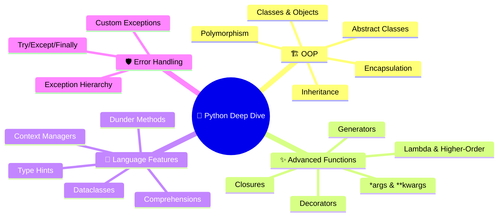
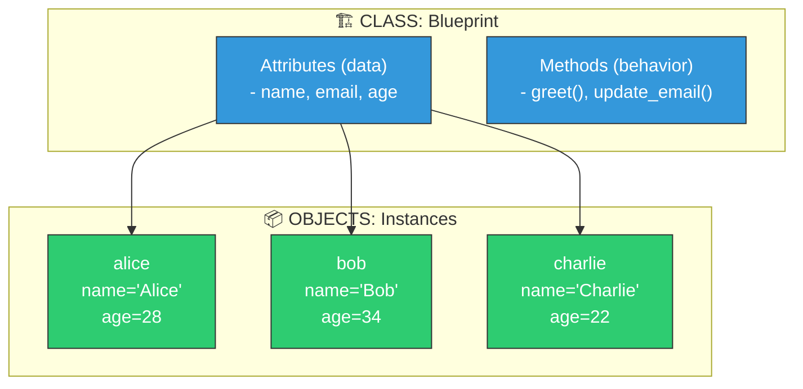
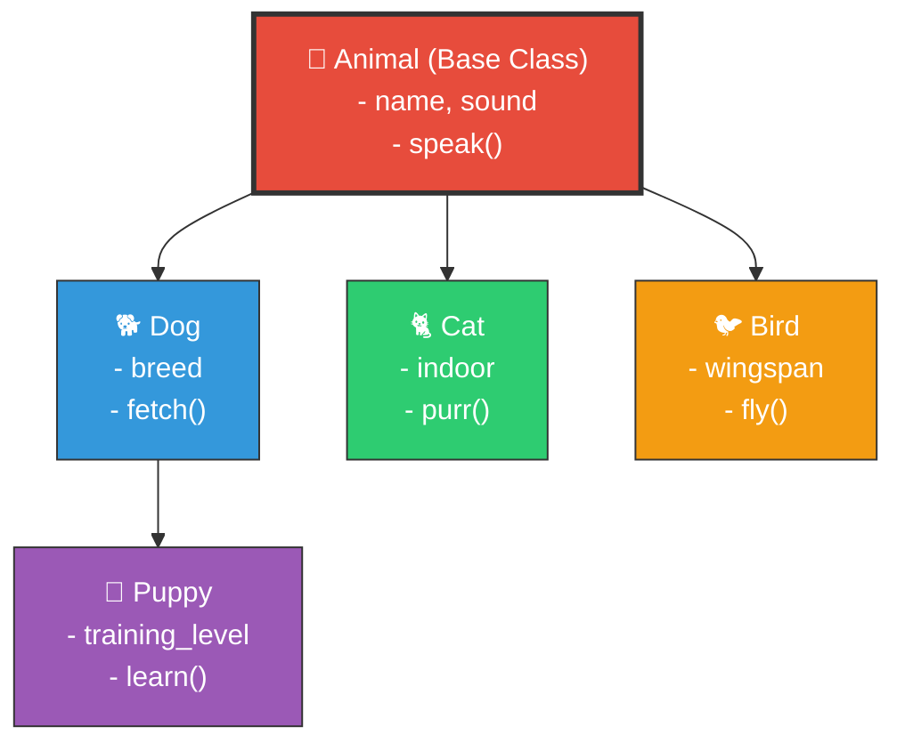
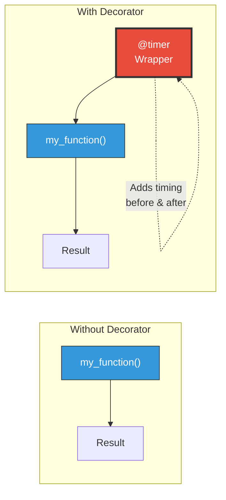
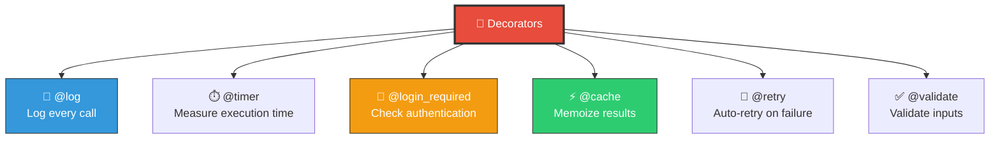
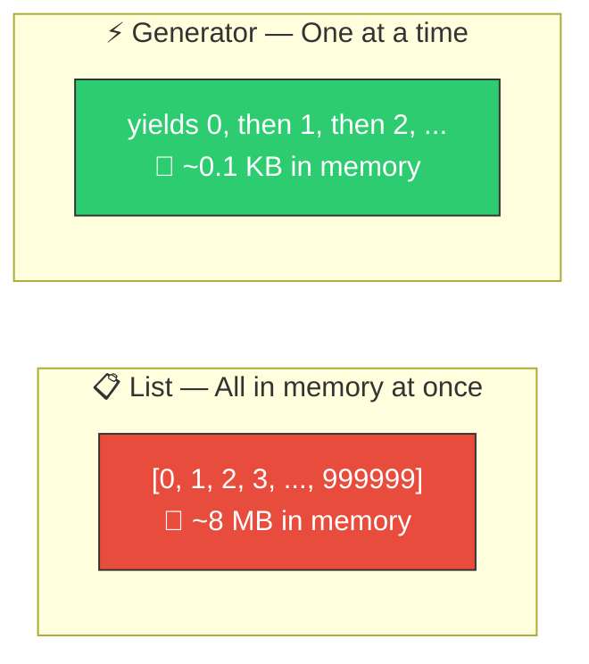
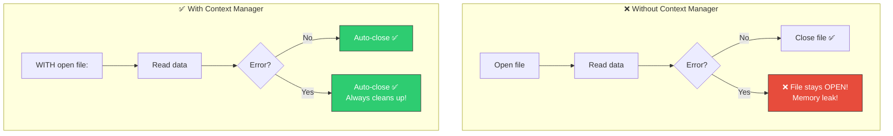
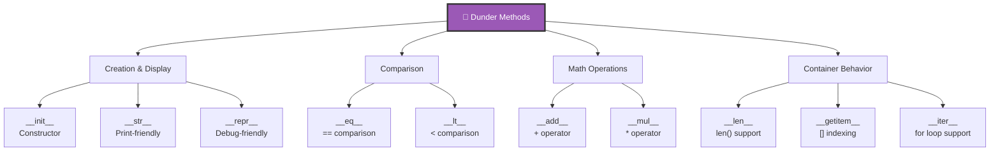
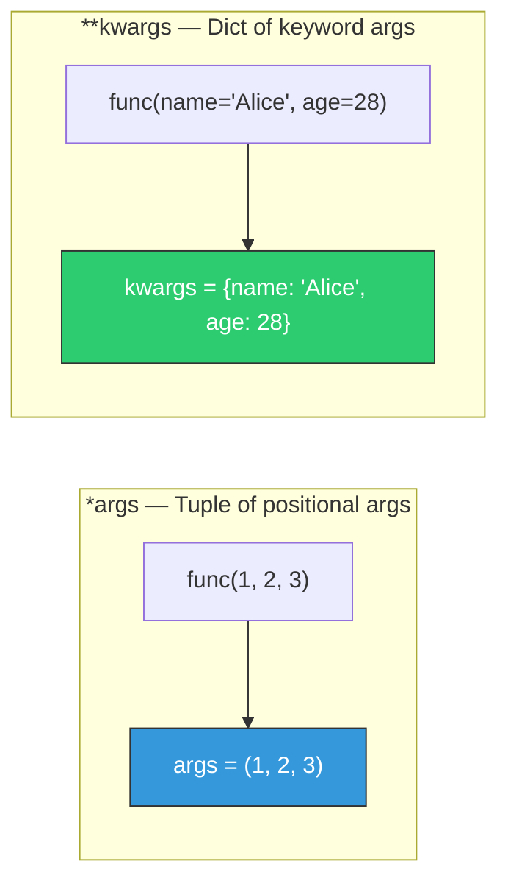
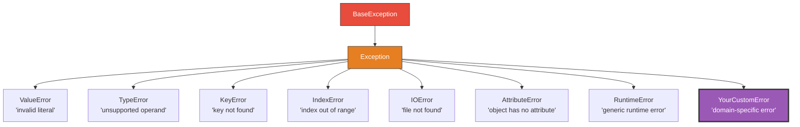

# 📘 Topic 1.5 — Python Deep Dive

> **Why this matters**: Knowing Python syntax is like knowing the alphabet. This topic teaches you to **write poetry**. These advanced features separate junior developers who write code that works from senior developers who write code that's **elegant, maintainable, and fast**.

> **Code Implementation**: See [code.py](./code.py) for runnable Python implementation

---

## 🧠 The Big Picture — What Makes Python Powerful?



---

## 1️⃣ OOP — Object-Oriented Programming

### 🎯 Analogy
> A **class** is a blueprint (like an architect's plan for a house). An **object** is an actual house built from that blueprint. You can build many houses from one blueprint, each with different colors and sizes.

### 📊 Class Structure



### Pseudo Code

```
CLASS User:
    // Constructor — runs when creating a new object
    FUNCTION __init__(self, name, email, age):
        self.name = name
        self.email = email
        self.age = age

    // Method — behavior the object can perform
    FUNCTION greet(self):
        RETURN "Hello, I'm " + self.name

    // Method with logic
    FUNCTION is_adult(self):
        RETURN self.age >= 18

// Create objects from the class
alice = NEW User("Alice", "alice@mail.com", 28)
bob = NEW User("Bob", "bob@mail.com", 34)

PRINT(alice.greet())      // "Hello, I'm Alice"
PRINT(bob.is_adult())     // True
```

### 📊 Inheritance — Building on Top of Existing Classes



### Pseudo Code — Inheritance

```
CLASS Animal:
    FUNCTION __init__(self, name, sound):
        self.name = name
        self.sound = sound

    FUNCTION speak(self):
        RETURN self.name + " says " + self.sound

// Dog INHERITS from Animal — gets all its attributes and methods
CLASS Dog EXTENDS Animal:
    FUNCTION __init__(self, name, breed):
        SUPER().__init__(name, "Woof!")     // Call parent constructor
        self.breed = breed

    FUNCTION fetch(self, item):
        RETURN self.name + " fetches the " + item

// Cat INHERITS from Animal but OVERRIDES speak()
CLASS Cat EXTENDS Animal:
    FUNCTION __init__(self, name, indoor):
        SUPER().__init__(name, "Meow!")
        self.indoor = indoor

    // POLYMORPHISM: Same method name, different behavior
    FUNCTION speak(self):
        IF self.indoor:
            RETURN self.name + " softly meows"
        ELSE:
            RETURN SUPER().speak()          // Use parent's version


dog = NEW Dog("Rex", "Labrador")
cat = NEW Cat("Whiskers", indoor=True)

PRINT(dog.speak())      // "Rex says Woof!"        (inherited from Animal)
PRINT(dog.fetch("ball")) // "Rex fetches the ball"  (Dog's own method)
PRINT(cat.speak())      // "Whiskers softly meows"  (overridden method)
```

### The 4 Pillars of OOP

| Pillar | What It Means | Example |
|--------|--------------|---------|
| **Encapsulation** | Hide internal data, expose only what's needed | Bank account: you can `deposit()` but can't directly change `_balance` |
| **Abstraction** | Hide complex implementation behind simple interface | You call `car.start()` without knowing how the engine works |
| **Inheritance** | Child class gets all parent's features + adds its own | `Dog` inherits `speak()` from `Animal`, adds `fetch()` |
| **Polymorphism** | Same method name, different behavior per class | `dog.speak()` → "Woof!", `cat.speak()` → "Meow!" |

---

## 2️⃣ Decorators — Functions That Modify Functions

### 🎯 Analogy
> A decorator is like **gift wrapping**. The gift (your function) stays the same inside, but the wrapping (decorator) adds something extra on the outside — like logging, timing, or access control.

### 📊 How Decorators Work



### Pseudo Code

```
// A decorator is a function that WRAPS another function
FUNCTION timer_decorator(original_function):

    FUNCTION wrapper(*args, **kwargs):
        start_time = GET_CURRENT_TIME()

        result = original_function(*args, **kwargs)    // Run the original

        end_time = GET_CURRENT_TIME()
        elapsed = end_time - start_time
        PRINT(original_function.name + " took " + elapsed + " seconds")

        RETURN result

    RETURN wrapper


// Using the decorator with @ syntax
@timer_decorator
FUNCTION slow_calculation(n):
    total = 0
    FOR i IN RANGE(n):
        total = total + i
    RETURN total

slow_calculation(1000000)
// Output: "slow_calculation took 0.05 seconds"
// The function itself didn't change — the decorator added timing!


// 🔥 Real-world decorators:
// @login_required    — check if user is authenticated before running
// @cache             — store results so same inputs don't recalculate
// @retry(max=3)      — retry the function up to 3 times if it fails
// @validate_input    — check that inputs are valid before processing
```

### Common Decorator Patterns



---

## 3️⃣ Generators — Lazy Data Streams

### 🎯 Analogy
> A **list** is like a buffet — all food is prepared upfront (uses lots of memory). A **generator** is like a **made-to-order kitchen** — it prepares one dish at a time, only when you ask (saves memory).

### 📊 List vs Generator — Memory Comparison



### Pseudo Code

```
// REGULAR FUNCTION: Creates entire list in memory
FUNCTION get_squares_list(n):
    result = EMPTY_LIST
    FOR i IN RANGE(n):
        APPEND(result, i * i)
    RETURN result                  // Returns ALL at once — uses O(n) memory


// GENERATOR FUNCTION: Yields one item at a time
GENERATOR get_squares_gen(n):
    FOR i IN RANGE(n):
        YIELD i * i                // Pauses here, returns one value
                                   // Resumes when next value is requested


// Using the generator
FOR square IN get_squares_gen(1000000):
    IF square > 100:
        BREAK                      // Stop early — didn't generate all 1M values!
    PRINT(square)

// 🔥 Key insight: Generator with 1 BILLION items uses SAME memory as 10 items
// Because it only holds ONE value at a time


// GENERATOR EXPRESSION (one-liner)
squares = (x * x FOR x IN RANGE(1000000))     // Generator — lazy
squares_list = [x * x FOR x IN RANGE(1000000)] // List — eager, all in memory
```

### When to Use Generators

| Use Generators When... | Use Lists When... |
|-----------------------|-------------------|
| Processing **large/infinite** data streams | You need **random access** (items by index) |
| You only need to iterate **once** | You need to iterate **multiple times** |
| Memory is a concern | You need the **length** upfront |
| Reading large files line by line | Data set is **small** |
| Data pipelines (chaining operations) | You need to **slice** or **reverse** |

---

## 4️⃣ Context Managers — Clean Resource Handling

### 🎯 Analogy
> A context manager is like checking into a **hotel**. When you arrive → room is prepared (setup). When you leave → room is cleaned (cleanup). You don't have to remember to clean up — it happens **automatically**, even if your stay was cut short by an emergency.

### 📊 The Problem Context Managers Solve



### Pseudo Code

```
// ❌ BAD — If read_data crashes, file stays open forever
file = OPEN("data.txt", "read")
data = file.read()
file.close()                        // Might never execute if error above!


// ✅ GOOD — With context manager, file ALWAYS closes
WITH OPEN("data.txt", "read") AS file:
    data = file.read()
// file.close() happens AUTOMATICALLY here, even if error occurred


// 🔥 Creating your own context manager
CLASS DatabaseConnection:
    FUNCTION __enter__(self):
        self.connection = CONNECT_TO_DB("localhost:5432")
        PRINT("Connected to database")
        RETURN self.connection

    FUNCTION __exit__(self, error_type, error_value, traceback):
        self.connection.close()
        PRINT("Disconnected from database")
        // Runs even if there was an error inside the WITH block!

// Usage
WITH NEW DatabaseConnection() AS db:
    results = db.query("SELECT * FROM users")
    // db.close() happens automatically!


// Common context managers:
// WITH open(file)         — auto-close files
// WITH db.transaction()   — auto-commit or rollback
// WITH lock               — auto-release thread locks
// WITH temp_directory()   — auto-delete temp files
```

---

## 5️⃣ Type Hints — Making Code Self-Documenting

### 🎯 Analogy
> Type hints are like **labels on kitchen containers**. Without labels, you have to open each container to see if it's sugar or salt. With labels, you know immediately what's inside.

### Pseudo Code

```
// ❌ Without type hints — what does this function expect and return?
FUNCTION process(data, flag):
    ...

// ✅ With type hints — crystal clear!
FUNCTION process(data: List<String>, flag: Boolean) -> Dictionary<String, Integer>:
    ...

// Common type hints
FUNCTION greet(name: String) -> String:
    RETURN "Hello, " + name

FUNCTION find_user(user_id: Integer) -> Optional<User>:
    // Returns a User or NULL
    ...

FUNCTION get_scores() -> List<Integer>:
    RETURN [95, 87, 92]

FUNCTION get_user_map() -> Dictionary<String, User>:
    RETURN {"alice": alice_user, "bob": bob_user}

// Function that takes a callback
FUNCTION retry(action: Callable, max_attempts: Integer = 3) -> Any:
    ...
```

---

## 6️⃣ Dunder (Magic) Methods — Customizing How Objects Behave

### 🎯 Analogy
> Dunder methods let you teach your objects **how to behave** with built-in operations. Want your custom `Money` object to support `+`? Define `__add__`. Want it to print nicely? Define `__str__`.

### 📊 Most Important Dunder Methods



### Pseudo Code

```
CLASS Money:
    FUNCTION __init__(self, amount, currency):
        self.amount = amount
        self.currency = currency

    // What PRINT shows
    FUNCTION __str__(self):
        RETURN "$" + STRING(self.amount)

    // Debug representation
    FUNCTION __repr__(self):
        RETURN "Money(" + STRING(self.amount) + ", '" + self.currency + "')"

    // Support + operator
    FUNCTION __add__(self, other):
        IF self.currency != other.currency:
            RAISE Error("Cannot add different currencies")
        RETURN NEW Money(self.amount + other.amount, self.currency)

    // Support == comparison
    FUNCTION __eq__(self, other):
        RETURN self.amount == other.amount AND self.currency == other.currency

    // Support < comparison (enables sorting!)
    FUNCTION __lt__(self, other):
        RETURN self.amount < other.amount

    // Support len()
    FUNCTION __len__(self):
        RETURN self.amount


wallet = NEW Money(100, "USD")
tip = NEW Money(15, "USD")

PRINT(wallet)            // "$100"           — uses __str__
PRINT(wallet + tip)      // "$115"           — uses __add__
PRINT(wallet == tip)     // False            — uses __eq__
PRINT(wallet > tip)      // True             — uses __lt__ (inferred)
PRINT(LEN(wallet))       // 100              — uses __len__
```

---

## 7️⃣ *args & **kwargs — Flexible Function Arguments

### 📊 Visual



### Pseudo Code

```
// *args — Accept any number of positional arguments
FUNCTION sum_all(*numbers):
    total = 0
    FOR EACH num IN numbers:
        total = total + num
    RETURN total

sum_all(1, 2, 3)           // 6
sum_all(10, 20, 30, 40)    // 100


// **kwargs — Accept any number of keyword arguments
FUNCTION create_user(**fields):
    FOR EACH key, value IN fields:
        PRINT(key + " = " + value)

create_user(name="Alice", age=28, city="NYC")
// name = Alice
// age = 28
// city = NYC


// Combining both
FUNCTION flexible(required_arg, *args, **kwargs):
    PRINT("Required: " + required_arg)
    PRINT("Extra positional: " + STRING(args))
    PRINT("Extra keyword: " + STRING(kwargs))

flexible("hello", 1, 2, 3, debug=True, verbose=False)
// Required: hello
// Extra positional: (1, 2, 3)
// Extra keyword: {debug: True, verbose: False}
```

---

## 8️⃣ Comprehensions — Elegant Data Transformation

### Pseudo Code

```
// ═══ List Comprehension ═══
// Pattern: [expression FOR item IN iterable IF condition]

numbers = [1, 2, 3, 4, 5, 6, 7, 8, 9, 10]

// Filter even numbers and square them
even_squares = [n * n FOR n IN numbers IF n % 2 == 0]
// Result: [4, 16, 36, 64, 100]

// Equivalent long form:
even_squares = EMPTY_LIST
FOR n IN numbers:
    IF n % 2 == 0:
        APPEND(even_squares, n * n)


// ═══ Dictionary Comprehension ═══
// Pattern: {key: value FOR item IN iterable IF condition}

words = ["hello", "world", "python"]
word_lengths = {word: LENGTH(word) FOR word IN words}
// Result: {"hello": 5, "world": 5, "python": 6}


// ═══ Set Comprehension ═══
// Pattern: {expression FOR item IN iterable}

sentence = "hello world hello python world"
unique_lengths = {LENGTH(word) FOR word IN SPLIT(sentence)}
// Result: {5, 6}  — only unique values


// ═══ Nested Comprehension ═══
matrix = [[1, 2, 3], [4, 5, 6], [7, 8, 9]]
flat = [num FOR row IN matrix FOR num IN row]
// Result: [1, 2, 3, 4, 5, 6, 7, 8, 9]
```

---

## 9️⃣ Error Handling — Graceful Failure

### 📊 Exception Hierarchy



### Pseudo Code

```
// Basic try/except/finally
TRY:
    result = risky_operation()
CATCH ValueError AS error:
    PRINT("Invalid value: " + STRING(error))
CATCH ConnectionError AS error:
    PRINT("Network issue: " + STRING(error))
    retry_later()
CATCH Exception AS error:
    PRINT("Unexpected error: " + STRING(error))
    log_error(error)
FINALLY:
    cleanup()          // ALWAYS runs, even if error occurred


// Custom exceptions — for YOUR domain
CLASS InsufficientFundsError EXTENDS Exception:
    FUNCTION __init__(self, balance, amount):
        self.balance = balance
        self.amount = amount
        message = "Cannot withdraw " + amount + " from balance of " + balance
        SUPER().__init__(message)

CLASS AccountLockedError EXTENDS Exception:
    PASS

// Using custom exceptions
FUNCTION withdraw(account, amount):
    IF account.locked:
        RAISE AccountLockedError("Account is locked")
    IF account.balance < amount:
        RAISE InsufficientFundsError(account.balance, amount)
    account.balance = account.balance - amount

// Catching custom exceptions
TRY:
    withdraw(my_account, 5000)
CATCH InsufficientFundsError AS error:
    PRINT("Not enough money! Balance: " + error.balance)
CATCH AccountLockedError:
    PRINT("Contact support to unlock your account")
```

---

## 🔟 Dataclasses — Less Boilerplate, More Productivity

### 🎯 Analogy
> A dataclass is like a **pre-built form**. Instead of manually creating fields, validation, and display formatting, you just list what data you need and everything else is auto-generated.

### Pseudo Code

```
// ❌ WITHOUT dataclass — lots of boilerplate
CLASS Product:
    FUNCTION __init__(self, name, price, quantity):
        self.name = name
        self.price = price
        self.quantity = quantity

    FUNCTION __repr__(self):
        RETURN "Product(name=" + self.name + ", price=" + self.price + ")"

    FUNCTION __eq__(self, other):
        RETURN self.name == other.name AND self.price == other.price


// ✅ WITH dataclass — auto-generates __init__, __repr__, __eq__
@dataclass
CLASS Product:
    name: String
    price: Float
    quantity: Integer = 0       // Default value

    // Only add methods that have LOGIC
    FUNCTION total_value(self) -> Float:
        RETURN self.price * self.quantity

// That's it! __init__, __repr__, __eq__ are auto-generated
laptop = NEW Product("Laptop", 999.99, 5)
PRINT(laptop)                  // Product(name='Laptop', price=999.99, quantity=5)
PRINT(laptop.total_value())    // 4999.95


// Frozen dataclass — immutable (cannot change after creation)
@dataclass(frozen=True)
CLASS Point:
    x: Float
    y: Float

p = NEW Point(3.0, 4.0)
p.x = 5.0                     // ERROR! Cannot modify frozen dataclass
```

---

## 🏋️ Practice Exercises

### Exercise 1: Design a Class Hierarchy
> Design a class hierarchy for a **payment system**: `Payment` (base), `CreditCardPayment`, `BankTransferPayment`, `CryptoPayment`. Each has `process()` but with different behavior.

### Exercise 2: Build a Decorator
> Create a `@retry(max_attempts=3)` decorator that retries a function if it raises an exception, up to N times with a delay between attempts.

### Exercise 3: Generator Pipeline
> Create a pipeline of generators that: reads lines from a file → filters lines containing "ERROR" → extracts the timestamp → yields formatted results. Process a 1GB log file using only KB of memory.

### Exercise 4: Context Manager
> Create a `Timer` context manager that measures how long a block of code takes:
```
WITH Timer("database query"):
    run_query()
// Output: "database query took 0.234 seconds"
```

### Exercise 5: Dunder Methods
> Create a `Vector` class that supports `+`, `-`, `*` (scalar), `==`, `len()`, and `[]` indexing.

---

## 🎤 Interview Corner

> **Q: "What are decorators and when would you use them?"**
>
> **Great answer**: "A decorator wraps a function to add behavior without modifying the original. I use them for cross-cutting concerns: logging, timing, authentication, caching, input validation. For example, `@login_required` checks auth before the route handler runs."

> **Q: "What's the difference between a list and a generator?"**
>
> **Great answer**: "A list stores all elements in memory at once. A generator computes values lazily — one at a time, on demand. For processing a 10GB file, a list would crash with out-of-memory, but a generator handles it using constant memory by reading line by line."

> **Q: "Explain the 4 pillars of OOP."**
>
> **Great answer**: "Encapsulation hides internal state behind methods. Abstraction simplifies complex systems with clean interfaces. Inheritance lets classes share behavior through parent-child relationships. Polymorphism allows different classes to be treated uniformly through a shared interface — like calling `.area()` on any `Shape` subclass."

---

## ✅ Key Takeaways

| Feature | Remember |
|---------|----------|
| **OOP** | Classes = blueprints. Inheritance = code reuse. Polymorphism = same interface, different behavior. |
| **Decorators** | Wrap functions to add behavior. Use for logging, auth, caching, retry. |
| **Generators** | Lazy iteration. Use for large data. `yield` instead of `return`. |
| **Context Managers** | `WITH` block = auto-cleanup. Use for files, DB connections, locks. |
| **Type Hints** | Self-documenting code. Catches bugs before runtime. |
| **Dunder Methods** | Customize how objects work with `+`, `==`, `[]`, `len()`, `print()`. |
| **Dataclasses** | Auto-generate boilerplate. Use for data-holding classes. |

---

**🎉 Phase 1: Foundations Complete!**

**Next up → [Phase 2: System Design — Topic 1: What Is System Design](../../02-System-Design/2.1-What-Is-System-Design/)**
