# 🏗️ System Design — Topic 1: What Is System Design & Why It Matters

> **Why this matters**: You can write perfect code, but if your system can't handle 1,000 users, you've built nothing. System design is the difference between a **toy project** and a **production system** that serves millions. Every senior developer interview asks this.

> **Code Implementation**: See [code.py](./code.py) for runnable Python simulations

---

## 🧠 What Is System Design?

> System design is the process of defining the **architecture, components, and data flow** of a system to satisfy a set of requirements — at scale.

### 🎯 Analogy
> Building code is like building a **single room**. System design is like planning an **entire city** — roads (networking), power grid (servers), water supply (databases), traffic lights (load balancers), hospitals (backup systems). A single room can be perfect, but if the city plan is bad, everything collapses.

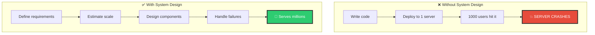

---

## 1️⃣ The Starting Point — Single Server Architecture

> Every system in the world started here. Even Google, Netflix, and Amazon began with ONE server doing EVERYTHING.

### 📊 Single Server Setup

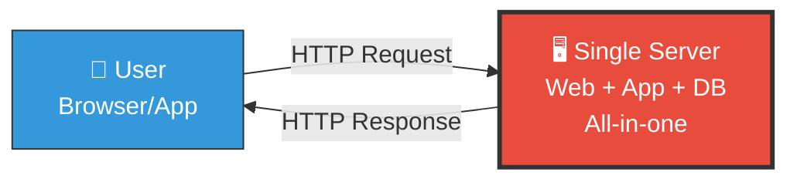

```
WHAT'S ON THIS SINGLE SERVER:
├── 🌐 Web Server (Nginx)          — Serves static files (HTML, CSS, JS)
├── 🐍 Application Server (FastAPI) — Business logic, API endpoints
├── 🗄️ Database (PostgreSQL)        — Stores all data
├── 📦 File Storage                  — User uploads, images
└── ⚡ Cache (in-memory)             — Frequently accessed data

SPECS: 8 CPU cores, 32 GB RAM, 500 GB SSD
CAPACITY: ~100-500 concurrent users
COST: ~$50-200/month
```

### This Works Fine Until...

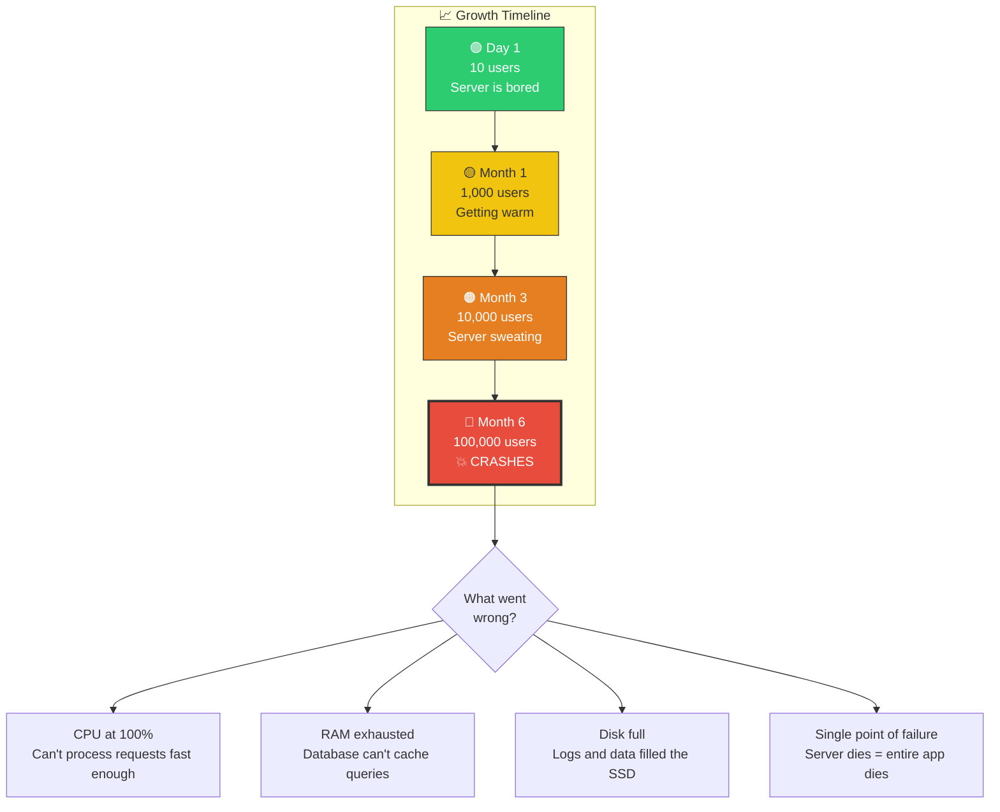

---

## 2️⃣ The Evolution — How Systems Grow

### Stage 1: Separate the Database

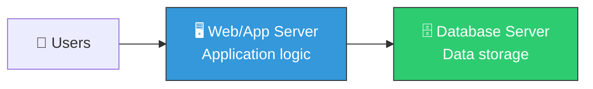

```
WHY SEPARATE?
- Web server and database have DIFFERENT resource needs
- Web server needs: CPU (processing requests)
- Database needs: RAM (caching queries) + Fast disk (I/O)
- Can upgrade each INDEPENDENTLY
- Database crash doesn't kill the web server (and vice versa)
```

### Stage 2: Add a Load Balancer + Multiple Servers

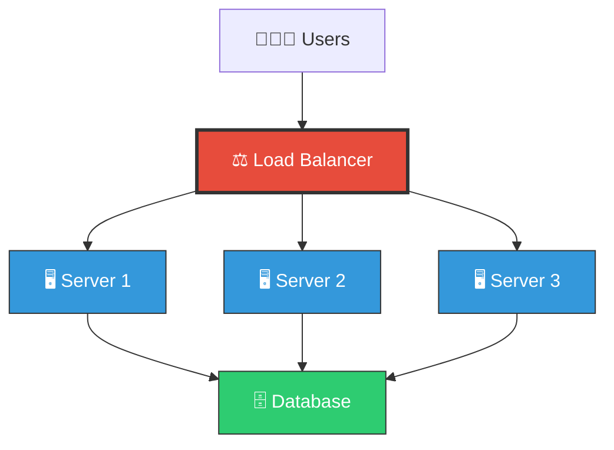

```
WHY MULTIPLE SERVERS?
- Load balancer distributes traffic evenly across servers
- If one server dies, others keep working (no downtime!)
- Add more servers when traffic increases
- Can handle 10x more users
```

### Stage 3: Add Caching

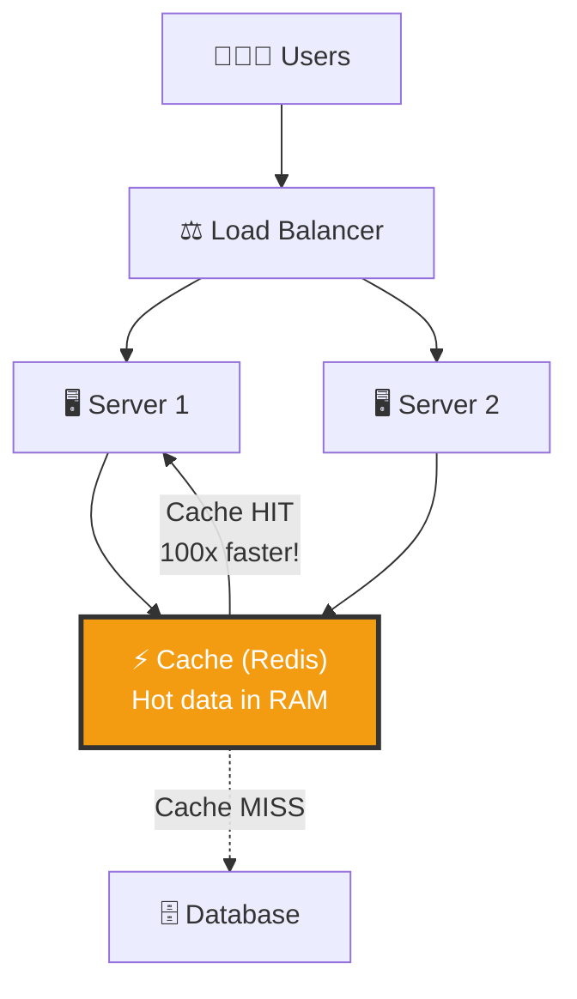

```
WHY CACHE?
- Database reads are SLOW (disk I/O: ~10ms)
- Cache reads are FAST (memory: ~0.1ms) — 100x faster!
- 80% of requests are for the SAME 20% of data (80/20 rule)
- Cache that 20% in memory → 80% of requests become instant
```

### Stage 4: Database Replication

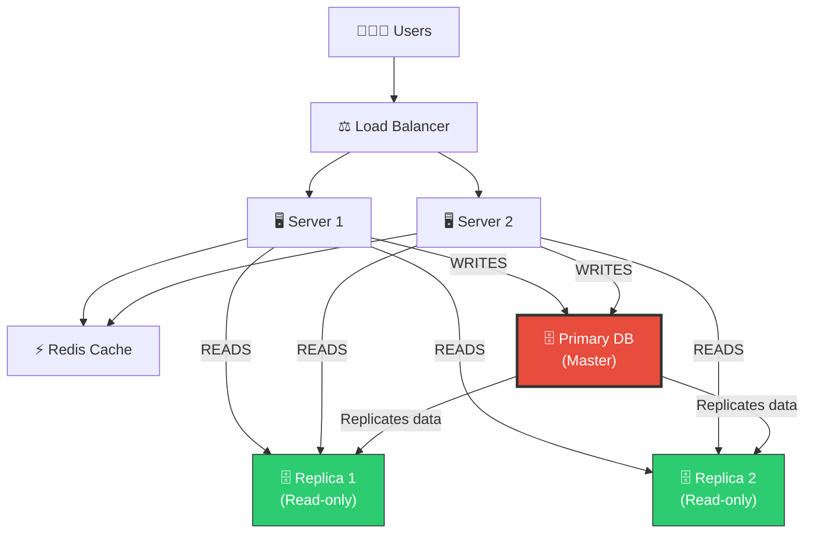

```
WHY REPLICATE?
- Most apps are READ-HEAVY (95% reads, 5% writes)
- Spread reads across multiple replicas
- If primary dies, promote a replica (high availability)
- Replicas can be in different regions (lower latency globally)
```

### Stage 5: The Full Architecture

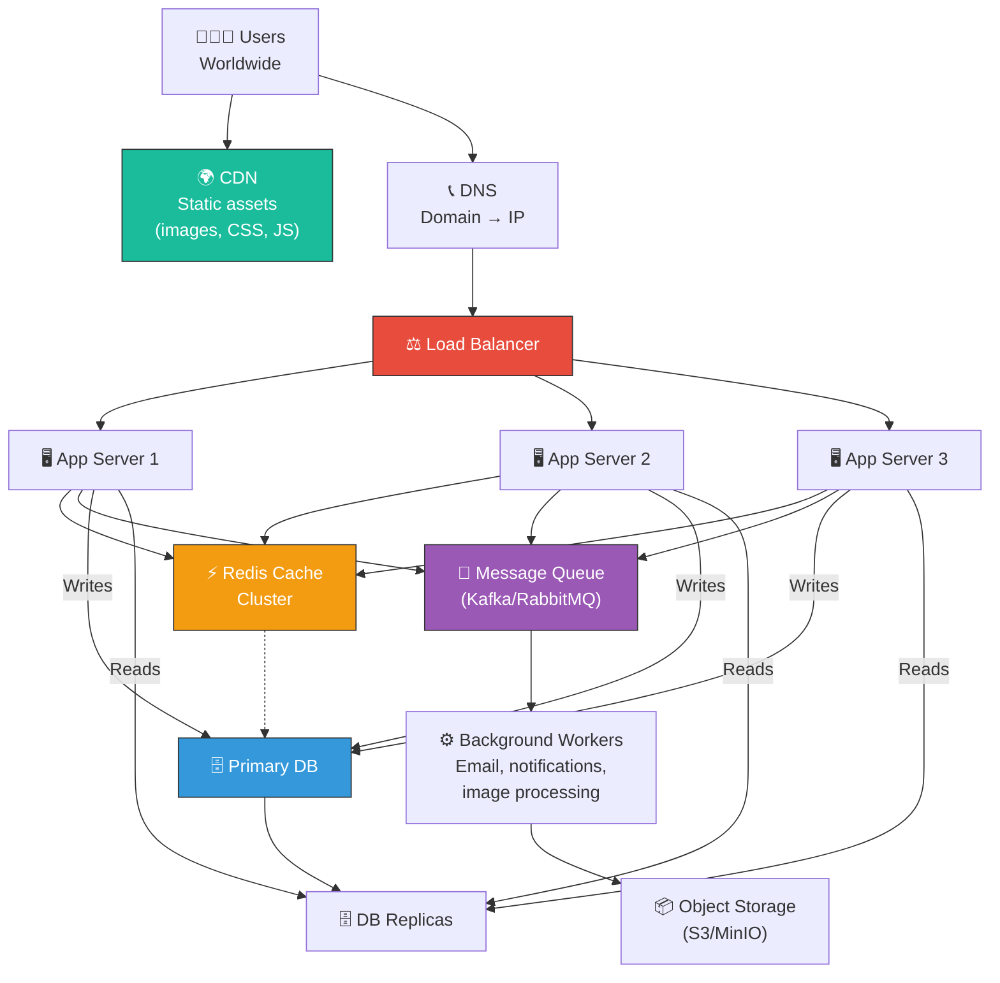

---

## 3️⃣ The Request Lifecycle — What Really Happens

### 📊 Step-by-Step Journey of a Single Request

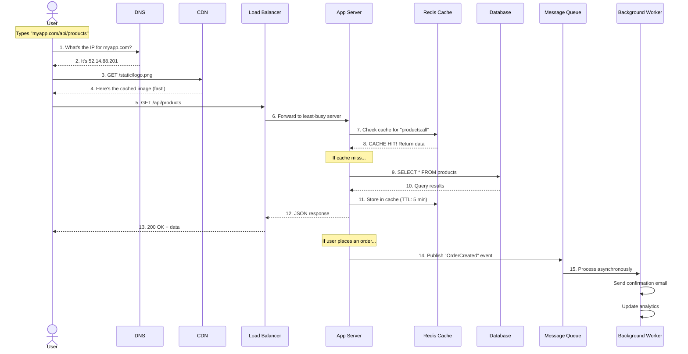

---

## 4️⃣ Latency vs Throughput — The Two Numbers That Matter

### 🎯 Analogy
> - **Latency** = How long it takes ONE car to drive from city A to city B (time per request)
> - **Throughput** = How many cars can travel that road PER HOUR (requests per second)
> - A highway has HIGH throughput (many cars) but SAME latency as a single lane for one car

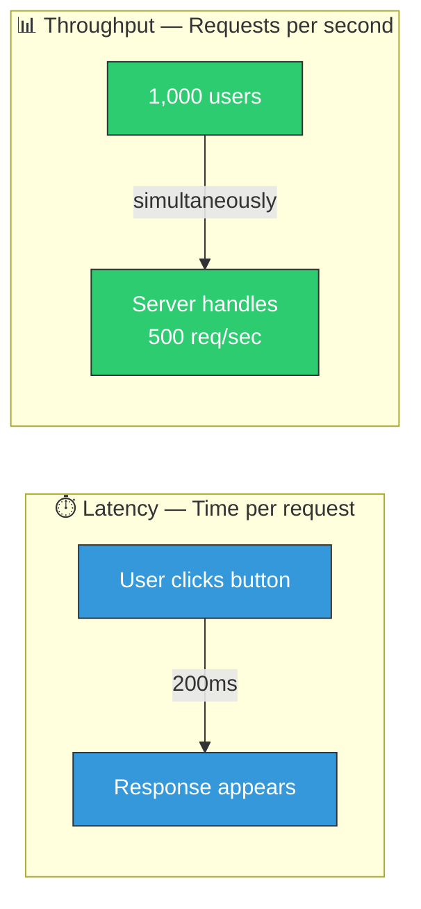

### Latency Targets

| Type | Target | User Experience |
|------|--------|----------------|
| **API response** | < 200ms | Feels instant |
| **Page load** | < 1 second | User stays engaged |
| **Search results** | < 500ms | Feels responsive |
| **Video start** | < 2 seconds | User doesn't leave |
| **Checkout** | < 3 seconds | User completes purchase |
| > 10 seconds | ❌ | User leaves your site |

---

## 5️⃣ Latency Numbers Every Programmer Should Know

> These numbers help you make **informed design decisions**. If you know RAM is 100,000x faster than network, you'll cache aggressively.

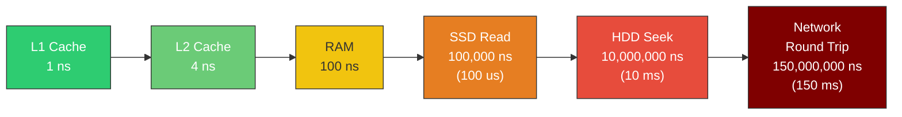

### The Full Table

| Operation | Time | Relative | Notes |
|-----------|------|----------|-------|
| L1 cache read | 1 ns | 1x | CPU's personal notepad |
| L2 cache read | 4 ns | 4x | CPU's desk drawer |
| RAM read | 100 ns | 100x | Your computer's memory |
| SSD random read | 100 us | 100,000x | Fast disk |
| HDD seek | 10 ms | 10,000,000x | Slow spinning disk |
| Same datacenter round trip | 0.5 ms | 500,000x | Server to server |
| California → Netherlands | 150 ms | 150,000,000x | Across the world |

### What This Means for Design

```
RULE OF THUMB:
- If data is in RAM cache   → 0.1 ms response
- If data is in SSD/DB      → 5-10 ms response
- If data is across network → 50-200 ms response

CONCLUSION:
→ Cache everything you can in RAM (Redis/Memcached)
→ Keep servers close to users (CDN, edge computing)
→ Minimize network round trips (batch requests)
→ Use SSDs, not HDDs for databases
```

---

## 6️⃣ Back-of-Envelope Estimation — The Math Behind System Design

### 🎯 Analogy
> You don't need exact numbers. You need to know if you need **1 server or 1,000**. Estimation is like asking "Do I need a bicycle or a fleet of trucks?" — not "exactly how many bolts does the truck need?"

### The Key Numbers to Know

```
STORAGE:
  1 character (ASCII)  = 1 byte
  1 character (UTF-8)  = 1-4 bytes
  Average tweet         = ~300 bytes
  Average photo         = ~2 MB
  Average video (1 min) = ~50 MB
  1 KB = 1,000 bytes
  1 MB = 1,000 KB
  1 GB = 1,000 MB
  1 TB = 1,000 GB

TIME:
  1 day    = 86,400 seconds    (~100,000 for easy math)
  1 month  = 2,500,000 seconds (~2.5 million)
  1 year   = 30,000,000 seconds (~30 million)

TYPICAL SERVER:
  QPS (Queries Per Second) for web server: ~1,000-10,000
  QPS for database: ~5,000-10,000 (with indexing)
  QPS for Redis: ~100,000+
```

### Worked Example: Design Storage for Twitter

```
GIVEN:
- 500 million users
- 200 million daily active users (DAU)
- Each user posts 2 tweets/day on average
- Each tweet: 280 chars = ~300 bytes (with metadata)
- 10% of tweets have images (~2 MB each)
- Data retention: 5 years

STEP 1: Daily tweets
  200M users × 2 tweets = 400 million tweets/day

STEP 2: Daily storage (text only)
  400M × 300 bytes = 120 GB/day

STEP 3: Daily storage (with images)
  400M × 10% = 40M images/day
  40M × 2 MB = 80 TB/day

STEP 4: Total text storage (5 years)
  120 GB × 365 × 5 = ~219 TB

STEP 5: Total image storage (5 years)
  80 TB × 365 × 5 = ~146 PB (PETABYTES!)

STEP 6: QPS (Queries Per Second)
  400M tweets / 86,400 seconds = ~4,600 tweets/second (writes)
  Reads are ~10x writes = ~46,000 reads/second

CONCLUSION:
  - Need distributed storage (single server can't hold 146 PB)
  - Need database sharding (4,600 writes/sec is heavy)
  - Need CDN for images (146 PB can't be on one server)
  - Need caching for reads (46,000 reads/sec needs Redis)
```

---

## 7️⃣ Functional vs Non-Functional Requirements

### 📊 Every System Design Starts Here

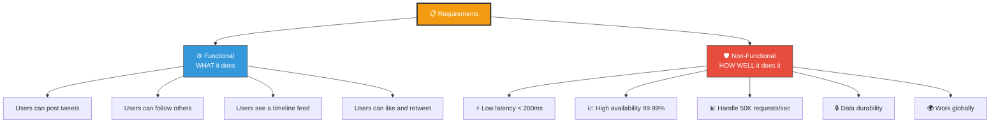

### Non-Functional Requirements Cheat Sheet

| Requirement | What It Means | Typical Target |
|-------------|--------------|----------------|
| **Availability** | System is up and accessible | 99.9% (8.7 hrs downtime/year) to 99.99% (52 min/year) |
| **Scalability** | Handle growing load | 10x current load without redesign |
| **Latency** | Speed of response | < 200ms for APIs |
| **Throughput** | Requests handled per second | Depends on use case |
| **Durability** | Data is never lost | 99.999999999% (11 nines) for S3 |
| **Consistency** | All users see the same data | Depends — strong vs eventual |
| **Fault Tolerance** | Works even when components fail | No single point of failure |

### Availability Math

```
AVAILABILITY LEVELS:
  99%     = "two nines"   = 3.65 days downtime/year
  99.9%   = "three nines" = 8.7 hours downtime/year
  99.99%  = "four nines"  = 52 minutes downtime/year
  99.999% = "five nines"  = 5 minutes downtime/year

  Most web apps target 99.9% to 99.99%
  Banks/healthcare aim for 99.999%

HOW TO CALCULATE:
  If system has 2 components in SERIES (both must work):
    Availability = A1 × A2
    Example: 99.9% × 99.9% = 99.8% (worse!)

  If system has 2 components in PARALLEL (either works):
    Availability = 1 - (1 - A1) × (1 - A2)
    Example: 1 - (0.001 × 0.001) = 99.9999% (much better!)

  LESSON: Add REDUNDANCY (parallel components) to increase availability
```

---

## 🏋️ Practice Exercises

### Exercise 1: Trace the Request
> Your friend types `https://myshop.com/products` in their browser. Describe every component the request passes through, from DNS to the final response.

### Exercise 2: Estimate — Instagram Storage
> Instagram has 2 billion users, 500 million DAU. Each DAU uploads 1 photo/day (average 3 MB). How much storage does Instagram need per day? Per year? How many hard drives?

### Exercise 3: Identify the Bottleneck
> Your single-server app has: 4 CPU cores, 16 GB RAM, 100 GB SSD. At 5,000 concurrent users, CPU is at 95%, RAM at 40%, disk at 20%. What should you do first? Scale vertically or horizontally?

### Exercise 4: Design the Evolution
> You're building a food delivery app. Draw the architecture at:
> - Stage 1: 100 users (MVP)
> - Stage 2: 10,000 users
> - Stage 3: 1,000,000 users
> What components do you add at each stage and why?

---

## 🎤 Interview Corner

> **Q: "How would you design a system for millions of users?"**
>
> **Great answer**: "I'd start by understanding the requirements — what the system does and the scale needed. Then I'd estimate QPS and storage. I'd separate web servers from databases, add a load balancer for horizontal scaling, introduce caching for read-heavy workloads, use database replication for availability, and add message queues for async processing. Each component addresses a specific bottleneck."

> **Q: "What's the difference between latency and throughput?"**
>
> **Great answer**: "Latency is the time for one request to complete — like how long one car takes to drive across a bridge. Throughput is how many requests can be handled per second — like how many cars can cross the bridge per hour. You can have low latency but low throughput (narrow bridge), or high throughput with moderate latency (wide highway)."

---

## ✅ Key Takeaways

| Concept | Remember |
|---------|----------|
| **System design** | Architecture decisions for handling scale & failure |
| **Single → distributed** | Every system evolves: 1 server → separate DB → LB + replicas → caching → queues |
| **Latency numbers** | RAM: 100ns, SSD: 100us, Network: 150ms — cache everything possible |
| **Back-of-envelope** | Estimate QPS, storage, bandwidth BEFORE designing |
| **Requirements** | Always clarify functional (WHAT) + non-functional (HOW WELL) first |
| **Availability** | Redundancy (parallel components) increases availability |
| **80/20 rule** | 80% of requests hit 20% of data → cache that 20% |

---

**Next up → [Topic 2: Scalability — Vertical vs Horizontal](../2.2-Scalability/)**
