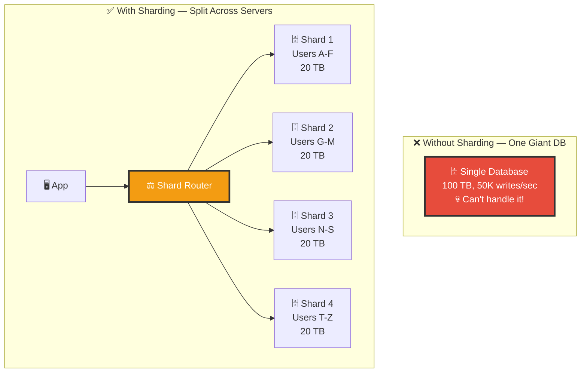
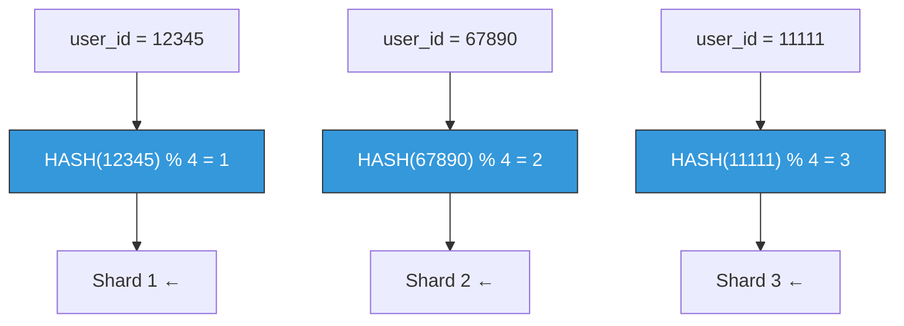
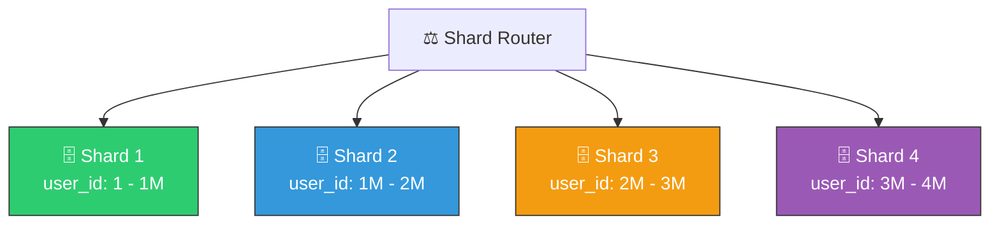
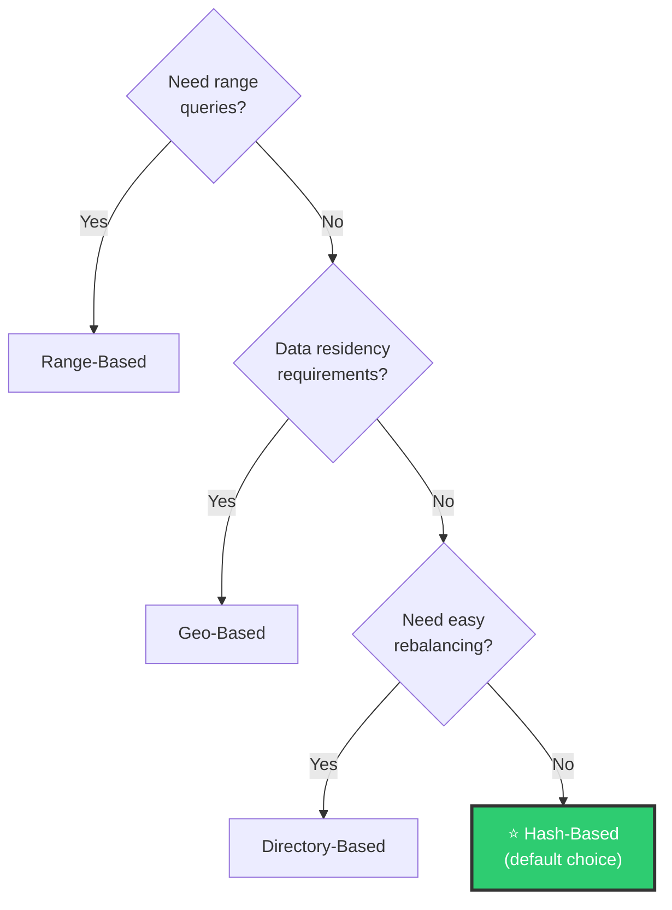
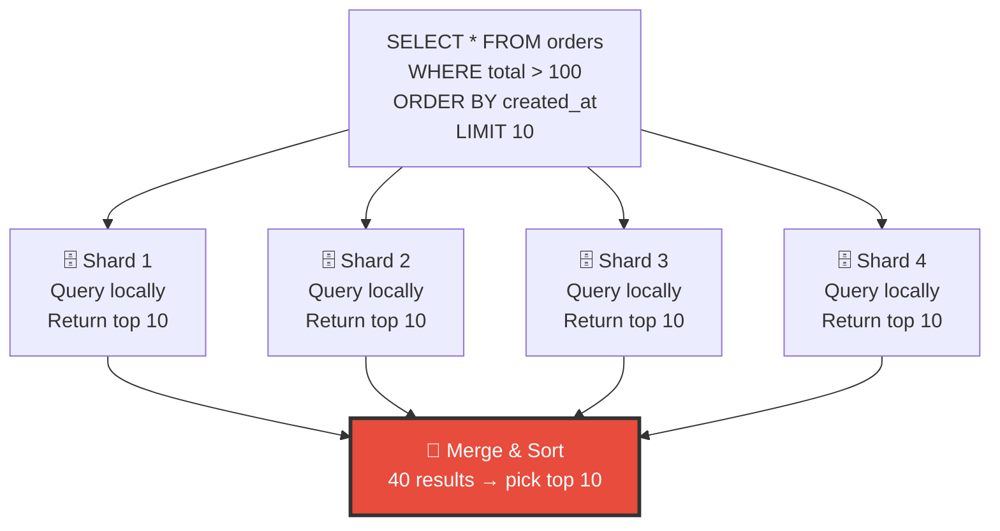
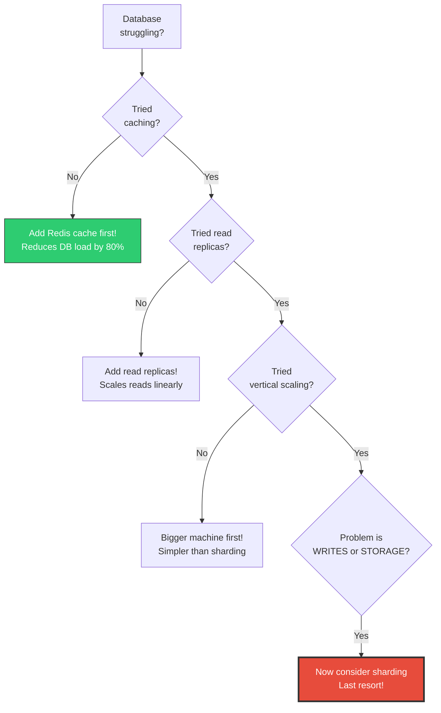

# 🏗️ System Design — Topic 10: Database Sharding & Partitioning

> **Why this matters**: Replication scales **reads**, but what happens when your single primary can't handle all the **writes**? Or when your data grows to **tens of terabytes** and one server can't store it all? That's when you need sharding — splitting your database across multiple servers. It's the most powerful and most dangerous scaling technique.

> **Code Implementation**: See [code.py](./code.py) for runnable Python simulations

---

## 🧠 What Is Sharding?

> Sharding means splitting a large database into **smaller pieces (shards)**, where each shard lives on a **different server** and holds a **subset of the data**.

### 🎯 Analogy
> Imagine a **library with 1 million books** on one floor. The librarian is overwhelmed. Solution: Split the library into **5 floors** — Floor A-E has authors A-E, Floor F-J has F-J, etc. Each floor has its own librarian. Now 5 librarians work in parallel!



### Partitioning vs Sharding

```
PARTITIONING: Splitting data within ONE server
  Table 'orders' → partition by year
  Same server, different files on disk
  PostgreSQL supports this natively

SHARDING: Splitting data across MULTIPLE servers
  Table 'orders' → shard by user_id
  Different servers, different networks
  Application must handle routing

  Sharding = distributed partitioning
```

---

## 1️⃣ Sharding Strategies

### Strategy 1: Hash-Based Sharding (Most Common)



### Pseudo Code

```
// HASH-BASED SHARDING
FUNCTION get_shard(key, num_shards):
    shard_id = HASH(key) % num_shards
    RETURN shards[shard_id]

// Example: 4 shards
get_shard("user_123", 4)   →  HASH("user_123") % 4 = 2  → Shard 2
get_shard("user_456", 4)   →  HASH("user_456") % 4 = 0  → Shard 0

PROS:
  ✅ Even distribution (good hash = uniform spread)
  ✅ Simple to implement
  ✅ Deterministic — always know which shard has the data

CONS:
  ❌ RESHARDING IS PAINFUL — Adding a shard changes ALL mappings!
     HASH("user_123") % 4 = 2  →  With 5 shards: % 5 = 3
     Most data must be moved! (see Consistent Hashing in Topic 14)
  ❌ Range queries across shards are expensive
```

### Strategy 2: Range-Based Sharding



```
// RANGE-BASED SHARDING
FUNCTION get_shard(user_id):
    IF user_id <= 1_000_000:    RETURN shard_1
    IF user_id <= 2_000_000:    RETURN shard_2
    IF user_id <= 3_000_000:    RETURN shard_3
    ELSE:                       RETURN shard_4

PROS:
  ✅ Range queries are efficient (all data in sequence on one shard)
  ✅ Easy to understand and implement
  ✅ Easy to add new shards (just extend the range)

CONS:
  ❌ HOTSPOTS — If user_id is sequential, newest shard gets ALL writes!
     Users 1-1M: old, inactive → Shard 1 is idle
     Users 3M-4M: new, active → Shard 4 is OVERLOADED
  ❌ Uneven data distribution
```

### Strategy 3: Directory-Based Sharding

```
// DIRECTORY-BASED — A lookup table maps keys to shards

SHARD_DIRECTORY:
    user_123  →  Shard 2
    user_456  →  Shard 1
    user_789  →  Shard 3
    ...

FUNCTION get_shard(key):
    RETURN DIRECTORY.lookup(key)

PROS:
  ✅ Maximum flexibility — any key can go anywhere
  ✅ Easy to rebalance — just update the directory
  ✅ No hotspot problem

CONS:
  ❌ Directory is a single point of failure
  ❌ Extra latency — must query directory before every DB query
  ❌ Directory itself must be distributed for scale
```

### Strategy 4: Geo-Based Sharding

```
// GEO-BASED — Shard by geographic region

FUNCTION get_shard(user):
    IF user.country IN ["US", "CA", "MX"]:
        RETURN shard_americas
    IF user.country IN ["GB", "DE", "FR", ...]:
        RETURN shard_europe
    IF user.country IN ["JP", "KR", "IN", ...]:
        RETURN shard_asia

PROS:
  ✅ Data close to users = low latency
  ✅ Compliance with data residency laws (GDPR)

CONS:
  ❌ Uneven distribution (US shard >> others)
  ❌ Cross-region queries are slow
```

### Choosing the Right Strategy



---

## 2️⃣ Choosing the Shard Key — The Most Critical Decision

```
THE SHARD KEY determines which shard holds each row.
Pick wrong → hotspots, cross-shard queries, pain.

GOOD SHARD KEYS:
  ✅ user_id     — Data for one user is on one shard
  ✅ tenant_id   — Multi-tenant SaaS: each company on one shard
  ✅ order_id    — Even distribution with hash sharding

BAD SHARD KEYS:
  ❌ created_at  — All new data goes to ONE shard (hotspot!)
  ❌ country     — Huge skew (US shard 10x bigger than others)
  ❌ status      — Only a few values = very uneven distribution

COMPOUND SHARD KEYS:
  (tenant_id, user_id) — Data for one tenant together,
                         users within tenant spread out

THE GOLDEN RULE:
  "Queries should hit ONE shard, not all shards."
  If you shard by user_id, then:
    SELECT * FROM orders WHERE user_id = 123  → ONE shard (fast!)
    SELECT * FROM orders WHERE product = 'X'  → ALL shards (slow!)
```

---

## 3️⃣ The Hard Problems of Sharding

### Problem 1: Cross-Shard Queries



```
CROSS-SHARD QUERIES ARE EXPENSIVE:
  Must query ALL shards → collect results → merge → sort → return
  4 shards = 4x network calls = 4x latency
  Aggregations (COUNT, SUM, AVG) require scatter-gather

MITIGATION:
  Design schema so most queries hit ONE shard
  Denormalize data to avoid JOINs across shards
  Use separate analytics DB (ClickHouse) for cross-shard queries
```

### Problem 2: Cross-Shard Transactions

```
SCENARIO: Transfer $100 from User A (Shard 1) to User B (Shard 3)

WITHOUT DISTRIBUTED TX:
  Shard 1: Deduct $100 from A  ✅
  Shard 3: Add $100 to B      ❌ FAILS!
  Result: $100 disappeared! A lost money, B didn't get it.

WITH 2-PHASE COMMIT (2PC):
  Phase 1 (PREPARE):
    Coordinator → Shard 1: "Can you deduct $100?"  → "Yes"
    Coordinator → Shard 3: "Can you add $100?"     → "Yes"

  Phase 2 (COMMIT):
    Coordinator → Shard 1: "COMMIT"  ✅
    Coordinator → Shard 3: "COMMIT"  ✅

  If ANY shard says "No" in Phase 1 → ABORT everything

PROBLEMS WITH 2PC:
  ❌ Slow (2 round trips to every shard)
  ❌ Coordinator is single point of failure
  ❌ Locks held during entire process

ALTERNATIVE: Saga pattern (used in microservices)
  Execute each step, if one fails → run compensating transactions
  Deduct from A → Add to B (fails) → Refund A
```

### Problem 3: Resharding (Adding More Shards)

```
ADDING A 5TH SHARD TO 4 EXISTING SHARDS:

  With hash sharding: HASH(key) % 4  →  HASH(key) % 5
  Most keys change shard! ~80% of data must be MOVED.

  THIS IS A NIGHTMARE:
    1. Copy data to new shard mapping
    2. Keep serving reads/writes during migration
    3. Handle data that changes DURING migration
    4. Switch over atomically
    5. Pray nothing breaks

  SOLUTION: Consistent Hashing (Topic 14)
    Adding a shard only moves ~1/N of the data
    4→5 shards = only ~20% of data moves (vs 80%!)
```

---

## 4️⃣ When to Shard (and When NOT To)



```
TRY THESE FIRST (in order):
  1. Optimize queries & add indexes     (free!)
  2. Add caching (Redis)                (80% read reduction)
  3. Add read replicas                  (linear read scaling)
  4. Vertical scaling (bigger machine)  (simple, no code changes)
  5. Archive old data                   (reduce table size)
  6. THEN shard                         (last resort!)

SHARDING IS WORTH IT WHEN:
  ✅ Single server can't hold all data (>1-5 TB)
  ✅ Write throughput exceeds single server capacity
  ✅ You've exhausted all simpler options
  ✅ You have engineering resources to maintain it

COMPANIES THAT DON'T SHARD:
  Stack Overflow:   1 SQL Server handles ALL of Stack Overflow
  GitHub:           Vertical scaling + read replicas (mostly)
  Basecamp:         Single MySQL server for millions of users
```

---

## 5️⃣ How Real Companies Shard

```
INSTAGRAM (PostgreSQL):
  Shard key: user_id
  Strategy: Hash-based (user_id % num_shards)
  Shards: Thousands of PostgreSQL instances
  Each shard has: 1 primary + 12 replicas
  Lesson: Started with 1 DB, sharded when they hit 25M users

DISCORD (Cassandra → ScyllaDB):
  Shard key: channel_id
  Strategy: Consistent hashing (built into Cassandra)
  Why: Messages are always queried by channel
  Lesson: Moved from Cassandra to ScyllaDB for better performance

UBER (MySQL):
  Shard key: city_id (geo-based)
  Strategy: Custom "Schemaless" layer on top of MySQL
  Why: Trip data is naturally city-scoped
  Lesson: Built custom sharding middleware

VITESS (YouTube's sharding solution):
  Open-source MySQL sharding proxy
  Handles: Routing, resharding, schema changes
  Used by: YouTube, Slack, GitHub, Square
```

---

## 🏋️ Practice Exercises

### Exercise 1: Choose the Shard Key
> For each application, pick the best shard key and justify:
> - a) E-commerce platform (orders, products, users)
> - b) Multi-tenant SaaS (each company has their own data)
> - c) Social media (posts, comments, likes)
> - d) Ride-sharing app (trips, drivers, riders)
> - e) Chat application (messages, conversations)

### Exercise 2: Shard the Database
> Your user table has 500 million rows, 50 TB of data, and 20,000 writes/sec. Each server handles 5 TB and 5,000 writes/sec. How many shards? Which strategy? Show the routing logic.

### Exercise 3: The Cross-Shard Problem
> You sharded by user_id but now need to run: "Find the top 10 most ordered products last month." This requires scanning ALL shards. Design two solutions to make this query fast.

---

## 🎤 Interview Corner

> **Q: "What is database sharding?"**
>
> **Great answer**: "Sharding is horizontally partitioning a database across multiple servers, where each shard holds a subset of the data. For example, users A-M on Shard 1 and N-Z on Shard 2. It's used when a single server can't handle the data volume or write throughput. The key decisions are the shard key — usually user_id or tenant_id — and the strategy — hash-based for even distribution or range-based for range queries. The main challenges are cross-shard queries, distributed transactions, and resharding."

> **Q: "When would you NOT shard?"**
>
> **Great answer**: "Sharding should be a last resort because it adds enormous complexity — cross-shard JOINs, distributed transactions, resharding nightmares. I'd first optimize queries and indexes, add caching with Redis to reduce read load by 80%, add read replicas for read scaling, and try vertical scaling. Stack Overflow serves millions of users on a single SQL Server. Only when data exceeds what one server can hold or write throughput is the bottleneck would I consider sharding."

---

## ✅ Key Takeaways

| Concept | Remember |
|---------|----------|
| **Sharding** | Split data across multiple servers for write scaling + storage |
| **Hash-based** ⭐ | `HASH(key) % N` — even distribution, hard to reshard |
| **Range-based** | Sequential ranges — good for range queries, hotspot risk |
| **Shard key** | Most critical decision — usually user_id or tenant_id |
| **Golden rule** | Queries should hit ONE shard, not scatter across all |
| **Cross-shard** | JOINs and transactions across shards are VERY expensive |
| **Resharding** | Adding shards moves ~80% of data — use consistent hashing |
| **Last resort** | Try caching → replicas → vertical scaling BEFORE sharding |

---

**Next up → [Topic 11: Message Queues & Async Processing](../2.11-Message-Queues/)**
