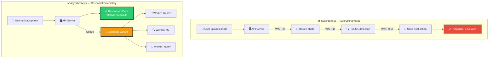
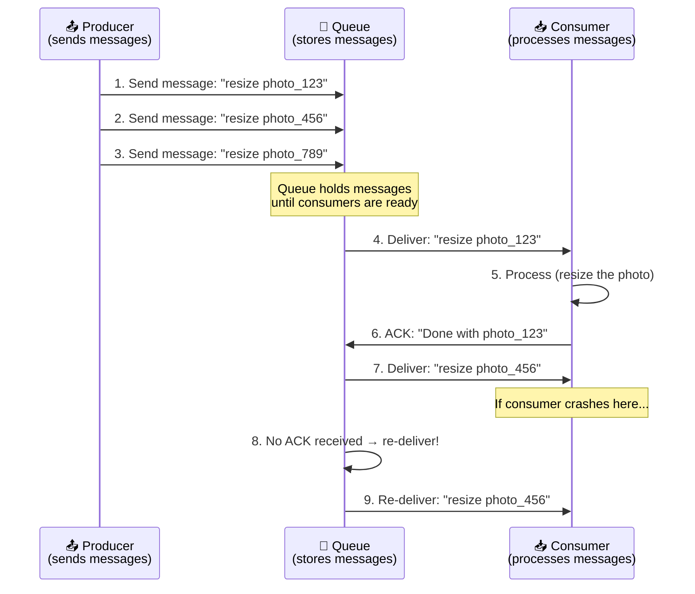
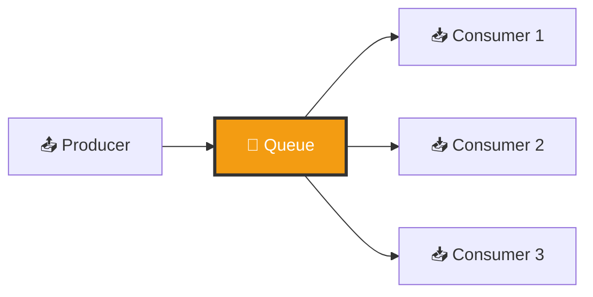
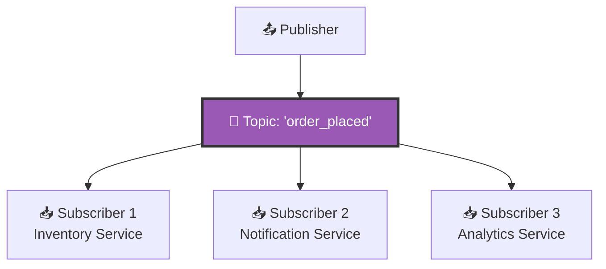
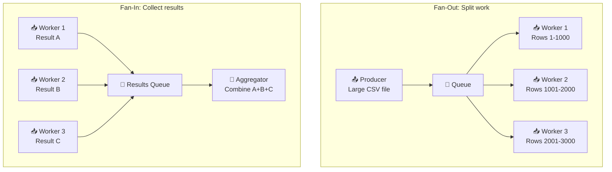
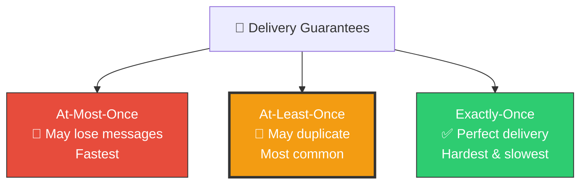
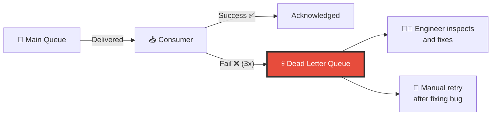
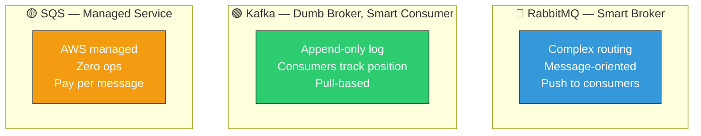
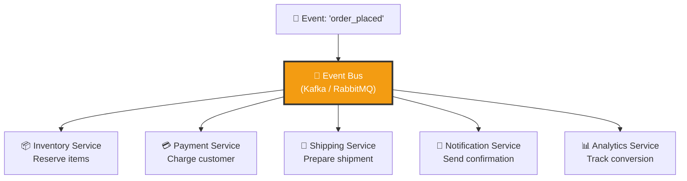

# 🏗️ System Design — Topic 11: Message Queues & Async Processing

> **Why this matters**: Without message queues, every service calls every other service **directly and waits**. One slow service → everything is slow. One crashed service → everything crashes. Message queues **decouple** services, making systems resilient, scalable, and fast. Every company at scale uses them — Uber processes **1 trillion+ messages/day** through Kafka.

> **Code Implementation**: See [code.py](./code.py) for runnable Python simulations

---

## 🧠 Synchronous vs Asynchronous — Why Queues Exist

### 🎯 Analogy
> - **Sync** = calling someone on the phone. You WAIT until they answer and finish talking.
> - **Async** = sending a text message. You send it and move on. They reply when they can.



```
SYNC: User waits 3.5 seconds for EVERYTHING to finish
ASYNC: User waits 50ms, gets immediate response
       Heavy work happens in background via queue

RESULT:
  User experience: 70x faster response!
  System resilience: If ML service is down, photos still upload
  Scalability: Add more workers when queue backs up
```

---

## 1️⃣ How Message Queues Work



### Pseudo Code — Producer & Consumer

```
// PRODUCER — Sends work to the queue
FUNCTION handle_photo_upload(user_id, photo):
    // Save photo to storage immediately
    photo_url = STORAGE.save(photo)

    // Send async tasks to queue
    QUEUE.publish("photo_tasks", {
        type: "resize",
        photo_url: photo_url,
        sizes: [150, 300, 600, 1200]
    })

    QUEUE.publish("photo_tasks", {
        type: "detect_faces",
        photo_url: photo_url,
        user_id: user_id
    })

    QUEUE.publish("notifications", {
        type: "photo_uploaded",
        user_id: user_id
    })

    RETURN "Upload successful!"   // Return immediately!


// CONSUMER — Processes work from the queue
FUNCTION photo_worker():
    WHILE TRUE:
        message = QUEUE.consume("photo_tasks")

        TRY:
            IF message.type == "resize":
                resize_photo(message.photo_url, message.sizes)
            ELSE IF message.type == "detect_faces":
                detect_faces(message.photo_url)

            QUEUE.acknowledge(message)    // Tell queue: "Done!"

        CATCH error:
            QUEUE.reject(message)         // Tell queue: "Failed, retry!"
            LOG_ERROR(error)
```

---

## 2️⃣ Queue Patterns

### Pattern 1: Point-to-Point (Work Queue)



```
Each message is delivered to EXACTLY ONE consumer.
Multiple consumers compete for messages (load balancing).

Use cases:
  - Background jobs (resize images, send emails)
  - Task distribution across workers
  - Order processing pipeline
```

### Pattern 2: Pub/Sub (Publish-Subscribe)



```
Each message is delivered to ALL subscribers.
One event triggers multiple independent actions.

Use cases:
  - Event-driven architecture
  - "Order placed" → update inventory + send email + log analytics
  - Real-time data pipelines
```

### Pattern 3: Fan-Out / Fan-In



---

## 3️⃣ Message Delivery Guarantees



| Guarantee | How It Works | Risk | Use Case |
|-----------|-------------|------|----------|
| **At-Most-Once** | Send and forget, no retry | Lost messages | Metrics, logs (losing one is OK) |
| **At-Least-Once** ⭐ | Retry until ACK received | Duplicate processing | Most use cases (make consumers idempotent) |
| **Exactly-Once** | Dedup + transactions | Complex, slow | Financial transactions, billing |

### Pseudo Code — Idempotent Consumer

```
// AT-LEAST-ONCE: Message might be delivered twice!
// Consumer MUST be idempotent (safe to process twice)

// BAD — Not idempotent (double-charges the user!)
FUNCTION process_payment(message):
    charge_credit_card(message.user_id, message.amount)
    // If this runs twice → user charged TWICE! 💀

// GOOD — Idempotent (safe to process multiple times)
FUNCTION process_payment(message):
    // Check if already processed using idempotency key
    IF ALREADY_PROCESSED(message.idempotency_key):
        LOG("Duplicate message, skipping")
        RETURN

    charge_credit_card(message.user_id, message.amount)
    MARK_PROCESSED(message.idempotency_key)
    // If this runs twice → second run skips (no double charge!)
```

---

## 4️⃣ Dead Letter Queue (DLQ) — When Messages Fail



```
DEAD LETTER QUEUE:
  When a message fails processing N times (e.g., 3 retries),
  it's moved to a "dead letter queue" instead of being lost.

  This prevents:
    - Infinite retry loops (poison messages)
    - Blocking the main queue
    - Silent data loss

  What to do with DLQ messages:
    1. Alert the engineering team
    2. Fix the bug that caused failure
    3. Re-process the messages from DLQ
    4. If truly invalid → discard with logging
```

---

## 5️⃣ Backpressure — When Producers Are Too Fast

```
THE PROBLEM:
  Producer sends 10,000 messages/sec
  Consumer processes 1,000 messages/sec
  Queue grows by 9,000 messages every second!
  Eventually: Out of memory → queue crashes → data loss

SOLUTIONS:

1. ADD MORE CONSUMERS (horizontal scaling)
   10 consumers × 1,000/sec = 10,000/sec ← matches producer!

2. RATE LIMIT THE PRODUCER
   Producer: "Queue is 80% full → slow down my sends"
   Prevents queue overflow

3. DROP LOW-PRIORITY MESSAGES
   Queue full? Drop analytics events, keep payment events.
   "It's OK to lose some metrics, never lose an order"

4. BUFFERING WITH DISK (Kafka approach)
   Kafka writes to disk, not just memory
   Can hold BILLIONS of messages (limited by disk, not RAM)
```

---

## 6️⃣ Kafka vs RabbitMQ vs SQS



| Feature | RabbitMQ | Kafka | SQS |
|---------|----------|-------|-----|
| **Model** | Message queue | Distributed log | Managed queue |
| **Delivery** | Push (broker → consumer) | Pull (consumer → broker) | Pull |
| **Ordering** | Per-queue | Per-partition | Best-effort (FIFO available) |
| **Throughput** | ~50K msg/sec | ~1M msg/sec | ~3K msg/sec |
| **Retention** | Until consumed | Configurable (days/weeks) | 14 days max |
| **Replay** | No (message deleted after ACK) | ✅ Yes (consumers can rewind) | No |
| **Routing** | Complex (exchanges, bindings) | Simple (topics, partitions) | Simple (queue URL) |
| **Ops burden** | Medium (self-managed) | High (ZooKeeper, clusters) | Zero (AWS managed) |
| **Best for** | Task queues, RPC | Event streaming, logs, analytics | Simple async jobs on AWS |

### When to Use Which

```
USE RABBITMQ WHEN:
  ✅ Complex routing (route by headers, patterns)
  ✅ Task distribution (background jobs)
  ✅ RPC pattern (request-reply)
  ✅ Message-level acknowledgment

USE KAFKA WHEN:
  ✅ High throughput (millions of events/sec)
  ✅ Event sourcing / event streaming
  ✅ Log aggregation from many services
  ✅ Need to REPLAY old messages
  ✅ Data pipeline (source → processing → sink)

USE SQS WHEN:
  ✅ Already on AWS
  ✅ Simple job queue, don't want to manage infrastructure
  ✅ Low throughput, simple use case
  ✅ Zero operational burden
```

---

## 7️⃣ Real-World Use Cases

```
UBER:
  Order placed → Queue → Dispatch driver
                       → Charge payment
                       → Send receipt
                       → Update analytics
  Queue: Apache Kafka (1 trillion+ messages/day!)

NETFLIX:
  User starts video → Queue → Update "continue watching"
                            → Log viewing event
                            → Update recommendations
                            → Measure quality metrics
  Queue: Apache Kafka

INSTAGRAM:
  Photo uploaded → Queue → Generate thumbnails (6 sizes)
                        → Run content moderation
                        → Update feed for followers
                        → Send push notification
  Queue: RabbitMQ + Celery (Python task queue)

STRIPE:
  Payment received → Queue → Process payment
                           → Send webhook to merchant
                           → Generate receipt
                           → Update fraud model
  Queue: SQS + custom pipeline
```

---

## 8️⃣ Event-Driven Architecture



```
EVENT-DRIVEN vs DIRECT CALLS:

DIRECT (tight coupling):
  Order Service → calls Inventory API → calls Payment API → calls...
  If Payment is down → Order fails!
  If you add Analytics → must modify Order Service code!

EVENT-DRIVEN (loose coupling):
  Order Service → publishes "order_placed" event
  Every service subscribes independently
  Payment down? Event stays in queue, processed later.
  Add Analytics? Just subscribe — zero changes to Order Service!

BENEFITS:
  ✅ Services are independent (loose coupling)
  ✅ Add new consumers without changing producer
  ✅ Resilient — messages survive service outages
  ✅ Scalable — add consumers as load increases
```

---

## 🏋️ Practice Exercises

### Exercise 1: Design the Queue Architecture
> Your e-commerce checkout does: validate order, charge payment, reserve inventory, send confirmation email, update analytics. Design the message queue architecture. Which tasks are sync? Which are async?

### Exercise 2: Choose the Queue
> For each use case, pick RabbitMQ, Kafka, or SQS and justify:
> - a) Processing 100K log events/second from 50 microservices
> - b) Sending email notifications for a small SaaS app
> - c) Real-time activity feed (like Instagram)
> - d) Background image processing (resize, watermark)

### Exercise 3: Handle Failures
> A payment message fails processing. Design the retry strategy: How many retries? What delay between retries (exponential backoff)? When to send to DLQ? How to alert the team?

---

## 🎤 Interview Corner

> **Q: "Why use a message queue?"**
>
> **Great answer**: "Message queues decouple producers from consumers, providing three key benefits. First, resilience — if a downstream service is down, messages wait in the queue instead of causing failures. Second, scalability — you can add more consumers to handle load spikes without changing the producer. Third, performance — the API responds immediately after queuing the work, instead of waiting for all processing to complete. For example, when a user uploads a photo, we return success in 50ms and queue the resize, moderation, and notification tasks for background processing."

> **Q: "Kafka vs RabbitMQ?"**
>
> **Great answer**: "Kafka is a distributed log optimized for high-throughput event streaming — it can handle millions of messages per second, supports message replay, and retains data for configurable periods. RabbitMQ is a traditional message broker optimized for complex routing and task distribution with per-message acknowledgment. I'd use Kafka for event sourcing, log aggregation, and data pipelines. I'd use RabbitMQ for background job processing, RPC patterns, and when complex routing logic is needed."

---

## ✅ Key Takeaways

| Concept | Remember |
|---------|----------|
| **Why queues** | Decouple services, handle failures, async processing |
| **Point-to-point** | Each message → ONE consumer (task distribution) |
| **Pub/Sub** | Each message → ALL subscribers (event broadcasting) |
| **At-least-once** ⭐ | Most common guarantee — make consumers idempotent |
| **Dead Letter Queue** | Failed messages go here after N retries — don't lose them |
| **Backpressure** | Add consumers, rate-limit producers, or drop low-priority |
| **Kafka** | High throughput, event streaming, replay capability |
| **RabbitMQ** | Complex routing, task queues, message-level ACK |
| **Event-driven** | Loose coupling — services communicate through events, not direct calls |

---

**Next up → [Topic 12: API Design & Protocols](../2.12-API-Design/)**
