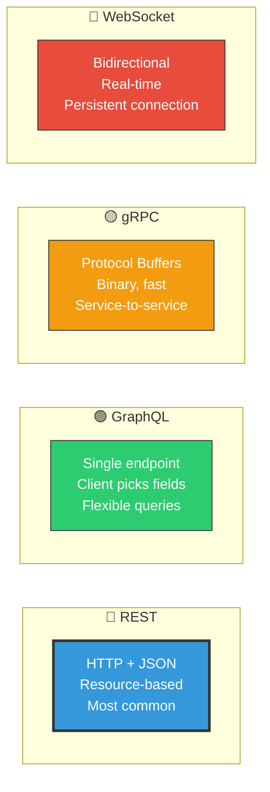
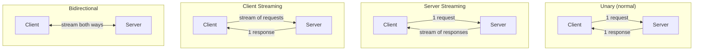
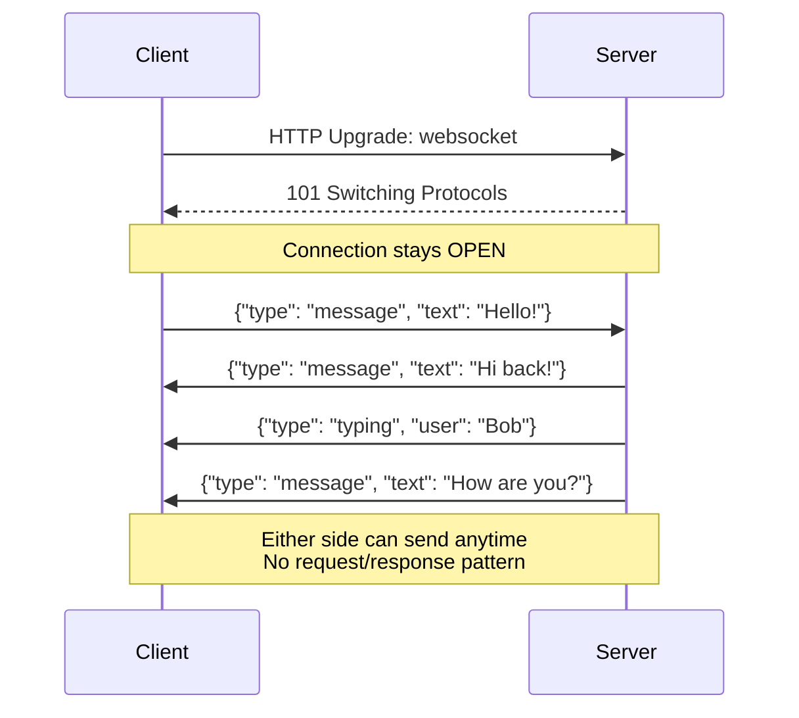
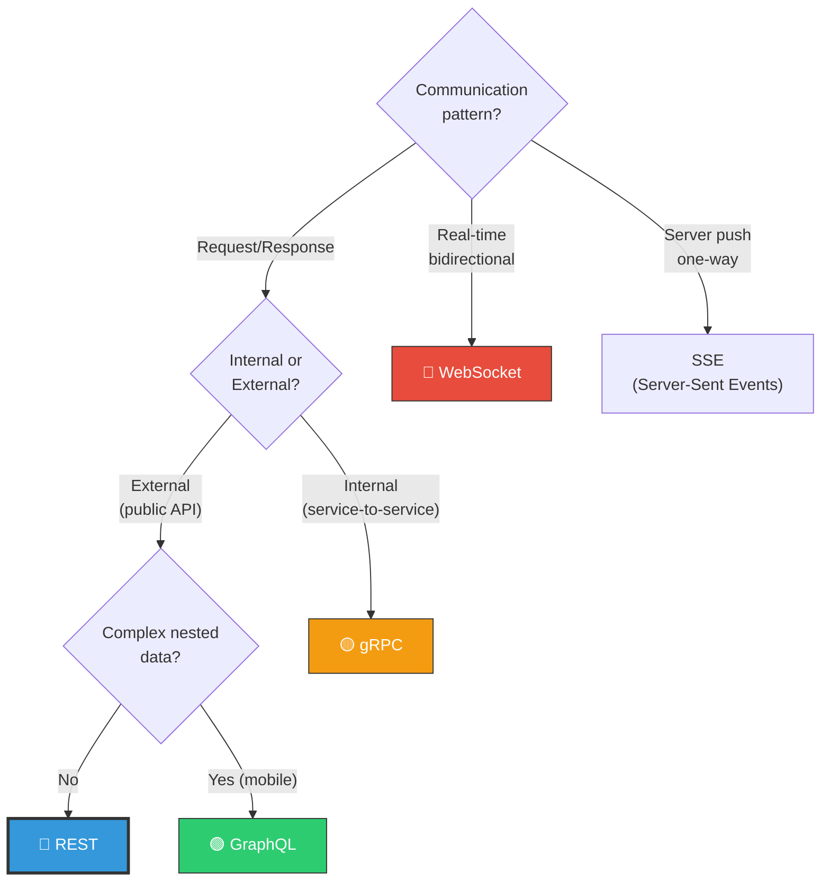
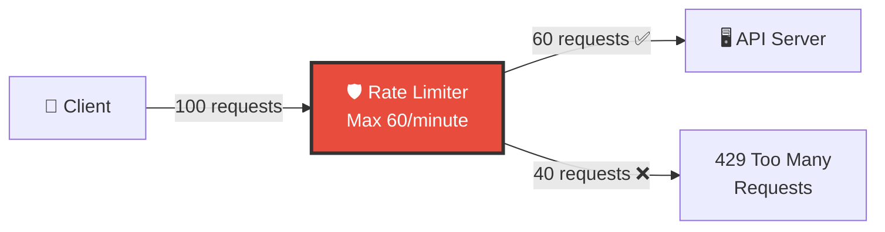
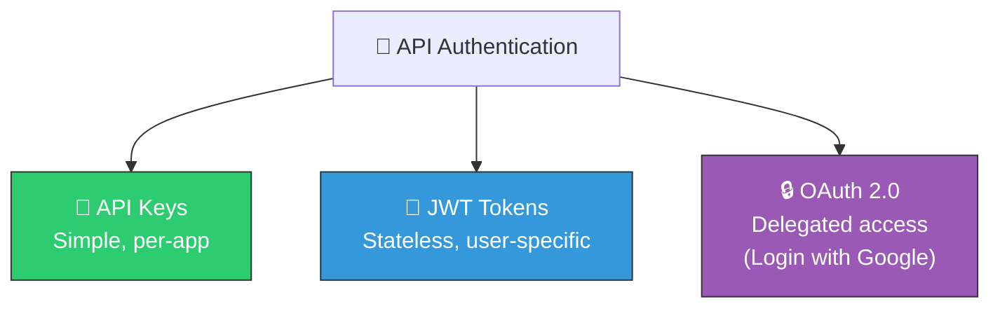

# 🏗️ System Design — Topic 12: API Design & Protocols

> **Why this matters**: APIs are the **contracts** between services. A poorly designed API leads to confused developers, breaking changes, security holes, and performance problems. Every system design interview expects you to design clean APIs. And choosing the wrong protocol (REST vs GraphQL vs gRPC) can cost months of refactoring.

> **Code Implementation**: See [code.py](./code.py) for runnable Python simulations

---

## 🧠 What Is an API?

> An API (Application Programming Interface) is a **contract** that defines how two pieces of software communicate — what you can ask for, how to ask, and what you'll get back.

### 🎯 Analogy
> An API is like a **restaurant menu**. You don't go into the kitchen and cook. You look at the menu (API documentation), place an order (request), and receive your dish (response). The menu defines what's available, in what format, and what you'll get.



---

## 1️⃣ REST API Design — The Standard

### REST Principles

```
REST = Representational State Transfer

CORE PRINCIPLES:
  1. RESOURCES — Everything is a resource (user, order, product)
  2. HTTP METHODS — Use the right verb for the right action
  3. STATELESS — Each request contains all info needed
  4. UNIFORM INTERFACE — Consistent URL patterns
  5. JSON — Standard data format
```

### HTTP Methods — Use the Right Verb

| Method | Action | Idempotent? | Example |
|--------|--------|-------------|---------|
| **GET** | Read resource | ✅ Yes | `GET /users/123` |
| **POST** | Create resource | ❌ No | `POST /users` |
| **PUT** | Replace resource entirely | ✅ Yes | `PUT /users/123` |
| **PATCH** | Partial update | ❌ No | `PATCH /users/123` |
| **DELETE** | Remove resource | ✅ Yes | `DELETE /users/123` |

### URL Design — Good vs Bad

```
GOOD (resource-based, noun-based):
  GET    /users                 ← List all users
  GET    /users/123             ← Get user 123
  POST   /users                 ← Create new user
  PUT    /users/123             ← Update user 123
  DELETE /users/123             ← Delete user 123
  GET    /users/123/orders      ← Get user 123's orders
  GET    /users/123/orders/456  ← Get order 456 of user 123

BAD (verb-based, inconsistent):
  GET    /getUser?id=123        ← Don't put verbs in URLs!
  POST   /createUser            ← POST already means "create"
  GET    /getAllUserOrders/123   ← Nested resources instead
  POST   /deleteUser/123        ← Use DELETE method instead
```

### HTTP Status Codes — Respond Correctly

```
2xx SUCCESS:
  200 OK            — Request succeeded (GET, PUT, PATCH)
  201 Created       — Resource created (POST)
  204 No Content    — Success, nothing to return (DELETE)

3xx REDIRECT:
  301 Moved Permanently  — Resource moved (URL changed)
  304 Not Modified       — Cached version is still valid

4xx CLIENT ERROR:
  400 Bad Request    — Invalid input (missing fields, wrong format)
  401 Unauthorized   — Not authenticated (no token or invalid token)
  403 Forbidden      — Authenticated but not authorized (no permission)
  404 Not Found      — Resource doesn't exist
  409 Conflict       — Conflict (duplicate email, version mismatch)
  422 Unprocessable  — Valid syntax but semantically wrong
  429 Too Many Requests — Rate limited!

5xx SERVER ERROR:
  500 Internal Server Error — Bug on server
  502 Bad Gateway           — Upstream service failed
  503 Service Unavailable   — Server overloaded or in maintenance
  504 Gateway Timeout       — Upstream service too slow
```

### Pseudo Code — Clean REST API

```
// WELL-DESIGNED REST API

// LIST with filtering, sorting, pagination
GET /api/v1/products?category=electronics&sort=-price&page=2&limit=20

RESPONSE 200:
{
    "data": [
        {"id": 1, "name": "Laptop", "price": 999.99, "category": "electronics"},
        {"id": 2, "name": "Phone", "price": 699.99, "category": "electronics"}
    ],
    "pagination": {
        "page": 2,
        "limit": 20,
        "total": 150,
        "total_pages": 8,
        "next": "/api/v1/products?page=3&limit=20",
        "prev": "/api/v1/products?page=1&limit=20"
    }
}


// CREATE with validation
POST /api/v1/products
Body: {"name": "Tablet", "price": 499.99, "category": "electronics"}

RESPONSE 201:
{
    "data": {"id": 3, "name": "Tablet", "price": 499.99, ...},
    "message": "Product created successfully"
}


// ERROR response (consistent format!)
RESPONSE 400:
{
    "error": {
        "code": "VALIDATION_ERROR",
        "message": "Invalid input",
        "details": [
            {"field": "price", "message": "Price must be positive"},
            {"field": "name", "message": "Name is required"}
        ]
    }
}
```

---

## 2️⃣ GraphQL — Query What You Need

### The Problem REST Has

```
REST: Over-fetching and Under-fetching

OVER-FETCHING:
  GET /users/123
  Returns: {id, name, email, phone, address, bio, avatar, settings, ...}
  You only needed: {name, avatar}
  Wasted bandwidth on 8 unused fields!

UNDER-FETCHING:
  Need: user name + their posts + each post's comments
  REST requires 3 separate requests:
    GET /users/123
    GET /users/123/posts
    GET /posts/456/comments (for EACH post!)
  N+1 query problem!

GRAPHQL SOLVES BOTH:
  One request, get exactly what you need.
```

### GraphQL in Action

```
// GRAPHQL — Single request, exact data needed

QUERY:
{
  user(id: 123) {
    name
    avatar
    posts(last: 5) {
      title
      likes
      comments(first: 3) {
        text
        author { name }
      }
    }
  }
}

RESPONSE:
{
  "data": {
    "user": {
      "name": "Alice",
      "avatar": "https://...",
      "posts": [
        {
          "title": "Hello World",
          "likes": 42,
          "comments": [
            {"text": "Great post!", "author": {"name": "Bob"}}
          ]
        }
      ]
    }
  }
}

// ONE request → user + posts + comments + comment authors
// REST would need 4+ separate API calls!
```

### REST vs GraphQL

| Feature | REST | GraphQL |
|---------|------|---------|
| **Endpoints** | Many (`/users`, `/posts`, ...) | One (`/graphql`) |
| **Data fetching** | Fixed response shape | Client chooses fields |
| **Over-fetching** | ❌ Common | ✅ Eliminated |
| **Under-fetching** | ❌ N+1 problem | ✅ Single query |
| **Caching** | ✅ Easy (HTTP caching by URL) | ❌ Complex (POST requests) |
| **File uploads** | ✅ Easy | ❌ Requires workarounds |
| **Learning curve** | Low | Medium |
| **Best for** | Simple CRUD, public APIs | Mobile apps, complex nested data |

---

## 3️⃣ gRPC — High-Performance Service-to-Service

```
gRPC = Google Remote Procedure Call

KEY FEATURES:
  - Uses Protocol Buffers (binary, not JSON)
  - HTTP/2 (multiplexing, streaming)
  - Code generation (client/server stubs auto-generated)
  - 5-10x faster than REST for internal services
```

### Pseudo Code — gRPC Definition

```
// PROTOCOL BUFFER — Define the service contract
// File: user_service.proto

SERVICE UserService:
    RPC GetUser(GetUserRequest) → UserResponse
    RPC CreateUser(CreateUserRequest) → UserResponse
    RPC ListUsers(ListUsersRequest) → STREAM UserResponse  // streaming!

MESSAGE GetUserRequest:
    int32 user_id = 1

MESSAGE UserResponse:
    int32 id = 1
    string name = 2
    string email = 3

// After compilation, you get auto-generated client code:
// client = UserServiceClient(channel)
// user = client.GetUser(GetUserRequest(user_id=123))
// print(user.name)  ← Typed, auto-complete in IDE!
```

### gRPC Streaming Patterns



---

## 4️⃣ WebSocket — Real-Time Bidirectional



```
WHEN TO USE WEBSOCKET:
  ✅ Chat applications (WhatsApp, Slack)
  ✅ Live notifications
  ✅ Real-time dashboards (stock tickers)
  ✅ Collaborative editing (Google Docs)
  ✅ Multiplayer games

WHEN NOT TO USE:
  ❌ Simple CRUD operations (use REST)
  ❌ Infrequent updates (use polling or SSE)
  ❌ Stateless operations
```

---

## 5️⃣ The Protocol Decision Framework



---

## 6️⃣ API Pagination — Don't Return 1 Million Rows

### Three Approaches

```
1. OFFSET-BASED (simplest, worst for large datasets)
   GET /products?page=5&limit=20
   SQL: SELECT * FROM products LIMIT 20 OFFSET 80

   Problem: OFFSET 1,000,000 scans 1M rows then skips them!
   Use for: Small datasets, admin panels

2. CURSOR-BASED (best for infinite scroll) ⭐
   GET /products?cursor=eyJpZCI6MTAwfQ&limit=20
   SQL: SELECT * FROM products WHERE id > 100 LIMIT 20

   Cursor = encoded last-seen ID
   Uses index → fast regardless of position!
   Use for: Social media feeds, chat history, large datasets

3. KEYSET-BASED (best for sorted data)
   GET /products?after_price=29.99&after_id=500&limit=20
   SQL: SELECT * FROM products
        WHERE (price, id) > (29.99, 500)
        ORDER BY price, id LIMIT 20

   Use for: Sorted listings, leaderboards
```

---

## 7️⃣ Rate Limiting — Protect Your API



### Common Algorithms

```
1. TOKEN BUCKET (most common)
   Bucket holds N tokens, refills at rate R
   Each request consumes 1 token
   Empty bucket → reject request

2. SLIDING WINDOW
   Count requests in last 60 seconds
   More accurate than fixed windows

3. FIXED WINDOW
   Count requests per minute (reset at :00)
   Simple but has burst problem at window boundaries

RATE LIMIT HEADERS (tell client their limits):
  X-RateLimit-Limit: 60          ← Max requests per window
  X-RateLimit-Remaining: 42      ← Requests left
  X-RateLimit-Reset: 1609459200  ← When limit resets (Unix timestamp)
  Retry-After: 30                ← Seconds to wait (on 429)
```

---

## 8️⃣ API Versioning — Don't Break Your Clients

```
3 STRATEGIES:

1. URL PATH (most common, clearest)
   GET /api/v1/users/123
   GET /api/v2/users/123

2. HEADER-BASED
   GET /api/users/123
   Header: Accept: application/vnd.myapp.v2+json

3. QUERY PARAMETER
   GET /api/users/123?version=2

BEST PRACTICE:
  Use URL path versioning (/v1/, /v2/)
  Support old versions for 6-12 months
  Document deprecation timeline
  Communicate breaking changes early
```

---

## 9️⃣ API Authentication



| Method | How It Works | Best For |
|--------|-------------|----------|
| **API Key** | Include key in header: `X-API-Key: abc123` | Server-to-server, public APIs |
| **JWT** | Token with encoded user info, signed | User authentication, mobile apps |
| **OAuth 2.0** | Delegated access tokens | "Login with Google/GitHub" |
| **Basic Auth** | Base64 encoded username:password | Development/testing only |

---

## 🏋️ Practice Exercises

### Exercise 1: Design the REST API
> Design the complete REST API for a food delivery app:
> - Restaurants (list, search, details)
> - Menu items (per restaurant)
> - Orders (place, track, cancel)
> - Reviews (per restaurant)
> Include: URLs, methods, request/response bodies, status codes, pagination.

### Exercise 2: REST vs GraphQL
> A mobile app needs to display a user's profile page with: name, avatar, last 5 posts (title + likes), and 3 followers (name + avatar). Design both the REST and GraphQL solutions. Compare the number of requests and data transferred.

### Exercise 3: Rate Limiting Design
> Your API gets 10,000 requests/second. Design rate limiting at 3 levels: per API key (100/min), per user (30/min), and global (50,000/min). What algorithm? Where does the counter live? What happens at each limit?

---

## 🎤 Interview Corner

> **Q: "How would you design a REST API?"**
>
> **Great answer**: "I'd follow REST conventions: use nouns for resources (`/users`, `/orders`), HTTP methods for actions (GET/POST/PUT/DELETE), proper status codes (201 for created, 404 for not found), and consistent error response format. I'd version the API in the URL path (`/v1/`), use cursor-based pagination for large lists, and include rate limiting headers. For authentication, JWT tokens for user-facing APIs and API keys for server-to-server communication."

> **Q: "When would you choose GraphQL over REST?"**
>
> **Great answer**: "GraphQL shines when clients need flexible queries — especially mobile apps where bandwidth matters and data relationships are deeply nested. Instead of making 5 REST calls to build a screen, GraphQL fetches exactly the needed data in one request. However, I'd stick with REST for simple CRUD APIs, public APIs where caching matters, and when the team doesn't need the added complexity. Many companies use both — REST for simple endpoints and GraphQL for complex query patterns."

---

## ✅ Key Takeaways

| Concept | Remember |
|---------|----------|
| **REST** ⭐ | Resource-based, HTTP methods, JSON — default choice for most APIs |
| **GraphQL** | Single endpoint, client picks fields — great for mobile/nested data |
| **gRPC** | Binary Protocol Buffers, HTTP/2 — fastest for internal services |
| **WebSocket** | Bidirectional real-time — chat, live updates, gaming |
| **Status codes** | 2xx success, 4xx client error, 5xx server error — use correctly |
| **Pagination** | Cursor-based ⭐ for large datasets (not offset!) |
| **Rate limiting** | Token bucket, return 429 + Retry-After header |
| **Versioning** | URL path (`/v1/`) — clearest and most common |
| **Auth** | JWT for users, API keys for services, OAuth for third-party |

---

**Stage 2: Core Building Blocks — COMPLETE! 🎉**

**Next up → [Stage 3, Topic 13: Microservices Architecture](../2.13-Microservices/)**
