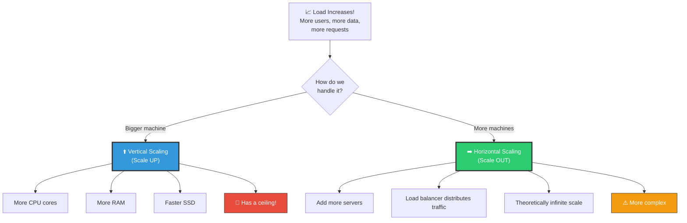
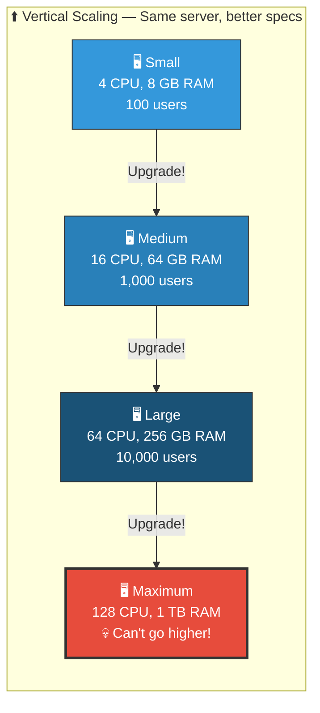
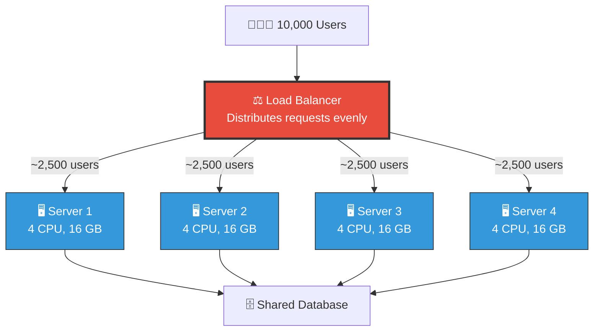
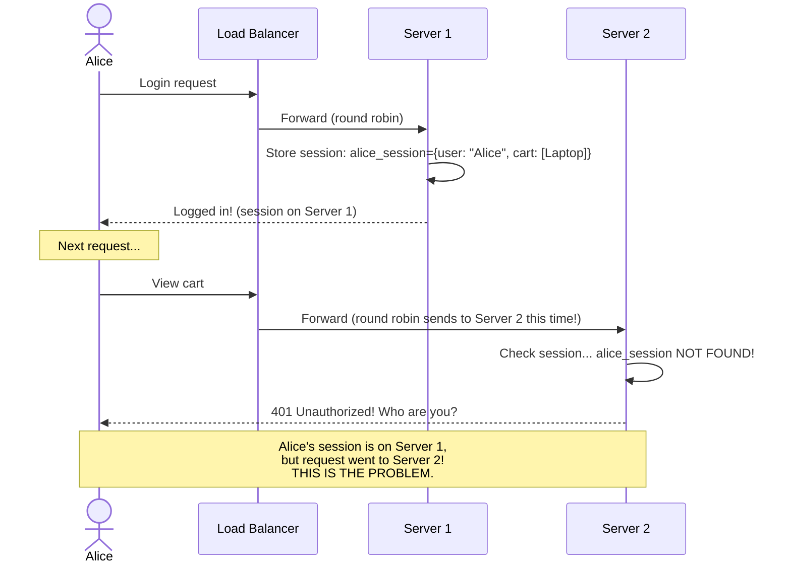
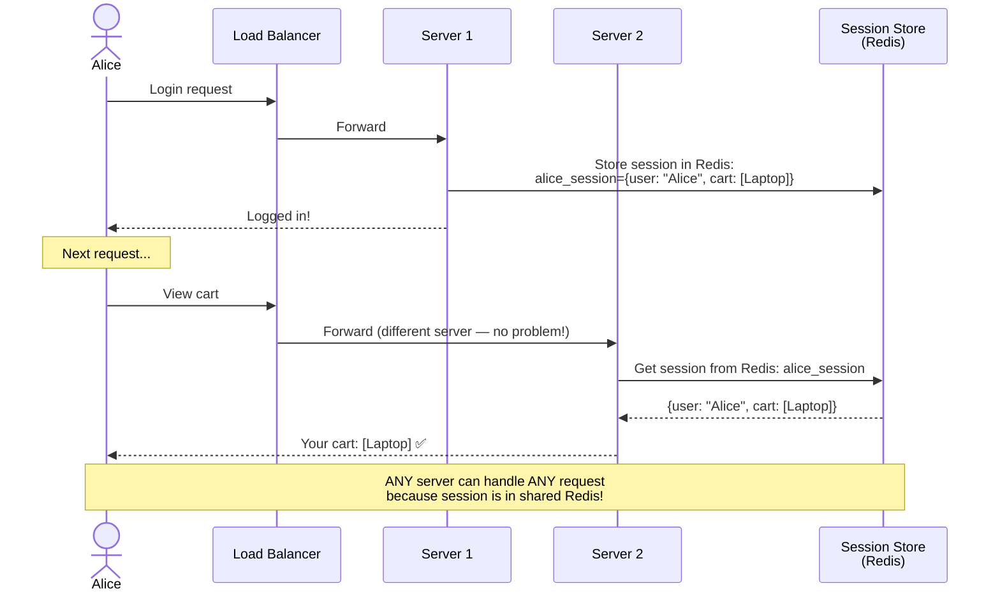
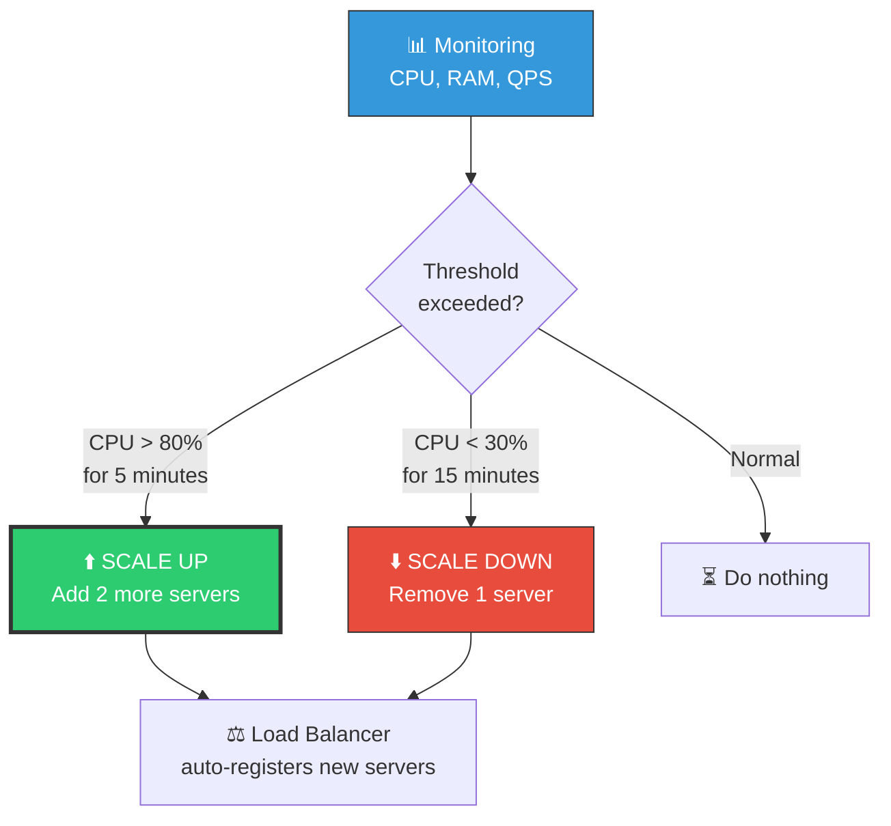
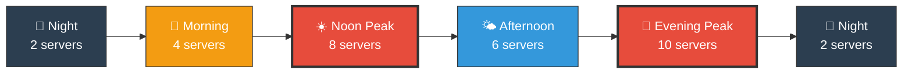
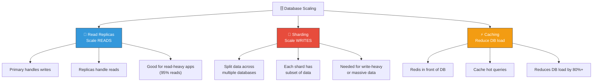
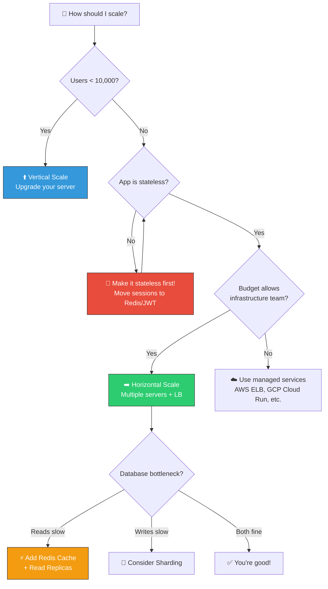

# 🏗️ System Design — Topic 2: Scalability — Vertical vs Horizontal

> **Why this matters**: Your app works great with 100 users. Now 100,000 sign up. Do you buy a **bigger server** or **more servers**? This single decision shapes your entire architecture. Get it wrong and you'll rebuild everything from scratch.

> **Code Implementation**: See [code.py](./code.py) for runnable Python simulations

---

## 🧠 What Is Scalability?

> Scalability is the ability of a system to handle **increased load** by adding resources — without changing the application's core design.

### 🎯 Analogy
> Your restaurant has 10 tables and is always full.
> - **Vertical Scaling** = Knock down walls, make the restaurant BIGGER (same building, more space)
> - **Horizontal Scaling** = Open MORE restaurants in different locations (multiple buildings)



---

## 1️⃣ Vertical Scaling (Scale UP) — The Bigger Machine

### 🎯 Analogy
> Upgrading from a bicycle to a motorcycle to a sports car to a jet. Each step is faster, but eventually **there's no bigger vehicle**. You can't buy a CPU with 10,000 cores — they don't exist.

### 📊 How It Works



### Pseudo Code — Vertical Scaling Decision

```
FUNCTION should_scale_vertically(server):
    current_cpu = server.cpu_usage          // e.g., 85%
    current_ram = server.ram_usage          // e.g., 90%
    current_users = server.concurrent_users // e.g., 800

    // Check if vertical scaling is still an option
    IF server.cpu_cores >= 128:
        PRINT("Already at max CPU — can't scale vertically further!")
        RETURN False

    IF server.ram_gb >= 1024:
        PRINT("Already at max RAM — can't scale vertically further!")
        RETURN False

    // Cost check — bigger machines get EXPONENTIALLY more expensive
    next_tier_cost = server.monthly_cost * 2.5   // Roughly 2.5x per tier
    IF next_tier_cost > budget:
        PRINT("Too expensive — consider horizontal scaling instead")
        RETURN False

    RETURN True
```

### Pros & Cons

| Pros | Cons |
|------|------|
| ✅ Simple — no code changes needed | ❌ **Hard ceiling** — biggest server has limits |
| ✅ No distributed system complexity | ❌ **Single point of failure** — server dies = everything dies |
| ✅ Strong data consistency | ❌ **Cost grows exponentially** — 2x CPU ≠ 2x price, more like 4x |
| ✅ Good for databases (simpler) | ❌ **Downtime during upgrade** — must restart to add RAM/CPU |

### Real-World Server Tiers (AWS EC2 Examples)

```
TIER        CPU    RAM       MONTHLY COST    MAX USERS (approx)
t3.small    2      2 GB      ~$15            ~100
t3.xlarge   4      16 GB     ~$120           ~500
m5.4xlarge  16     64 GB     ~$560           ~5,000
m5.16xlarge 64     256 GB    ~$2,200         ~20,000
x1.32xlarge 128    1,952 GB  ~$13,300        ~100,000
                                              ↑ CEILING!

NOTICE: Going from 2 CPU to 128 CPU (64x more):
  Cost goes from $15 to $13,300 (886x more expensive!)
  This is why vertical scaling doesn't scale long-term.
```

---

## 2️⃣ Horizontal Scaling (Scale OUT) — More Machines

### 🎯 Analogy
> Instead of one super-chef trying to cook 1,000 meals, hire **100 regular chefs**. Each handles 10 meals. Need more? Hire more chefs. There's no limit — you can always add more.

### 📊 How It Works



```
NEED MORE CAPACITY?
- Traffic doubled? Add 4 more servers. Done.
- Black Friday sale? Spin up 20 extra servers. Remove them after.
- This is what "auto-scaling" does automatically.

COST:
  4 servers × $120/month = $480/month for 10,000 users
  vs. 1 big server at $2,200/month for same capacity
  Horizontal is often CHEAPER!
```

### Pros & Cons

| Pros | Cons |
|------|------|
| ✅ **No ceiling** — add servers infinitely | ❌ Application must be **stateless** (explained below) |
| ✅ **Fault tolerant** — one server dies, others handle it | ❌ **Distributed system complexity** — harder to debug |
| ✅ **Cost effective** — many small machines cheaper than one giant | ❌ **Data consistency** challenges across servers |
| ✅ **Auto-scaling** — add/remove servers based on demand | ❌ Need **load balancer** infrastructure |
| ✅ **Zero downtime** deploys — roll update server by server | ❌ **Network latency** between servers |

---

## 3️⃣ Stateless vs Stateful — The Key to Horizontal Scaling

> **This is the MOST important concept for scaling.** If your server stores user session data locally, you CANNOT add more servers easily.

### ❌ Stateful Server — The Problem



### ✅ Stateless Server — The Solution



### Pseudo Code — Making a Service Stateless

```
// ❌ STATEFUL — Session stored IN the server's memory
CLASS StatefulServer:
    sessions = {}       // Stored locally — DIES with the server!

    FUNCTION handle_login(user, password):
        IF verify_password(user, password):
            session_id = GENERATE_UUID()
            self.sessions[session_id] = {user: user, logged_in: True}
            RETURN session_id

    FUNCTION handle_request(session_id):
        session = self.sessions[session_id]  // Only works on THIS server!
        IF session IS NULL:
            RETURN 401 "Unauthorized"
        RETURN process_request(session.user)


// ✅ STATELESS — Session stored in EXTERNAL store (Redis)
CLASS StatelessServer:
    // NO local session storage!

    FUNCTION handle_login(user, password):
        IF verify_password(user, password):
            session_id = GENERATE_UUID()
            REDIS.SET(session_id, {user: user, logged_in: True}, TTL=3600)
            RETURN session_id

    FUNCTION handle_request(session_id):
        session = REDIS.GET(session_id)    // Works from ANY server!
        IF session IS NULL:
            RETURN 401 "Unauthorized"
        RETURN process_request(session.user)


// ANOTHER APPROACH: JWT (JSON Web Token) — No session store needed at all!
CLASS JWTServer:
    FUNCTION handle_login(user, password):
        IF verify_password(user, password):
            token = JWT.ENCODE({user: user, exp: NOW + 1 HOUR}, SECRET_KEY)
            RETURN token    // Token contains ALL session data

    FUNCTION handle_request(token):
        payload = JWT.DECODE(token, SECRET_KEY)    // Verify + extract data
        IF payload IS NULL OR payload.exp < NOW:
            RETURN 401 "Unauthorized"
        RETURN process_request(payload.user)
        // NO database/Redis lookup needed! Token IS the session.
```

### Comparison

| Approach | Where Session Lives | Scalability | Speed | Complexity |
|----------|-------------------|-------------|-------|------------|
| **Stateful** | Server memory | ❌ Can't scale | Fast | Simple |
| **Shared Session Store** (Redis) | External Redis | ✅ Scalable | Fast | Medium |
| **JWT Token** | In the token itself | ✅ Most scalable | Fastest | Medium |
| **Sticky Sessions** | Server memory + LB affinity | ⚠️ Limited | Fast | Medium |

---

## 4️⃣ Auto-Scaling — Letting the Cloud Handle It

### 🎯 Analogy
> Auto-scaling is like a **restaurant that adds tables when it's crowded** and removes them when it's empty — automatically, without a manager deciding.

### 📊 How Auto-Scaling Works



### Pseudo Code — Auto-Scaling Policy

```
AUTO_SCALING_POLICY:
    min_servers: 2           // Never go below 2 (redundancy)
    max_servers: 20          // Cost protection
    desired_cpu: 60%         // Target CPU utilization

    SCALE_UP WHEN:
        average_cpu > 80% FOR 5 minutes
        OR request_count > 10,000/sec
        OR response_time > 500ms
        ACTION: Add 2 servers
        COOLDOWN: 5 minutes (don't scale again too quickly)

    SCALE_DOWN WHEN:
        average_cpu < 30% FOR 15 minutes
        AND request_count < 2,000/sec
        AND current_servers > min_servers
        ACTION: Remove 1 server
        COOLDOWN: 10 minutes

    EXAMPLE TIMELINE:
        06:00  2 servers  (night — low traffic)
        09:00  4 servers  (morning rush)
        12:00  8 servers  (lunch peak)
        15:00  6 servers  (afternoon dip)
        20:00  10 servers (evening peak)
        01:00  2 servers  (night — auto-scaled down)
```

### 📊 Auto-Scaling Timeline Visual



---

## 5️⃣ Database Scaling — The Hard Part

> Scaling web servers is relatively easy (stateless + load balancer). Scaling **databases** is THE hard problem in system design.



```
DATABASE SCALING STRATEGY (in order):
1. First: Add caching (Redis) — easiest, biggest impact
2. Then: Add read replicas — spreads read load
3. Then: Vertical scale the DB — bigger machine
4. Finally: Shard the database — hardest, only when truly needed

MOST APPS NEVER NEED SHARDING!
  Netflix, GitHub, StackOverflow — all run on replicated PostgreSQL
  Sharding is for: Google, Facebook, Twitter scale (billions of writes)
```

---

## 6️⃣ Vertical vs Horizontal — The Decision Framework



### Summary Table

| Factor | Vertical | Horizontal |
|--------|----------|------------|
| **Complexity** | Simple | Complex |
| **Cost curve** | Exponential (gets expensive fast) | Linear (pay per server) |
| **Ceiling** | Yes — biggest server has limits | No — add servers infinitely |
| **Downtime** | Yes — restart to upgrade | No — rolling updates |
| **Fault tolerance** | None — single point of failure | High — servers are redundant |
| **Data consistency** | Easy — single database | Hard — distributed data |
| **Best for** | Databases, early-stage apps | Web servers, microservices |
| **Used by** | Small-medium apps | Google, Netflix, Amazon |

---

## 🏋️ Practice Exercises

### Exercise 1: Scale This App
> Your e-commerce app has: 1 server (8 CPU, 32 GB RAM), PostgreSQL on the same server, 5,000 daily users. CPU usage is 90%, RAM is 60%. What's your scaling plan? Draw the architecture for 50,000 users and 500,000 users.

### Exercise 2: Make It Stateless
> Your Flask app stores shopping cart in `session` (server memory). Rewrite it to be stateless using Redis. Show the pseudo code for `add_to_cart()`, `get_cart()`, and `checkout()`.

### Exercise 3: Cost Comparison
> Compare the cost of:
> - 1 server with 64 CPUs, 256 GB RAM (~$2,200/month)
> - 8 servers with 8 CPUs, 32 GB RAM each (~$200/month each)
> Which handles more total load? Which is more fault-tolerant? Which is cheaper?

### Exercise 4: Auto-Scaling Policy
> Design an auto-scaling policy for a video streaming app. Traffic pattern: low at night (2am-8am), spikes during lunch (12pm-2pm), highest in evening (7pm-11pm). Define min/max servers, scale-up/down triggers, and cooldown periods.

---

## 🎤 Interview Corner

> **Q: "What's the difference between vertical and horizontal scaling?"**
>
> **Great answer**: "Vertical scaling means upgrading to a more powerful machine — more CPU, RAM. It's simple but has a ceiling and creates a single point of failure. Horizontal scaling means adding more machines behind a load balancer. It's more complex — requires stateless services — but offers unlimited scaling and fault tolerance. Most production systems use horizontal scaling for web servers and vertical scaling for databases, with caching and read replicas to reduce database load."

> **Q: "How do you handle sessions with multiple servers?"**
>
> **Great answer**: "There are three approaches. Sticky sessions route the same user to the same server — simple but limits scaling. Shared session store like Redis stores sessions externally so any server can access them. JWT tokens encode session data in the token itself, eliminating server-side storage entirely. I prefer JWT for APIs and Redis sessions for server-rendered apps."

> **Q: "When would you still use vertical scaling?"**
>
> **Great answer**: "For databases — it's much simpler to scale a database vertically than to shard it. Also for early-stage startups where simplicity matters more than infinite scale. The rule of thumb: scale vertically until it hurts, then scale horizontally. Premature horizontal scaling adds complexity you don't need yet."

---

## ✅ Key Takeaways

| Concept | Remember |
|---------|----------|
| **Vertical** | Bigger machine. Simple, but has a ceiling and single point of failure |
| **Horizontal** | More machines. Complex, but unlimited scale and fault tolerant |
| **Stateless** | The KEY to horizontal scaling — no local state on servers |
| **Session strategies** | Redis (shared store), JWT (self-contained token), Sticky sessions (limited) |
| **Auto-scaling** | Automatically add/remove servers based on CPU, QPS, response time |
| **Database scaling** | Cache first → Read replicas → Vertical scale → Shard (last resort) |
| **Rule of thumb** | Scale vertically until it hurts, then scale horizontally |

---

**Next up → [Topic 3: CAP Theorem & Trade-offs](../2.3-CAP-Theorem/)**
