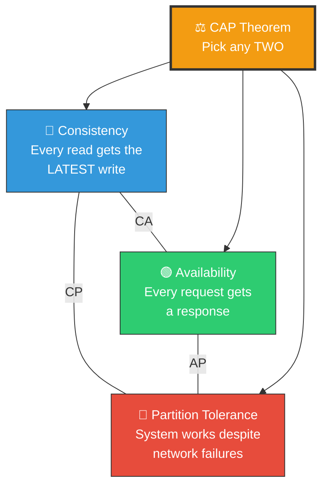
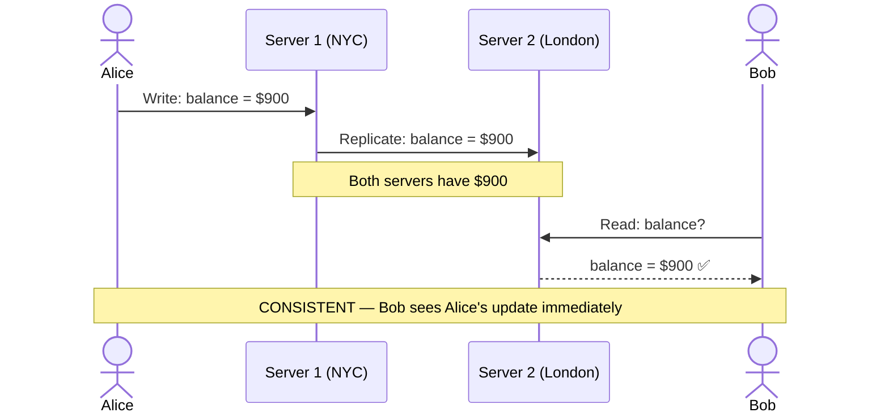
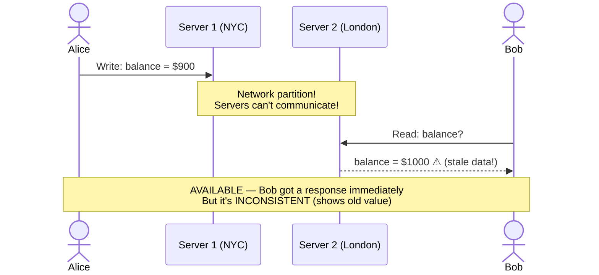
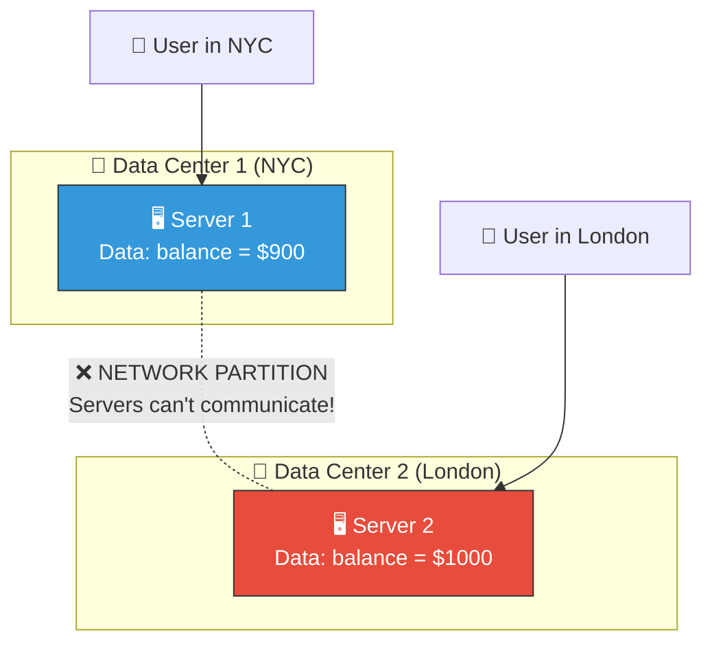
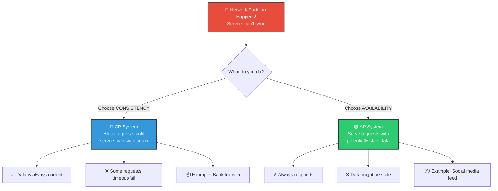
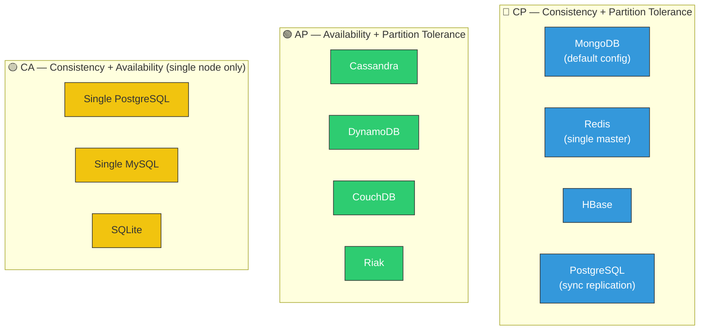
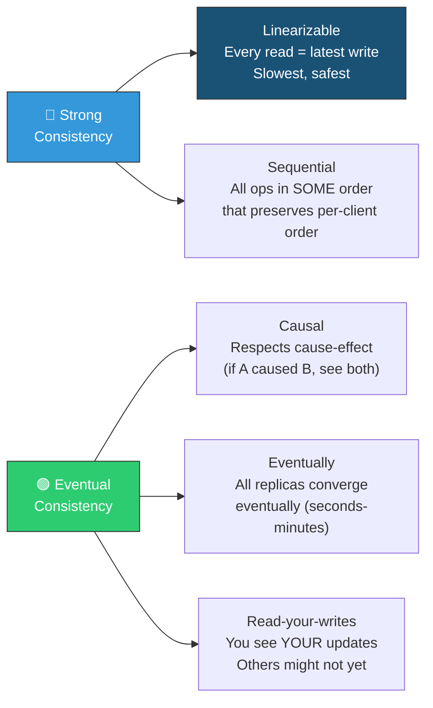
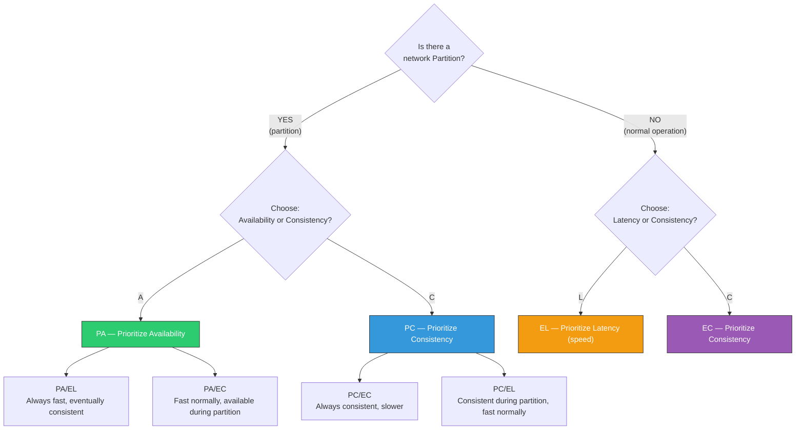

# 🏗️ System Design — Topic 3: CAP Theorem & Trade-offs

> **Why this matters**: The moment you have **more than one server**, you face an impossible choice. You literally **cannot have everything**. CAP Theorem tells you what trade-offs exist and how to choose wisely. Every database, every distributed system, every design decision is shaped by this.

> **Code Implementation**: See [code.py](./code.py) for runnable Python simulations

---

## 🧠 What Is the CAP Theorem?

> In a **distributed system**, you can only guarantee **TWO** out of three properties at the same time:



### 🎯 Analogy — The Breaking News Problem
> Imagine a **news agency** with offices in New York and London:
> - **Consistency**: Both offices always report the SAME story (even if it means waiting to sync)
> - **Availability**: Both offices ALWAYS publish a story when asked (even if it might be outdated)
> - **Partition Tolerance**: Offices keep working even when the phone line between them is cut
>
> If the phone line is cut (partition), you MUST choose: **wait for sync** (consistent but unavailable) or **publish what you have** (available but possibly inconsistent).

---

## 1️⃣ C — Consistency: "Everyone Sees the Same Data"

### 🎯 Analogy
> A **bank balance**. If Alice transfers \$100 to Bob, EVERY ATM in the world should instantly show the updated balances. You can't have one ATM say Alice has \$1000 and another say \$900.



### Pseudo Code

```
// STRONG CONSISTENCY — Every read returns the latest write
FUNCTION write_data(key, value):
    // Write to primary
    PRIMARY.write(key, value)

    // Wait for ALL replicas to confirm before responding
    FOR EACH replica IN replicas:
        response = replica.write(key, value)
        IF response != "OK":
            ROLLBACK()
            RETURN "Write failed"

    RETURN "Write successful"    // Only after ALL replicas are updated

FUNCTION read_data(key):
    // Always read from primary (guaranteed latest)
    RETURN PRIMARY.read(key)
```

---

## 2️⃣ A — Availability: "Every Request Gets a Response"

### 🎯 Analogy
> A **24/7 convenience store**. It's ALWAYS open, always serves you. Even if the store's inventory system is down, the cashier will still sell you items based on what's on the shelves (might not be perfectly up-to-date, but you always get served).



### Pseudo Code

```
// HIGH AVAILABILITY — Always respond, even with stale data
FUNCTION write_data(key, value):
    LOCAL_NODE.write(key, value)
    RETURN "Write successful"    // Respond immediately!

    // Replicate in background (async)
    ASYNC:
        FOR EACH replica IN replicas:
            TRY:
                replica.write(key, value)
            CATCH NetworkError:
                ADD_TO_RETRY_QUEUE(replica, key, value)  // Try again later

FUNCTION read_data(key):
    RETURN LOCAL_NODE.read(key)   // Respond from local data immediately
    // Might be stale if writes haven't replicated yet!
```

---

## 3️⃣ P — Partition Tolerance: "Survives Network Failures"

### 🎯 Analogy
> A **partition** is when the cable between two data centers gets cut. The servers are alive but **can't talk to each other**. Like two people in separate rooms with the intercom broken.



```
WHY PARTITION TOLERANCE IS NON-NEGOTIABLE:
  Network failures WILL happen in production:
  - Undersea cables get cut (happens ~100 times/year!)
  - Data center routers fail
  - Cloud provider has regional outage
  - DNS propagation delays

  If your system can't handle partitions,
  it CANNOT be distributed at all.

  So the real choice is: CP or AP (not CA)
```

---

## 4️⃣ The Real Choice: CP vs AP

> Since network partitions are unavoidable in distributed systems, you're really choosing between **CP** (consistent + partition tolerant) and **AP** (available + partition tolerant).

### 📊 CP vs AP During a Partition



### The Scenario That Makes It Clear

```
SCENARIO: E-commerce site with 2 data centers (NYC + London)
  Network cable between them gets cut.
  A customer in London tries to buy the LAST item in stock.

  CP CHOICE (Consistency):
    Server London: "I can't confirm stock with NYC. REFUSING the order."
    Customer: "Error: Service temporarily unavailable"
    Result: Customer is frustrated, but no overselling happens.

  AP CHOICE (Availability):
    Server London: "I'll accept the order based on my local data!"
    Meanwhile NYC: Also sells the same last item to someone else.
    Result: Two people bought the same last item = OVERSOLD!
    Need conflict resolution: refund one customer.

  WHICH IS BETTER? Depends on the business:
    Banking → CP (wrong balance = lawsuit)
    Social media → AP (seeing a post 2 seconds late = no big deal)
    E-commerce → Depends! Stock counts = CP, product reviews = AP
```

---

## 5️⃣ Real-World Database Examples



### Comparison Table

| Database | Type | Consistency | Availability | Use Case |
|----------|------|-------------|-------------|----------|
| **PostgreSQL** (replicated) | CP | ✅ Strong | ⚠️ May block during partition | Banking, e-commerce orders |
| **MongoDB** (default) | CP | ✅ Strong | ⚠️ Primary must be reachable | User accounts, inventory |
| **Redis** (master) | CP | ✅ Strong | ⚠️ Master is single point | Sessions, cache, queues |
| **Cassandra** | AP | ⚠️ Eventual | ✅ Always responds | Logs, IoT, time-series |
| **DynamoDB** | AP | ⚠️ Eventual | ✅ Always responds | Shopping carts, user profiles |
| **CouchDB** | AP | ⚠️ Eventual | ✅ Always responds | Offline-first apps, syncing |

---

## 6️⃣ Consistency Models — The Spectrum

> Consistency isn't binary (all or nothing). There's a spectrum from strict to relaxed.



### Pseudo Code — Consistency Models

```
// ═══ STRONG CONSISTENCY ═══
// After a write, ALL subsequent reads return the new value
FUNCTION strong_write(key, value):
    PRIMARY.write(key, value)
    WAIT FOR ALL replicas to acknowledge
    RETURN "OK"

// Guarantee: If write returns "OK", everyone sees the new value
// Cost: Slow! Must wait for all replicas.
// Use: Bank balances, inventory counts


// ═══ EVENTUAL CONSISTENCY ═══
// After a write, reads EVENTUALLY return the new value (maybe not immediately)
FUNCTION eventual_write(key, value):
    LOCAL.write(key, value)
    RETURN "OK"                         // Return immediately!
    ASYNC: replicate_to_others(key, value)  // Sync in background

// Guarantee: If you stop writing, all replicas will EVENTUALLY agree
// "Eventually" = usually milliseconds to seconds
// Cost: Fast! But reads might be stale briefly.
// Use: Social media likes, view counts, product reviews


// ═══ READ-YOUR-WRITES CONSISTENCY ═══
// YOU always see YOUR updates. Others might see stale data.
FUNCTION read_your_writes_read(key, user):
    IF user just wrote this key:
        RETURN read_from_primary(key)    // Force read from source of truth
    ELSE:
        RETURN read_from_nearest_replica(key)  // Fast but maybe stale

// Use: Profile updates (you see your new photo immediately,
//      your friends might see it a few seconds later)


// ═══ CAUSAL CONSISTENCY ═══
// Respects cause-and-effect relationships
// If Alice posts "I'm pregnant!" and Bob replies "Congrats!",
// NO ONE should see Bob's reply without seeing Alice's post first.
FUNCTION causal_write(key, value, depends_on):
    // Track dependencies
    write_with_vector_clock(key, value, depends_on)
    // Replicas apply writes in causal order

// Use: Comment threads, chat messages
```

### Which Consistency Model to Choose?

| Model | Speed | Safety | Best For |
|-------|-------|--------|----------|
| **Strong** | 🐌 Slowest | 🛡️ Safest | Bank transfers, inventory, bookings |
| **Sequential** | 🚶 Slow | 🛡️ Safe | User account data |
| **Causal** | 🚗 Medium | ⚠️ Good enough | Chat messages, comment threads |
| **Read-your-writes** | 🚀 Fast | ⚠️ Decent | Profile updates, settings |
| **Eventual** | ⚡ Fastest | ⚠️ Weakest | Likes, views, analytics, logs |

---

## 7️⃣ PACELC Theorem — Beyond CAP

> CAP only describes behavior **during a partition**. PACELC extends it to normal operation too.



### PACELC in Real Databases

| Database | During Partition | Else (Normal) | Classification |
|----------|-----------------|----------------|----------------|
| **Cassandra** | Availability | Latency | PA/EL |
| **DynamoDB** | Availability | Latency | PA/EL |
| **MongoDB** | Consistency | Consistency | PC/EC |
| **PostgreSQL** | Consistency | Consistency | PC/EC |
| **Cosmos DB** | Configurable | Configurable | Tunable! |

---

## 8️⃣ How Real Companies Choose

```
AMAZON (DynamoDB — AP/EL):
  "It's better to show a slightly stale shopping cart than to show
   an error page. We can always resolve conflicts later."
  → Chose: Availability + Low Latency
  → Accepts: Eventual consistency for cart data

GOOGLE (Spanner — CP/EC):
  "Financial data and ad billing must be globally consistent.
   We built atomic clocks (TrueTime) to make consistency fast."
  → Chose: Strong Consistency everywhere
  → Accepts: Higher latency (but minimized with hardware)

FACEBOOK (Cassandra for Inbox — AP/EL):
  "If your friend's post shows up 2 seconds late in your feed,
   nobody notices. But if the feed doesn't load, everyone complains."
  → Chose: Availability + Low Latency
  → Accepts: Eventually consistent feeds

BANKING SYSTEMS (PostgreSQL — CP/EC):
  "Showing wrong balance = regulatory violation + lawsuits.
   We'd rather show an error than wrong data."
  → Chose: Strong Consistency always
  → Accepts: Occasional unavailability during failures
```

---

## 🏋️ Practice Exercises

### Exercise 1: Classify the System
> For each system, decide if it should be CP or AP. Justify your answer.
> - a) Online banking transfer system
> - b) Instagram likes counter
> - c) Airline seat booking system
> - d) DNS (Domain Name System)
> - e) Real-time stock trading platform
> - f) WhatsApp "last seen" status

### Exercise 2: Design the Trade-off
> You're building a global e-commerce platform. Different parts of the system need different consistency:
> - Inventory count (how many items left?)
> - Product reviews and ratings
> - User authentication (login/password)
> - Order history
>
> For each, choose CP or AP and explain which consistency model you'd use.

### Exercise 3: Partition Scenario
> Your chat app has servers in US and Europe. The transatlantic cable goes down for 30 minutes. Describe exactly what happens to:
> - User in US sending a message to user in Europe
> - User in Europe checking their message history
> - What happens when the cable is restored?

---

## 🎤 Interview Corner

> **Q: "Explain the CAP theorem."**
>
> **Great answer**: "CAP states that a distributed system can guarantee at most two of three properties: Consistency (every read returns the latest write), Availability (every request gets a response), and Partition Tolerance (the system works despite network failures). Since network partitions are inevitable in distributed systems, the practical choice is between CP — blocking during partitions to stay consistent — and AP — staying available but potentially serving stale data. The choice depends on the domain: banking needs CP, social media prefers AP."

> **Q: "What is eventual consistency?"**
>
> **Great answer**: "Eventual consistency means that if no new writes are made, all replicas will eventually converge to the same value — usually within milliseconds to seconds. It's a trade-off: you get lower latency and higher availability, but reads might briefly return stale data. It's perfect for use cases where slight staleness is acceptable, like social media feeds, view counters, or DNS. For critical data like bank balances, you'd want strong consistency instead."

> **Q: "Give me a real-world example of CAP trade-offs."**
>
> **Great answer**: "Amazon's DynamoDB is AP — during a partition, it keeps accepting writes to both sides and resolves conflicts later using vector clocks. They chose this because showing a slightly stale shopping cart is better than an error page. Conversely, Google Spanner is CP — it uses hardware atomic clocks to achieve globally consistent transactions because their ad billing system cannot tolerate inconsistency. The right choice depends entirely on the business requirements."

---

## ✅ Key Takeaways

| Concept | Remember |
|---------|----------|
| **CAP Theorem** | Distributed systems: pick 2 of 3 (Consistency, Availability, Partition Tolerance) |
| **Partitions are inevitable** | Real choice is CP vs AP |
| **CP** | Block during partition to stay consistent (banks, inventory) |
| **AP** | Stay available during partition, accept stale data (social media, feeds) |
| **Eventual consistency** | All replicas converge eventually — fast but briefly stale |
| **Strong consistency** | All reads return latest write — safe but slow |
| **PACELC** | Extends CAP: also considers Latency vs Consistency during normal operation |
| **No universal answer** | Different parts of the SAME system can have different consistency needs |

---

**Next up → [Topic 4: Latency, Throughput & Estimation](../2.4-Latency-Throughput/)**
