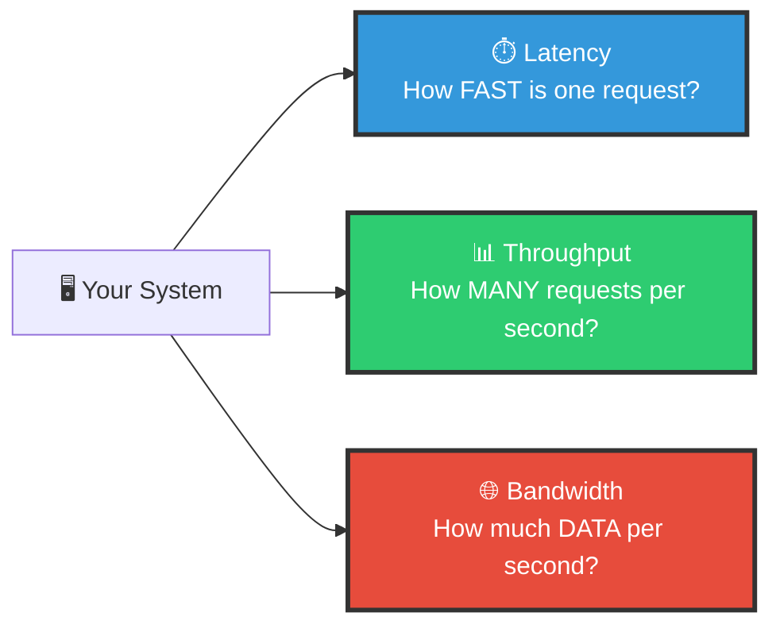
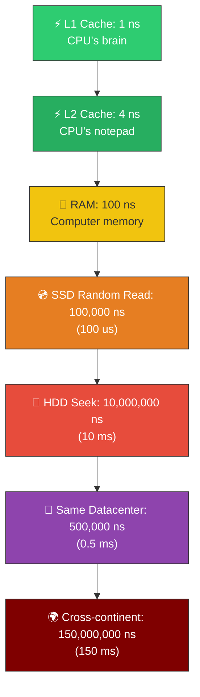
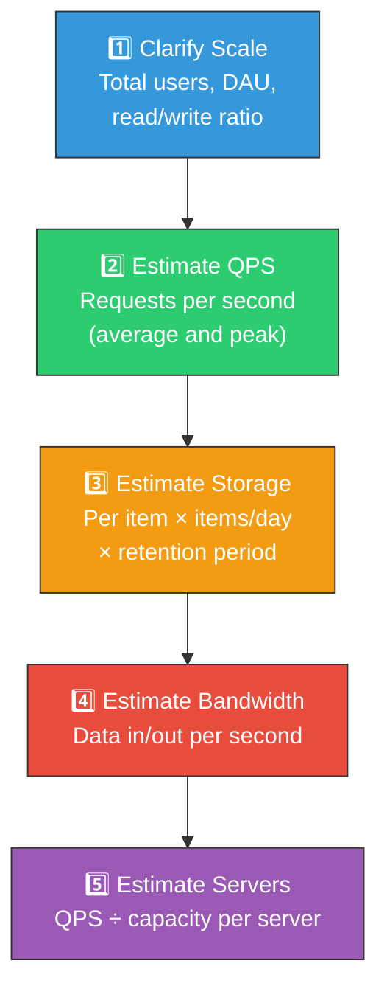

# 🏗️ System Design — Topic 4: Latency, Throughput & Back-of-Envelope Estimation

> **Why this matters**: In every system design interview, you'll be asked to **estimate**. "How many servers do we need?" "How much storage?" "What's the QPS?" If you can't do this math quickly, you can't design systems. This topic gives you the **numbers, formulas, and frameworks** to estimate anything.

> **Code Implementation**: See [code.py](./code.py) for runnable Python estimation calculator

---

## 🧠 The Three Numbers That Define Every System



---

## 1️⃣ Latency Numbers Every Programmer MUST Know

### 🎯 Analogy
> Latency is the time it takes to **travel**. Imagine fetching something from:
> - Your **pocket** (L1 cache) → instant
> - Your **desk drawer** (RAM) → walk across the room
> - A **filing cabinet** in the basement (SSD) → take the elevator
> - A **warehouse across town** (Network) → drive for hours

### 📊 The Latency Pyramid



### The Full Reference Table

| Operation | Time | Human Scale* | Relative |
|-----------|------|-------------|----------|
| L1 cache read | 1 ns | 1 second | 1x |
| L2 cache read | 4 ns | 4 seconds | 4x |
| Branch mispredict | 5 ns | 5 seconds | 5x |
| Mutex lock/unlock | 25 ns | 25 seconds | 25x |
| **RAM read** | **100 ns** | **1.5 minutes** | **100x** |
| Compress 1KB (Snappy) | 3,000 ns (3 us) | 50 minutes | 3,000x |
| Send 1KB over network | 10,000 ns (10 us) | 3 hours | 10,000x |
| **SSD random read** | **100,000 ns (100 us)** | **1.5 days** | **100,000x** |
| Read 1MB from RAM | 250,000 ns (250 us) | 3 days | 250,000x |
| **Same datacenter round trip** | **500,000 ns (0.5 ms)** | **6 days** | **500,000x** |
| Read 1MB from SSD | 1,000,000 ns (1 ms) | 12 days | 1,000,000x |
| HDD seek | 10,000,000 ns (10 ms) | 4 months | 10,000,000x |
| Read 1MB from HDD | 20,000,000 ns (20 ms) | 8 months | 20,000,000x |
| **Cross-continent round trip** | **150,000,000 ns (150 ms)** | **5 years** | **150,000,000x** |

> *If L1 cache = 1 second, what does everything else feel like at that scale?

### What These Numbers Mean for Design

```
DESIGN RULE 1: Cache everything possible in RAM
  RAM read:    100 ns
  SSD read:    100,000 ns (1,000x slower!)
  → Use Redis/Memcached for hot data

DESIGN RULE 2: Minimize network round trips
  Same DC:     0.5 ms
  Cross-DC:    150 ms (300x slower!)
  → Batch requests, use CDN, keep data close to users

DESIGN RULE 3: Use SSDs, not HDDs for databases
  SSD read:    100 us
  HDD seek:    10 ms (100x slower!)
  → Modern databases should always run on SSDs

DESIGN RULE 4: Compress data before sending over network
  Compress:    3 us
  Network 1KB: 10 us
  → Compression is almost free compared to network cost
```

---

## 2️⃣ Throughput — How Many Requests Per Second?

### 🎯 Analogy
> - **Latency** = How long it takes ONE car to cross a bridge
> - **Throughput** = How many cars cross the bridge PER HOUR
> - A 6-lane highway has 6x the throughput of a 1-lane road, but the same latency for one car

### Typical Throughput Numbers

| Component | Throughput | Notes |
|-----------|-----------|-------|
| **Single web server** | 1,000–10,000 QPS | Depends on CPU, app complexity |
| **Nginx** (static files) | 50,000+ QPS | Reverse proxy / load balancer |
| **Redis** | 100,000+ QPS | In-memory, single-threaded |
| **PostgreSQL** | 5,000–10,000 QPS | With proper indexing |
| **MySQL** | 5,000–10,000 QPS | Similar to PostgreSQL |
| **Cassandra** (per node) | 10,000–50,000 QPS | Scales linearly with nodes |
| **Kafka** (per broker) | 100,000+ msg/sec | Append-only log, very fast |

### Pseudo Code — Calculating Required QPS

```
FUNCTION estimate_qps(daily_active_users, actions_per_user):
    daily_requests = daily_active_users * actions_per_user

    // Average QPS (spread evenly across 24 hours)
    avg_qps = daily_requests / 86400       // 86,400 seconds in a day

    // Peak QPS (traffic is NOT evenly distributed)
    // Peak is typically 2x-5x average
    peak_qps = avg_qps * 3

    // Servers needed (each handles ~1,000-5,000 QPS)
    servers_needed = CEIL(peak_qps / 2000)

    RETURN {
        daily_requests: daily_requests,
        avg_qps: avg_qps,
        peak_qps: peak_qps,
        servers_needed: servers_needed
    }

// Example: Instagram
estimate_qps(
    daily_active_users = 500_000_000,   // 500M DAU
    actions_per_user = 20               // scrolls, likes, posts, stories
)
// daily_requests = 10 billion
// avg_qps = ~115,000
// peak_qps = ~350,000
// servers_needed = ~175 servers
```

---

## 3️⃣ Powers of 2 — The Programmer's Cheat Sheet

> You MUST know these for quick mental math during interviews.

| Power | Exact Value | Approx | Name | Example |
|-------|-------------|--------|------|---------|
| 2^10 | 1,024 | ~1 Thousand | 1 KB | Short text file |
| 2^20 | 1,048,576 | ~1 Million | 1 MB | A photo |
| 2^30 | 1,073,741,824 | ~1 Billion | 1 GB | A movie |
| 2^40 | ~1.1 Trillion | ~1 Trillion | 1 TB | Small database |
| 2^50 | — | ~1 Quadrillion | 1 PB | Large company's data |

### Quick Conversion Shortcuts

```
STORAGE SHORTCUTS:
  1 character (ASCII)  = 1 byte
  1 character (UTF-8)  = 1-4 bytes
  1 integer            = 4-8 bytes
  1 UUID               = 16 bytes
  1 timestamp          = 8 bytes
  1 row (typical)      = 100-500 bytes

COMMON OBJECT SIZES:
  Tweet (280 chars + metadata)    = ~500 bytes
  Chat message + metadata         = ~200 bytes
  User profile row                = ~1 KB
  Average photo (compressed)      = ~2 MB
  Average video (1 min, 720p)     = ~50 MB
  Average video (1 min, 1080p)    = ~150 MB

TIME SHORTCUTS:
  1 day    = 86,400 seconds   (use ~100,000 for easy math)
  1 month  = 2,592,000 seconds (use ~2.5 million)
  1 year   = 31,536,000 seconds (use ~30 million)
```

---

## 4️⃣ The Estimation Framework — Step by Step



---

## 5️⃣ Worked Example 1: Twitter

```
REQUIREMENTS:
  - 500M total users, 200M DAU
  - Each user posts 2 tweets/day, reads 100 tweets/day
  - Tweet = 280 chars + metadata = 500 bytes
  - 10% tweets have images (avg 2 MB each)
  - Data retention: 5 years

STEP 1: QPS
  Write QPS:
    200M × 2 tweets / 86,400 sec = ~4,600 tweets/sec
    Peak: 4,600 × 3 = ~14,000 tweets/sec

  Read QPS:
    200M × 100 reads / 86,400 sec = ~230,000 reads/sec
    Peak: 230,000 × 3 = ~700,000 reads/sec

  Read/Write ratio = 230,000 / 4,600 = 50:1 (very read-heavy!)

STEP 2: Storage
  Text per day:
    400M tweets × 500 bytes = 200 GB/day

  Images per day:
    400M × 10% = 40M images × 2 MB = 80 TB/day

  5-year totals:
    Text:   200 GB × 365 × 5 = ~365 TB
    Images: 80 TB × 365 × 5  = ~146 PB

STEP 3: Bandwidth
  Outgoing (reads dominate):
    200M users × 100 tweets × 500 bytes = ~10 TB/day (text)
    200M × 20 images viewed × 2 MB = ~8 PB/day (images)
    Per second: ~90 GB/s (mostly images → need CDN!)

STEP 4: Servers
  Web servers: 700,000 peak QPS / 5,000 QPS per server = ~140 servers
  DB: Need sharding (4,600 writes/sec is heavy)
  Cache: Redis for timeline (230K reads/sec ÷ 100K per Redis = 3+ Redis instances)

SUMMARY:
  ┌─────────────────────────────────────┐
  │ Twitter Scale                       │
  │ Write QPS:   ~4,600 (peak: 14K)    │
  │ Read QPS:    ~230,000 (peak: 700K) │
  │ Storage/day: ~80 TB (mostly images)│
  │ 5-year:      ~146 PB              │
  │ Web servers: ~140                   │
  │ Key need:    CDN, caching, sharding │
  └─────────────────────────────────────┘
```

---

## 6️⃣ Worked Example 2: YouTube

```
REQUIREMENTS:
  - 2B total users, 800M DAU
  - Each user watches 5 videos/day (avg 5 min each)
  - 1% of DAU upload 1 video/day (avg 5 min)
  - Video storage: 50 MB/min (compressed, multiple resolutions)
  - Retention: forever

STEP 1: QPS
  Video plays:
    800M × 5 / 86,400 = ~46,000 plays/sec (peak: ~140,000)

  Video uploads:
    800M × 1% × 1 / 86,400 = ~93 uploads/sec (peak: ~280)

STEP 2: Storage
  Daily uploads:
    8M videos × 5 min × 50 MB/min = 2 PB/day
    (Plus multiple resolutions: 360p, 720p, 1080p, 4K)
    With 4 resolutions: ~8 PB/day

  Per year: 8 PB × 365 = ~2.9 EB (exabytes!) per year

STEP 3: Bandwidth
  Streaming out:
    800M × 5 videos × 5 min × 10 MB/min (720p avg) = ~200 PB/day
    Per second: ~2.3 TB/s (!)

  Upload in:
    8M × 5 min × 50 MB/min = ~2 PB/day
    Per second: ~23 GB/s

SUMMARY:
  ┌─────────────────────────────────────┐
  │ YouTube Scale                       │
  │ Play QPS:    ~46,000 (peak: 140K)  │
  │ Upload QPS:  ~93 (peak: 280)       │
  │ Storage/day: ~8 PB                 │
  │ Bandwidth:   ~2.3 TB/s outgoing    │
  │ Key need:    CDN (critical!),      │
  │              object storage,        │
  │              transcoding pipeline   │
  └─────────────────────────────────────┘
```

---

## 7️⃣ Worked Example 3: Chat App (WhatsApp)

```
REQUIREMENTS:
  - 2B total users, 700M DAU
  - Each user sends 50 messages/day
  - Average message: 200 bytes
  - 5% messages have images (avg 300 KB compressed)
  - Messages stored for 30 days, then deleted
  - Read/write ratio: ~1:1 (chat is balanced)

STEP 1: QPS
  Messages:
    700M × 50 / 86,400 = ~405,000 msg/sec
    Peak: ~1.2M msg/sec

  Both reads AND writes are ~400K/sec
  This is WRITE-HEAVY compared to Twitter

STEP 2: Storage
  Text per day:
    35B messages × 200 bytes = 7 TB/day

  Images per day:
    35B × 5% = 1.75B images × 300 KB = 525 TB/day

  30-day retention:
    Text:   7 TB × 30 = 210 TB
    Images: 525 TB × 30 = 15.75 PB

STEP 3: Connections
  WebSocket connections:
    700M concurrent connections (!)
    Each connection uses ~10 KB memory
    700M × 10 KB = 7 TB of RAM just for connections!
    At 100K connections per server: 7,000 servers

SUMMARY:
  ┌──────────────────────────────────────┐
  │ WhatsApp Scale                       │
  │ Message QPS: ~405K (peak: 1.2M)     │
  │ Storage/day: ~530 TB                 │
  │ 30-day total: ~16 PB                │
  │ WebSocket servers: ~7,000            │
  │ Key need: Message queues, sharding,  │
  │           WebSocket management,      │
  │           end-to-end encryption      │
  └──────────────────────────────────────┘
```

---

## 8️⃣ Common Estimation Patterns

### The 80/20 Rule (Pareto Principle)
```
80% of requests go to 20% of data
→ Cache the top 20% in Redis
→ Cache size needed = 20% of total data

Example: 100 GB database
→ Cache the hot 20% = 20 GB in Redis
→ 80% of reads become cache hits (100x faster)
```

### The Read/Write Ratio
```
Social media (Twitter, Instagram):  100:1 (read-heavy)
→ Optimize reads: caching, read replicas, CDN

Chat apps (WhatsApp, Slack):        1:1 (balanced)
→ Need both read and write optimization

Logging/Analytics:                  1:100 (write-heavy)
→ Optimize writes: append-only logs, Kafka, batch processing
```

### Peak vs Average
```
Average QPS is NEVER enough for capacity planning!

Traffic is NOT evenly distributed:
  - Morning: 0.5x average
  - Lunch:   2x average
  - Evening: 3x average (peak)
  - Night:   0.2x average

RULE: Design for 3x average (peak factor)
SAFETY: Add 30% headroom on top of peak
FORMULA: capacity_needed = avg_qps × 3 × 1.3
```

---

## 🏋️ Practice Exercises

### Exercise 1: Estimate Instagram
> Instagram has 2B users, 500M DAU. Each DAU views 30 posts/day and uploads 0.5 photos/day (avg 3 MB). Calculate: QPS (read/write), daily storage, bandwidth, and servers needed.

### Exercise 2: Estimate Uber
> Uber has 100M monthly active users, 20M DAU. Each rider takes 2 rides/day. Each ride generates 1 GPS ping/second for 15 minutes. Calculate: GPS QPS, storage per day, and total storage for 1 year.

### Exercise 3: Estimate a URL Shortener
> 100M URLs shortened/month, each URL read 100x on average. URL data = 500 bytes. Calculate: Write QPS, Read QPS, storage for 5 years.

### Exercise 4: Your Own App
> Pick any app you use daily. Estimate its DAU, actions per user, data per action, QPS, storage, and how many servers it might need.

---

## 🎤 Interview Corner

> **Q: "How would you estimate the storage needed for a service like Google Drive?"**
>
> **Great answer**: "I'd start with users and usage. Say 1B users, 200M DAU, average user stores 5 GB. Total storage = 1B × 5 GB = 5 EB. But with replication (3 copies for durability) = 15 EB. Daily uploads: 200M users × 2 files × 2 MB average = 800 TB/day. Per second: about 9 GB/s incoming bandwidth. The key insight is that storage grows forever — unlike compute which scales with QPS — so the storage system is the primary cost driver."

> **Q: "Latency numbers every engineer should know?"**
>
> **Great answer**: "The critical ones: L1 cache is 1 nanosecond, RAM is 100 nanoseconds, SSD random read is 100 microseconds, same-datacenter round trip is 0.5 milliseconds, and cross-continent is 150 milliseconds. The key insight is that RAM is 1000x faster than SSD, and SSD is 300x faster than cross-continent network. This is why we cache aggressively in RAM and keep data close to users with CDNs."

---

## ✅ Key Takeaways

| Concept | Remember |
|---------|----------|
| **Latency hierarchy** | L1 (1ns) → RAM (100ns) → SSD (100us) → Network (150ms) |
| **RAM vs SSD** | RAM is 1,000x faster → cache hot data in Redis |
| **Powers of 2** | KB=2^10, MB=2^20, GB=2^30, TB=2^40, PB=2^50 |
| **Day in seconds** | 86,400 ≈ 100,000 (use for quick math) |
| **QPS formula** | DAU × actions_per_user / 86,400 |
| **Peak factor** | Peak = 3x average (design for this!) |
| **80/20 rule** | Cache 20% of data → 80% of reads become instant |
| **Read/Write ratio** | Social media = 100:1, Chat = 1:1, Logging = 1:100 |

---

**Next up → [Topic 5: DNS & Content Delivery Networks](../2.5-DNS-CDN/)**
