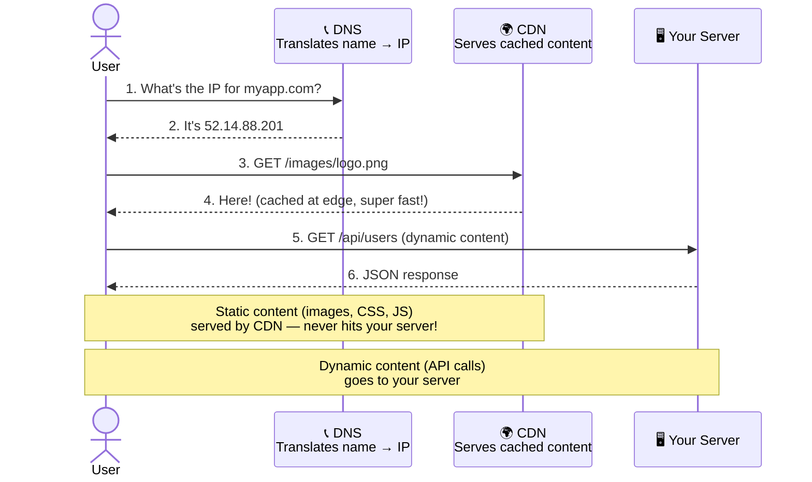
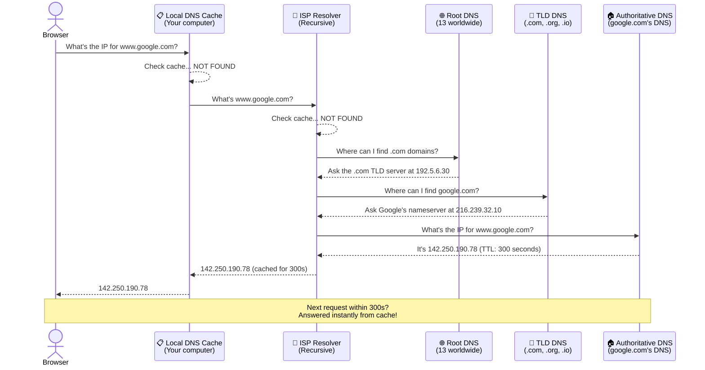
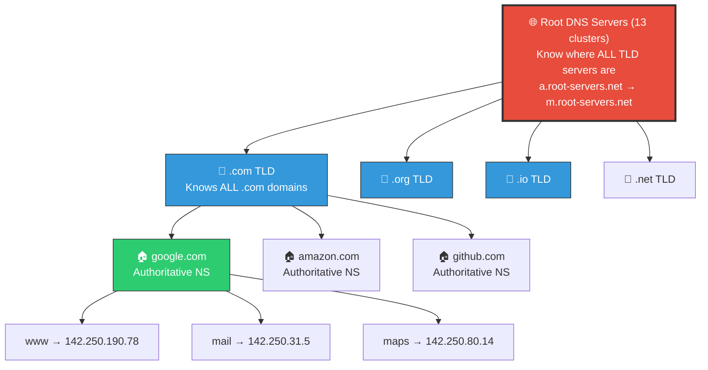
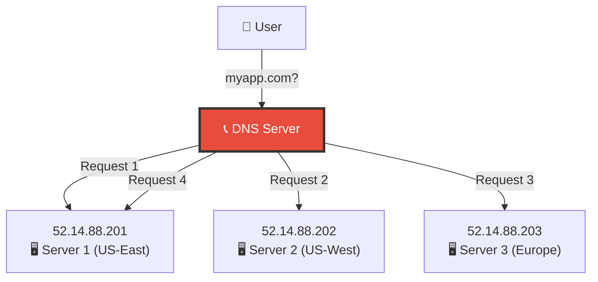
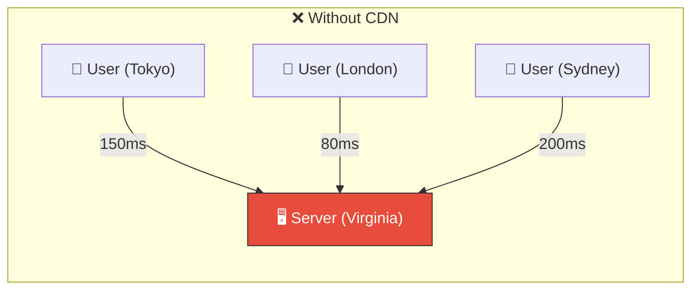
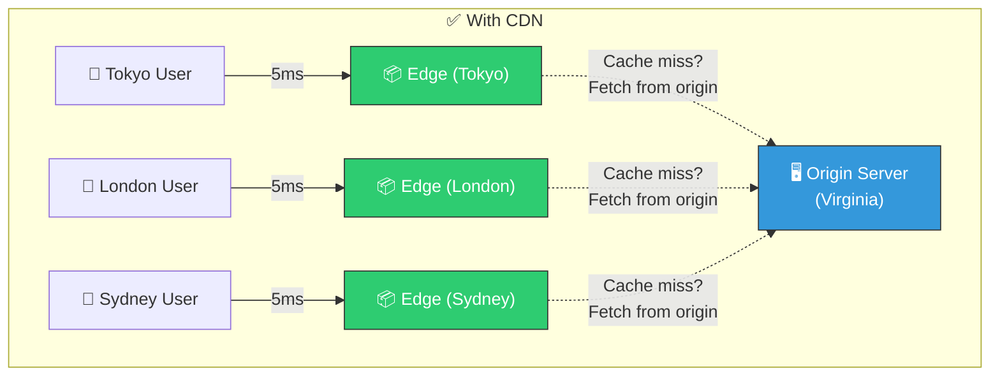
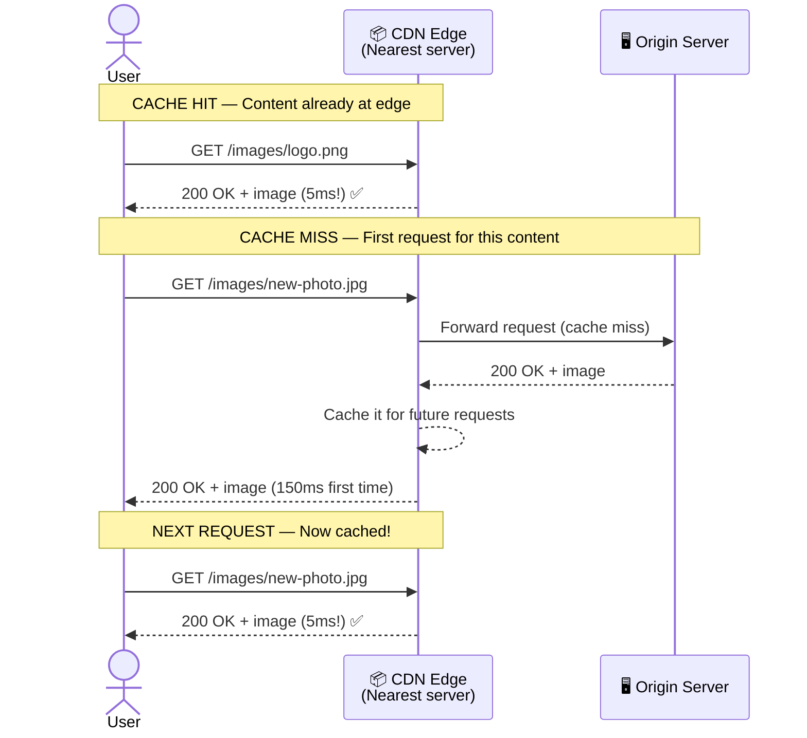
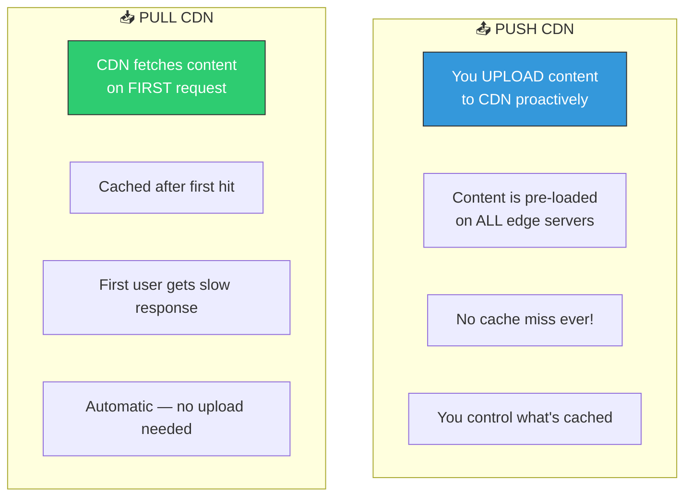
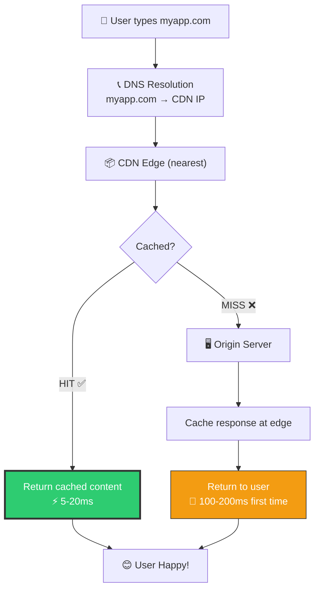

# 🏗️ System Design — Topic 5: DNS & Content Delivery Networks (CDN)

> **Why this matters**: Every request starts with DNS — it's the **phone book of the internet**. And CDNs serve **50-90% of all internet traffic** (Netflix alone is 15%). Understanding these two components is essential because they're the first things a user's request hits before reaching your servers.

> **Code Implementation**: See [code.py](./code.py) for runnable Python simulations

---

## 🧠 The Big Picture — The First Two Stops



---

## 1️⃣ DNS — The Phone Book of the Internet

### 🎯 Analogy
> You want to call your friend "Alice". You don't memorize her phone number (142.250.190.78). You look up "Alice" in your contacts and get the number. **DNS does exactly this** — converts human-readable names (google.com) to machine-readable IP addresses (142.250.190.78).

### 📊 Why Do We Need DNS?

```
WITHOUT DNS:
  You type: http://142.250.190.78   ← Who remembers this?!
  What if Google changes servers? Every user must update!

WITH DNS:
  You type: http://google.com       ← Easy to remember!
  DNS handles the translation automatically.
  Google can change servers anytime — DNS just updates the mapping.
```

---

## 2️⃣ DNS Resolution — Step by Step

### 📊 The Full Resolution Journey



### The DNS Hierarchy



---

## 3️⃣ DNS Record Types

| Record | What It Does | Example |
|--------|-------------|---------|
| **A** | Maps name → IPv4 address | `google.com → 142.250.190.78` |
| **AAAA** | Maps name → IPv6 address | `google.com → 2607:f8b0:4004::64` |
| **CNAME** | Alias pointing to another name | `www.google.com → google.com` |
| **MX** | Mail server for the domain | `google.com → smtp.google.com (priority 10)` |
| **NS** | Nameserver responsible for domain | `google.com → ns1.google.com` |
| **TXT** | Text data (verification, SPF) | `google.com → "v=spf1 include:_spf.google.com"` |
| **SOA** | Start of Authority (zone metadata) | Serial number, refresh intervals |
| **SRV** | Service location (port + host) | `_http._tcp.example.com → port 80 at web1` |

### Pseudo Code — DNS Records in Practice

```
// Your domain's DNS configuration (like a zone file)

DOMAIN: myapp.com

// A Records — Main IP addresses
A       myapp.com           →  52.14.88.201
A       myapp.com           →  52.14.88.202      // Multiple A records = round-robin LB!

// CNAME — Aliases
CNAME   www.myapp.com       →  myapp.com          // www redirects to root
CNAME   api.myapp.com       →  lb.myapp.com       // API points to load balancer
CNAME   cdn.myapp.com       →  d1234.cloudfront.net  // CDN subdomain

// MX — Email routing
MX      myapp.com           →  mail.myapp.com     (priority: 10)
MX      myapp.com           →  backup-mail.myapp.com (priority: 20)

// TXT — Verification & security
TXT     myapp.com           →  "v=spf1 include:_spf.google.com ~all"

// NS — Authoritative nameservers
NS      myapp.com           →  ns1.cloudflare.com
NS      myapp.com           →  ns2.cloudflare.com

// TTL (Time To Live) — How long to cache each record
// Low TTL (60s):   Changes propagate fast, more DNS queries
// High TTL (3600s): Fewer queries, but changes take up to 1 hour
```

---

## 4️⃣ DNS-Based Load Balancing



```
DNS LOAD BALANCING STRATEGIES:

1. ROUND ROBIN — Rotate through IP addresses
   Request 1 → Server 1
   Request 2 → Server 2
   Request 3 → Server 3
   Request 4 → Server 1 (repeat)
   Pros: Simple
   Cons: Doesn't know if a server is down or overloaded

2. WEIGHTED — Send more traffic to stronger servers
   Server 1 (powerful):  weight 5  → gets 50% traffic
   Server 2 (medium):    weight 3  → gets 30% traffic
   Server 3 (small):     weight 2  → gets 20% traffic

3. GEOLOCATION — Route to nearest server
   User in New York  → US-East server
   User in London    → Europe server
   User in Tokyo     → Asia server
   Pros: Low latency (nearest server)
   Cons: Complex setup

4. LATENCY-BASED — Route to fastest-responding server
   Measures actual response times
   Routes to server with lowest latency
   AWS Route 53 does this
```

---

## 5️⃣ CDN — Content Delivery Network

### 🎯 Analogy
> Without a CDN, everyone in the world orders from **one warehouse in Virginia**. Users in Tokyo wait 150ms for every image. With a CDN, you put **mini-warehouses (edge servers) in every major city**. Now Tokyo users get images from a server 5ms away.

### 📊 Without CDN vs With CDN





### How CDN Works — Cache Hit vs Miss



---

## 6️⃣ Push CDN vs Pull CDN



### When to Use Which

| Factor | Push CDN | Pull CDN |
|--------|----------|----------|
| **Traffic** | Low/medium traffic sites | High traffic sites |
| **Content** | Content changes rarely | Content changes frequently |
| **Control** | Full control over cache | Automatic management |
| **Storage** | Uses more CDN storage (all content pushed) | Uses less (only popular content cached) |
| **First request** | Fast (pre-loaded) | Slow (cache miss) |
| **Best for** | Small sites, firmware updates | Large sites, social media, e-commerce |
| **Cost** | Pay for storage + transfer | Pay mostly for transfer |

---

## 7️⃣ CDN Cache Invalidation

```
THE HARDEST PROBLEM: Your image changed, but CDN still serves the OLD one!

STRATEGIES:

1. TTL (Time To Live) — Content expires after set time
   Cache-Control: max-age=86400   (cache for 24 hours)
   Cache-Control: max-age=31536000 (cache for 1 year)
   Pros: Simple
   Cons: Users see stale content until TTL expires

2. VERSIONED URLs — Change the URL when content changes
   /images/logo.png          → OLD version
   /images/logo.v2.png       → NEW version (different URL = cache miss = fresh!)
   /images/logo.png?v=abc123 → Query string versioning
   Pros: Instant update, works perfectly
   Cons: Must update all references to the file

3. PURGE API — Tell CDN to delete cached content
   POST /purge {"url": "/images/logo.png"}
   CDN removes it from ALL edge servers
   Next request fetches fresh copy from origin
   Pros: On-demand control
   Cons: Takes time to propagate (seconds to minutes)

4. STALE-WHILE-REVALIDATE — Best of both worlds
   Cache-Control: max-age=60, stale-while-revalidate=3600
   "Serve cached version immediately, but check for updates in background"
   User always gets fast response
   Content updates within seconds
```

### Pseudo Code — Caching Headers

```
// Your server sets these headers to control CDN caching

// Static assets (images, CSS, JS) — cache aggressively
FUNCTION serve_static_file(file):
    SET_HEADER("Cache-Control", "public, max-age=31536000")  // 1 year
    SET_HEADER("ETag", HASH(file.content))                    // Fingerprint
    // Use versioned URLs: /static/app.abc123.js

// API responses — short cache or no cache
FUNCTION serve_api_response(data):
    SET_HEADER("Cache-Control", "private, max-age=60")  // 1 minute, user-specific
    // "private" = CDN should NOT cache, only browser

// Dynamic HTML pages — revalidate every time
FUNCTION serve_page(html):
    SET_HEADER("Cache-Control", "no-cache")  // Always check with server
    SET_HEADER("ETag", HASH(html))
    // Browser sends If-None-Match header, server responds 304 if unchanged

// Never cache (sensitive data)
FUNCTION serve_user_profile(profile):
    SET_HEADER("Cache-Control", "no-store")  // Don't cache at ALL
    // Banking data, personal info
```

---

## 8️⃣ CDN Providers & Global Reach

| Provider | Edge Locations | Best For |
|----------|---------------|----------|
| **CloudFlare** | 300+ cities | General purpose, DDoS protection, free tier |
| **AWS CloudFront** | 400+ locations | AWS ecosystem, Lambda@Edge |
| **Akamai** | 4,000+ locations | Enterprise, largest network |
| **Fastly** | 70+ locations | Real-time purging, developer-friendly |
| **Google Cloud CDN** | 100+ locations | GCP ecosystem |

### What CDNs Actually Serve

```
TYPICAL WEBSITE TRAFFIC BREAKDOWN:
  Static images (JPG, PNG, WebP)  → 40% of traffic → CDN ✅
  JavaScript bundles              → 15% of traffic → CDN ✅
  CSS stylesheets                 → 5% of traffic  → CDN ✅
  Video content                   → 25% of traffic → CDN ✅
  API responses (JSON)            → 10% of traffic → YOUR SERVER
  HTML pages                      → 5% of traffic  → YOUR SERVER (or CDN with short TTL)

  RESULT: CDN handles 85% of traffic!
  Your origin server only handles 15%.
  This means 5-6x fewer servers needed!
```

---

## 9️⃣ DNS + CDN Together — The Full Picture



---

## 🏋️ Practice Exercises

### Exercise 1: DNS Configuration
> You're launching `myshop.com`. Write the DNS records needed for:
> - Main website (2 web servers for redundancy)
> - API subdomain pointing to a load balancer
> - Email via Google Workspace
> - CDN for static assets
> - SPF record for email authentication

### Exercise 2: CDN Strategy
> Your e-commerce site serves: product images (change rarely), user avatars (change occasionally), price data (changes hourly), shopping cart (real-time). For each, define: TTL, cache-control headers, and invalidation strategy.

### Exercise 3: Estimate CDN Impact
> Your site gets 10M page views/day. Each page loads 20 assets (images, CSS, JS) averaging 100 KB each. Without CDN, origin server handles everything. With CDN (95% hit rate), how much bandwidth does your origin server save?

---

## 🎤 Interview Corner

> **Q: "How does DNS work?"**
>
> **Great answer**: "DNS translates domain names to IP addresses through a hierarchical lookup. The browser first checks its local cache, then asks a recursive resolver (usually your ISP). The resolver queries root servers to find the TLD server (.com), then the TLD server to find the authoritative nameserver for the domain. The authoritative server returns the IP. Results are cached at each level based on TTL values. This typically takes 20-100ms for uncached lookups but is instant for cached ones."

> **Q: "Why use a CDN?"**
>
> **Great answer**: "A CDN caches static content on edge servers close to users worldwide. This reduces latency from 150ms (cross-continent) to 5-20ms (local edge), offloads 80-90% of traffic from your origin server, provides DDoS protection since traffic is distributed, and improves availability since edge servers can serve cached content even if origin is down. Netflix, for example, pushes content to ISP-level caches to serve 15% of all internet traffic."

---

## ✅ Key Takeaways

| Concept | Remember |
|---------|----------|
| **DNS** | Phone book of the internet — name → IP address |
| **DNS hierarchy** | Browser cache → ISP resolver → Root → TLD → Authoritative |
| **TTL** | Time To Live — how long to cache DNS/CDN results |
| **A record** | Domain → IPv4 address |
| **CNAME** | Alias → another domain name |
| **CDN** | Edge servers worldwide, cache static content close to users |
| **Pull CDN** | Fetches on first request, most common |
| **Push CDN** | You upload proactively, for low-traffic or critical content |
| **Cache invalidation** | Versioned URLs (best), TTL, Purge API, Stale-while-revalidate |
| **Impact** | CDN handles 80-90% of traffic → 5-6x fewer origin servers needed |

---

**Next up → [Topic 6: Load Balancers — Distributing Traffic](../2.6-Load-Balancers/)**
