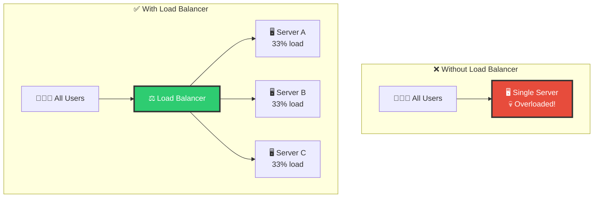
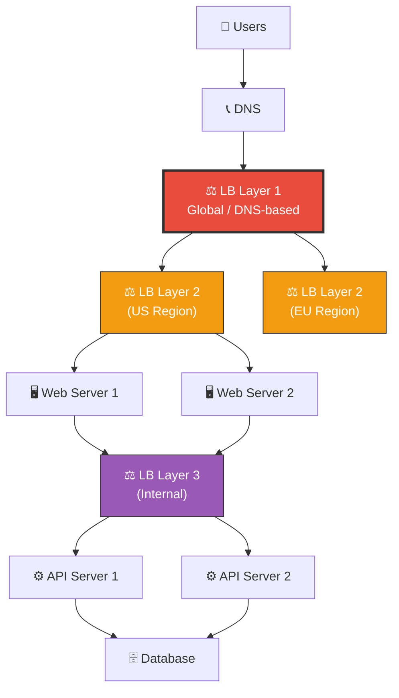
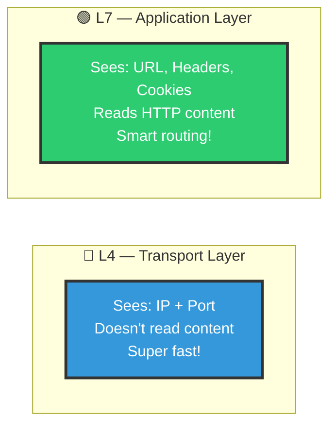
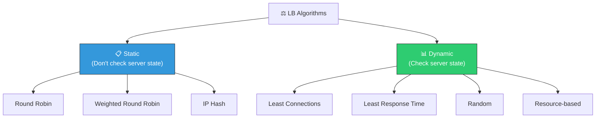
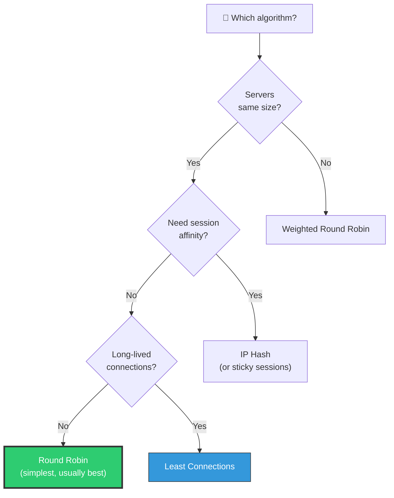
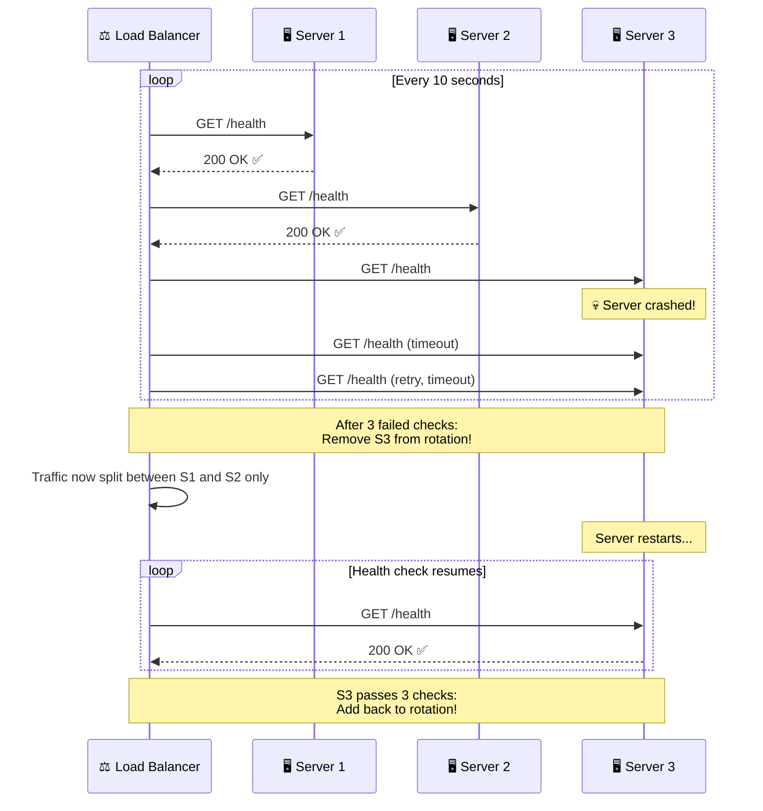
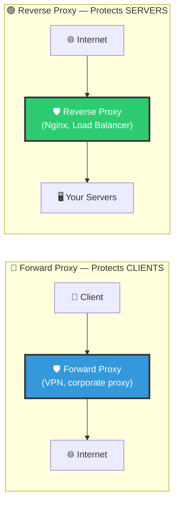
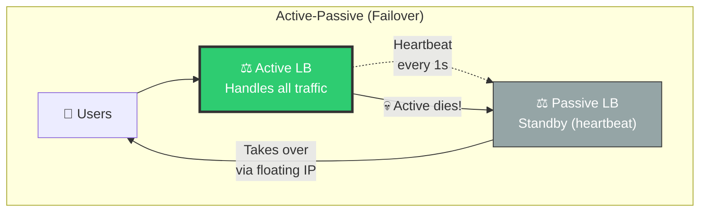
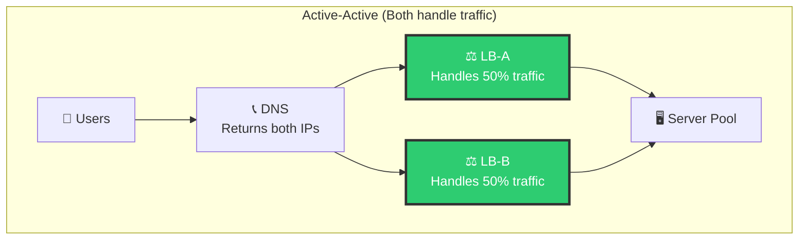
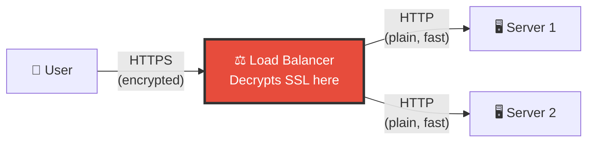

# 🏗️ System Design — Topic 6: Load Balancers — Distributing Traffic

> **Why this matters**: Without a load balancer, one server handles EVERYTHING — it becomes a **single point of failure** and a **performance bottleneck**. Load balancers are what make horizontal scaling possible. Every production system uses them — from a 2-server startup to Google's millions of servers.

> **Code Implementation**: See [code.py](./code.py) for runnable Python simulations

---

## 🧠 What Is a Load Balancer?

> A load balancer sits between clients and servers, distributing incoming requests across multiple servers so no single server gets overwhelmed.

### 🎯 Analogy
> A load balancer is like a **restaurant host**. When customers arrive, the host doesn't send everyone to the same waiter. They distribute guests evenly across all available waiters — keeping the workload balanced and service fast.



### What Problems Does It Solve?

```
1. SCALABILITY     — Distribute traffic across N servers
2. AVAILABILITY    — If one server dies, others handle traffic
3. PERFORMANCE     — No single server gets overwhelmed
4. ZERO-DOWNTIME   — Deploy updates server by server
5. SSL TERMINATION — Handle encryption in one place
6. HEALTH CHECKS   — Automatically remove unhealthy servers
```

---

## 1️⃣ Where Load Balancers Sit in the Architecture



```
MULTIPLE LAYERS OF LOAD BALANCING:
  Layer 1: Global LB (DNS-based) → Routes to nearest region
  Layer 2: Regional LB (L4/L7)   → Distributes to web servers
  Layer 3: Internal LB            → Distributes to API/microservices
  Layer 4: DB LB                  → Routes reads to replicas
```

---

## 2️⃣ L4 vs L7 Load Balancing



### Comparison

| Feature | L4 (Transport) | L7 (Application) |
|---------|----------------|-------------------|
| **Sees** | IP address + port number | Full HTTP request (URL, headers, body) |
| **Speed** | ⚡ Very fast (no content parsing) | 🚗 Slower (must parse HTTP) |
| **Routing** | Simple (by IP/port) | Smart (by URL path, cookies, headers) |
| **SSL** | Passes through | Can terminate SSL |
| **Examples** | AWS NLB, HAProxy (TCP mode) | AWS ALB, Nginx, HAProxy (HTTP mode) |
| **Use case** | Raw TCP/UDP, gaming, IoT | Web apps, APIs, microservices |

### Pseudo Code — L7 Routing Rules

```
// L7 Load Balancer can route based on URL path, headers, cookies

FUNCTION route_request(request):

    // Route by URL path
    IF request.path STARTS_WITH "/api/":
        FORWARD_TO api_server_pool

    ELSE IF request.path STARTS_WITH "/static/":
        FORWARD_TO cdn_or_static_pool

    ELSE IF request.path STARTS_WITH "/admin/":
        FORWARD_TO admin_server_pool

    // Route by header
    ELSE IF request.headers["X-API-Version"] == "v2":
        FORWARD_TO v2_api_servers

    // Route by cookie (A/B testing)
    ELSE IF request.cookies["experiment"] == "new_ui":
        FORWARD_TO canary_servers

    ELSE:
        FORWARD_TO default_web_pool


// L4 Load Balancer — much simpler, only sees IP + port
FUNCTION route_l4(packet):
    // Can only route by source IP, destination port
    IF packet.dest_port == 443:
        FORWARD_TO https_pool (round robin)
    ELSE IF packet.dest_port == 3306:
        FORWARD_TO mysql_pool
```

---

## 3️⃣ Load Balancing Algorithms

### 📊 The Algorithm Family



### Algorithm Details

```
1. ROUND ROBIN — Simplest, rotate through servers
   Request 1 → Server A
   Request 2 → Server B
   Request 3 → Server C
   Request 4 → Server A (repeat)

   Pros: Dead simple, even distribution
   Cons: Ignores server health/load. A slow server still gets same traffic.

2. WEIGHTED ROUND ROBIN — More traffic to stronger servers
   Server A (weight 5): Gets 5 out of 8 requests (62.5%)
   Server B (weight 2): Gets 2 out of 8 requests (25%)
   Server C (weight 1): Gets 1 out of 8 requests (12.5%)

   Pros: Accounts for different server capacities
   Cons: Weights are static, don't adapt to real-time load

3. LEAST CONNECTIONS — Send to least busy server
   Server A: 15 active connections ←
   Server B: 42 active connections
   Server C: 28 active connections
   Next request → Server A (fewest connections)

   Pros: Adapts to real-time load
   Cons: Slightly more overhead (must track connections)
   Best for: Long-lived connections (WebSocket, database)

4. LEAST RESPONSE TIME — Send to fastest server
   Server A: avg response 50ms ←
   Server B: avg response 120ms
   Server C: avg response 80ms
   Next request → Server A (fastest)

   Pros: Users get fastest response
   Cons: Most complex, needs constant monitoring
   Best for: Latency-sensitive APIs

5. IP HASH — Same client always goes to same server
   HASH(client_ip) % num_servers = server_index
   Client 192.168.1.1 → HASH → always Server B
   Client 192.168.1.2 → HASH → always Server A

   Pros: Session affinity without cookies
   Cons: Uneven distribution if clients are clustered
   Best for: Stateful servers (if you can't use Redis)

6. RANDOM — Pick a server randomly
   Surprisingly effective with many servers!
   With 100 servers, random gives near-perfect distribution.
```

### Choosing the Right Algorithm



---

## 4️⃣ Health Checks — Detecting Dead Servers

### 🎯 Analogy
> A load balancer constantly **pings** each server like a teacher doing roll call. If a server doesn't respond, it's removed from the rotation until it recovers.



### Pseudo Code — Health Check Endpoint

```
// Your server should expose a health endpoint
ENDPOINT GET /health:
    checks = {
        "database": check_db_connection(),
        "cache":    check_redis_connection(),
        "disk":     check_disk_space() > 10%,
        "memory":   check_ram_usage() < 90%,
    }

    all_healthy = ALL(checks.values())

    IF all_healthy:
        RETURN 200 {"status": "healthy", "checks": checks}
    ELSE:
        RETURN 503 {"status": "unhealthy", "checks": checks}
        // Load balancer sees 503 → removes this server


// Health check configuration (at the load balancer)
HEALTH_CHECK:
    endpoint: /health
    interval: 10 seconds         // Check every 10s
    timeout: 5 seconds           // Fail if no response in 5s
    healthy_threshold: 3         // Must pass 3 checks to be "healthy"
    unhealthy_threshold: 2       // 2 failures = mark "unhealthy"
```

---

## 5️⃣ Reverse Proxy vs Forward Proxy



| Feature | Forward Proxy | Reverse Proxy |
|---------|--------------|---------------|
| **Protects** | Clients (hides their identity) | Servers (hides server details) |
| **Sits in front of** | Clients | Servers |
| **Example** | VPN, corporate proxy, Tor | Nginx, HAProxy, AWS ALB |
| **Use case** | Privacy, access control, caching | Load balancing, SSL, security |
| **Client knows?** | Yes (configured in browser) | No (transparent to client) |

---

## 6️⃣ High Availability — What If the Load Balancer Fails?

### 🎯 The Load Balancer Is a Single Point of Failure Too!





```
ACTIVE-PASSIVE:
  - One LB handles all traffic
  - Passive monitors via heartbeat
  - If active dies, passive takes over (2-30 second failover)
  - Simpler, but passive wastes resources

ACTIVE-ACTIVE:
  - Both LBs handle traffic simultaneously
  - DNS returns both IPs (or GSLB routes to both)
  - If one dies, the other handles ALL traffic
  - Better resource utilization, more complex
  - What most large companies use
```

---

## 7️⃣ SSL/TLS Termination



```
WHY TERMINATE SSL AT THE LOAD BALANCER?
  1. Servers don't need to handle expensive encryption/decryption
  2. Only ONE place to manage SSL certificates
  3. LB can inspect HTTP headers (needed for L7 routing)
  4. Internal traffic (LB → Server) is on private network — safe unencrypted

  Server CPU savings: ~20-30% less CPU usage without SSL!
```

---

## 8️⃣ Real-World Load Balancer Solutions

| Solution | Type | Best For | Key Feature |
|----------|------|----------|-------------|
| **Nginx** | Software (L7) | Web apps, reverse proxy | Most popular, config-based |
| **HAProxy** | Software (L4/L7) | High-performance TCP/HTTP | Fastest open-source LB |
| **AWS ALB** | Cloud (L7) | AWS apps, microservices | Path-based routing, WAF |
| **AWS NLB** | Cloud (L4) | Ultra-low latency TCP | Millions of requests/sec |
| **Google Cloud LB** | Cloud (L4/L7) | GCP apps | Global anycast, auto-scaling |
| **Envoy** | Software (L7) | Service mesh (Kubernetes) | gRPC, observability |
| **Traefik** | Software (L7) | Docker/Kubernetes | Auto-discovery, Let's Encrypt |

---

## 🏋️ Practice Exercises

### Exercise 1: Choose the Algorithm
> For each scenario, pick the best load balancing algorithm and justify:
> - a) 5 identical web servers handling REST APIs
> - b) 3 servers: 1 powerful (64GB RAM), 2 small (16GB RAM)
> - c) WebSocket connections for a chat app
> - d) A/B testing: 10% of users see new UI

### Exercise 2: Design Health Checks
> Your e-commerce app depends on: PostgreSQL, Redis, Elasticsearch, and an external payment API. Design a `/health` endpoint that checks all dependencies. What should happen if Redis is down but everything else works?

### Exercise 3: LB Architecture
> Draw the load balancing architecture for an app serving 100K concurrent users with: web servers, API servers, WebSocket servers, and database read replicas. How many layers of LB do you need?

---

## 🎤 Interview Corner

> **Q: "What is a load balancer and why do we need one?"**
>
> **Great answer**: "A load balancer distributes incoming requests across multiple servers. It solves three key problems: scalability by spreading load, availability by routing around failed servers using health checks, and performance by preventing any single server from being overwhelmed. It also enables zero-downtime deployments by draining connections from one server at a time during updates."

> **Q: "What's the difference between L4 and L7 load balancing?"**
>
> **Great answer**: "L4 operates at the transport layer — it sees only IP addresses and port numbers, making it extremely fast but limited in routing decisions. L7 operates at the application layer — it can read HTTP headers, URLs, and cookies, enabling smart routing like sending `/api` requests to one server pool and `/static` to another. L4 is better for raw TCP/UDP traffic, while L7 is better for web applications where content-based routing is valuable."

> **Q: "How do you make the load balancer itself highly available?"**
>
> **Great answer**: "There are two approaches. Active-passive uses a standby LB that monitors the primary via heartbeats and takes over with a floating IP if the primary fails — failover takes 2-30 seconds. Active-active runs both LBs simultaneously, with DNS or anycast routing traffic to both. If one fails, the other absorbs all traffic. Active-active is preferred because it utilizes both LBs and provides faster failover."

---

## ✅ Key Takeaways

| Concept | Remember |
|---------|----------|
| **Load balancer** | Distributes traffic across servers for scale, availability, performance |
| **L4 vs L7** | L4 = fast, sees IP/port. L7 = smart, sees HTTP content |
| **Round Robin** | Simplest, usually good enough for identical servers |
| **Least Connections** | Best for long-lived connections (WebSocket, DB) |
| **Health checks** | Auto-detect and remove unhealthy servers (every 10s) |
| **Reverse proxy** | Sits in front of servers, clients don't know it's there |
| **Active-Active** | Two LBs both handling traffic — no single point of failure |
| **SSL termination** | Decrypt at LB, saves 20-30% server CPU |

---

**Next up → [Topic 7: Caching — The Speed Layer](../2.7-Caching/)**
