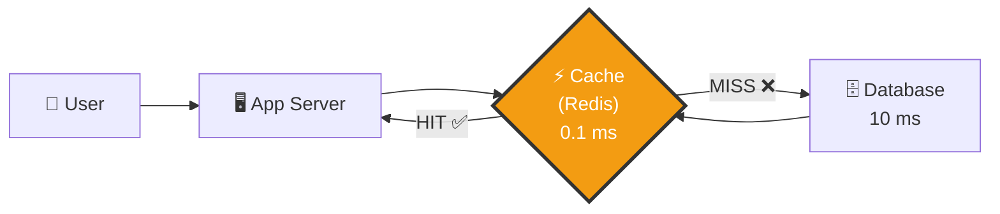
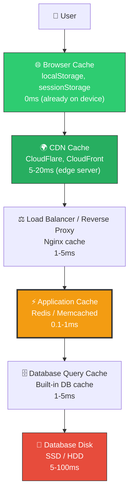
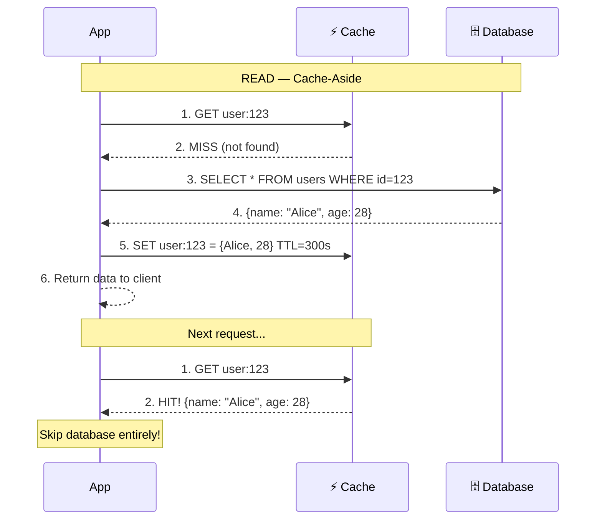
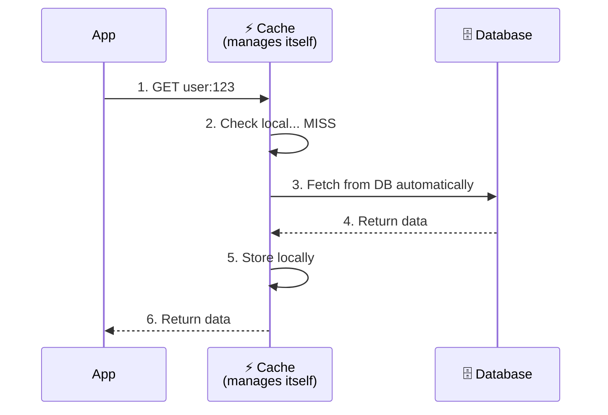
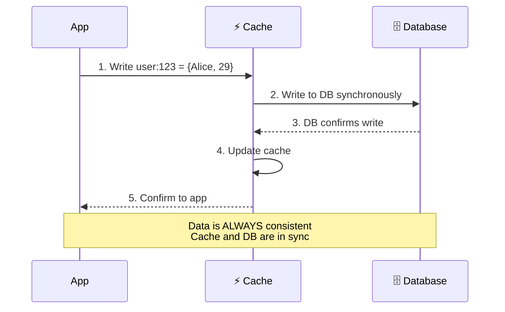
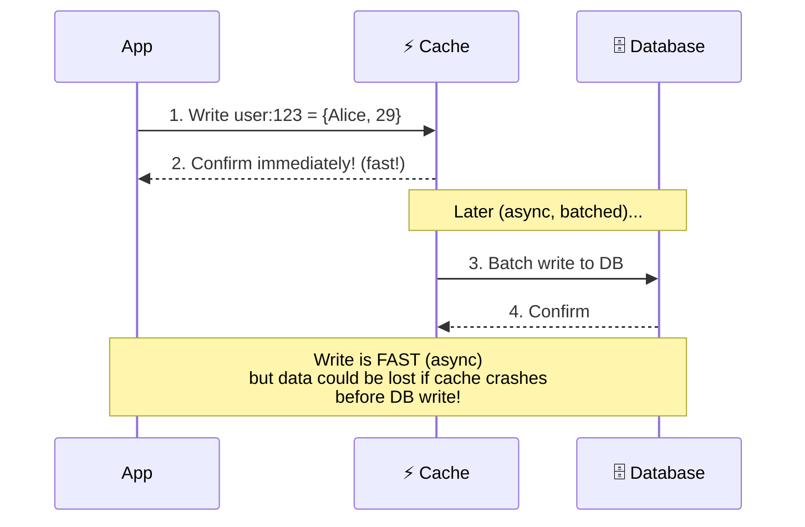
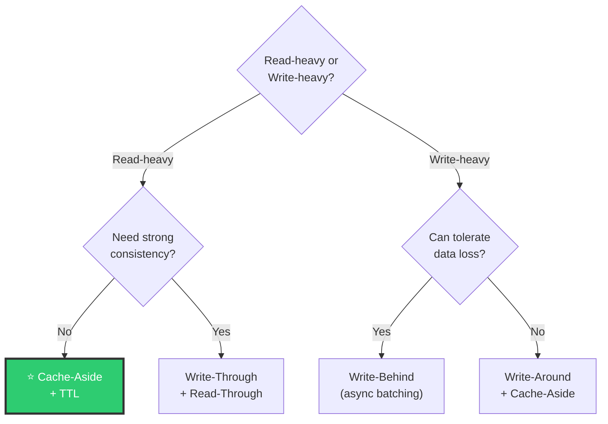
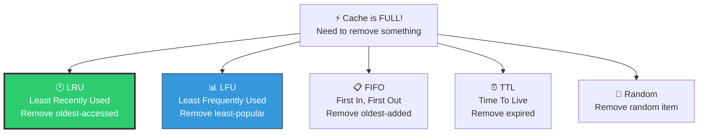
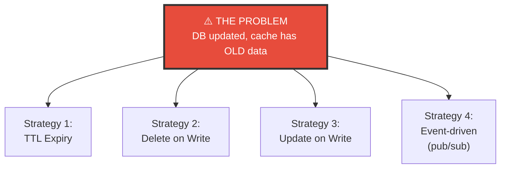
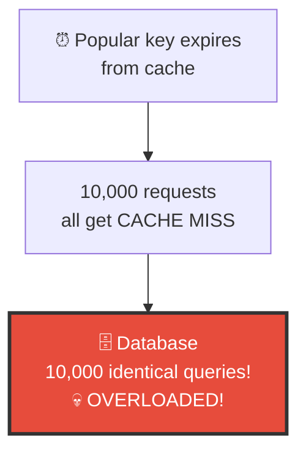

# 🏗️ System Design — Topic 7: Caching — The Speed Layer

> **Why this matters**: Caching is the **#1 technique** to make systems fast. A single Redis instance handles **100,000+ requests/second** at **sub-millisecond** latency, while a database does ~5,000. Caching correctly can make your system **10-100x faster** and reduce infrastructure costs by 80%. But caching incorrectly creates **stale data bugs** that are nightmarish to debug.

> **Code Implementation**: See [code.py](./code.py) for runnable Python simulations

---

## 🧠 What Is Caching?

> Caching is storing **frequently accessed data** in a **faster storage layer** so you don't have to fetch it from the slower source every time.

### 🎯 Analogy
> Your **brain** is a cache for your **library**. You don't walk to the library every time someone asks a question — you remember (cache) common answers. If someone asks something you don't remember (cache miss), THEN you go to the library (database).



```
WITHOUT CACHE:                    WITH CACHE:
  Every request → Database          First request → Database (10ms)
  Response time: 10-100ms           Store in cache
  QPS limit: ~5,000                 Next 99 requests → Cache (0.1ms)
                                    Avg response: ~0.2ms
                                    QPS: 100,000+
```

---

## 1️⃣ The Caching Layers — Where Caches Live



| Layer | What's Cached | Speed | Size | Managed By |
|-------|--------------|-------|------|------------|
| **Browser** | Pages, images, API responses | 0ms | ~100 MB | Frontend code |
| **CDN** | Static assets, media | 5-20ms | TBs | CDN provider |
| **Reverse Proxy** | Full HTTP responses | 1-5ms | GBs | Nginx/Varnish |
| **Application (Redis)** | Query results, sessions, computed data | 0.1-1ms | GBs-TBs | Your app code |
| **DB Query Cache** | Recent query results | 1-5ms | MBs-GBs | Database engine |
| **CPU Cache** | L1/L2/L3 | 1-100ns | KBs-MBs | Hardware |

---

## 2️⃣ Caching Strategies — The Five Patterns

### Pattern 1: Cache-Aside (Lazy Loading) ⭐ Most Common



### Pseudo Code

```
// CACHE-ASIDE — App manages the cache
FUNCTION get_user(user_id):
    // Step 1: Check cache
    cached = CACHE.GET("user:" + user_id)
    IF cached IS NOT NULL:
        RETURN cached                    // Cache HIT — fast!

    // Step 2: Cache miss — fetch from DB
    user = DB.QUERY("SELECT * FROM users WHERE id = ?", user_id)

    // Step 3: Store in cache for future requests
    CACHE.SET("user:" + user_id, user, TTL=300)  // Expire in 5 min

    RETURN user

// WRITE — Update DB, then invalidate cache
FUNCTION update_user(user_id, new_data):
    DB.UPDATE("UPDATE users SET ... WHERE id = ?", user_id, new_data)
    CACHE.DELETE("user:" + user_id)      // Invalidate — next read will refresh
```

```
PROS:
  ✅ Only caches data that's actually requested (lazy)
  ✅ Cache failures don't break the app (falls back to DB)
  ✅ Simple to implement
CONS:
  ❌ First request is always slow (cache miss)
  ❌ Data can be stale until TTL expires or explicit invalidation
```

---

### Pattern 2: Read-Through



```
DIFFERENCE FROM CACHE-ASIDE:
  Cache-Aside: APP fetches from DB on miss
  Read-Through: CACHE fetches from DB on miss (app doesn't touch DB)

PROS: Simpler app code (cache handles everything)
CONS: Cache library must support DB integration
```

---

### Pattern 3: Write-Through



```
PROS:
  ✅ Cache and DB always consistent (no stale data!)
  ✅ Reads are always fast (data already in cache)
CONS:
  ❌ Writes are SLOWER (must write to both cache + DB)
  ❌ Caches data that might never be read (wasteful)
Best for: Read-heavy data that MUST be consistent (user profiles)
```

---

### Pattern 4: Write-Behind (Write-Back)



```
PROS:
  ✅ FASTEST writes (return immediately from cache)
  ✅ Batching reduces DB load significantly
  ✅ Great for write-heavy workloads
CONS:
  ❌ DATA LOSS RISK — if cache crashes before DB sync
  ❌ Complex implementation
Best for: Logs, analytics, counters (where losing a few writes is OK)
```

---

### Pattern 5: Write-Around

```
Write-Around: Write directly to DB, skip cache entirely
  Reads still use cache-aside pattern

FUNCTION write_user(user_id, data):
    DB.UPDATE(...)           // Write to DB only
    // Don't touch cache — it will refresh on next read

PROS: ✅ Cache only contains data that's actually read
CONS: ❌ First read after write is always a cache miss
Best for: Data that's written frequently but rarely read
```

### Choosing the Right Strategy



---

## 3️⃣ Cache Eviction Policies — What to Remove When Cache Is Full?



### Pseudo Code — LRU Cache

```
// LRU (Least Recently Used) — Most popular eviction policy
// Removes the item that hasn't been accessed for the longest time

CLASS LRUCache:
    capacity = 100
    cache = OrderedDict()    // Maintains insertion/access order

    FUNCTION GET(key):
        IF key IN cache:
            cache.move_to_end(key)    // Mark as recently used
            RETURN cache[key]
        RETURN NULL                    // Cache miss

    FUNCTION SET(key, value):
        IF key IN cache:
            cache.move_to_end(key)
        cache[key] = value

        IF LENGTH(cache) > capacity:
            cache.pop_first()          // Remove LEAST recently used

// Example:
// Cache (capacity=3): [A, B, C]
// Access B → [A, C, B]     (B moved to end)
// Add D   → [C, B, D]     (A evicted — least recently used)
// Add E   → [B, D, E]     (C evicted)
```

| Policy | Best For | Weakness |
|--------|----------|----------|
| **LRU** ⭐ | General purpose — most used | Scan pollution (one-time scans evict popular items) |
| **LFU** | Data with stable popularity (trending) | Slow to adapt to new trends |
| **FIFO** | Simple use cases | Ignores access patterns |
| **TTL** | Data with known expiry (sessions) | Doesn't help with memory pressure |
| **Random** | When all items are equally likely | Unpredictable |

---

## 4️⃣ Cache Invalidation — "The Hardest Problem in CS"

```
"There are only two hard things in Computer Science:
 cache invalidation and naming things." — Phil Karlton
```

### The Problem



### Pseudo Code — Each Strategy

```
// Strategy 1: TTL — Let it expire naturally
CACHE.SET("user:123", user_data, TTL=300)
// Data might be stale for up to 5 minutes
// Simple but imprecise

// Strategy 2: Delete on Write (most common!)
FUNCTION update_user(user_id, new_data):
    DB.UPDATE(user_id, new_data)
    CACHE.DELETE("user:" + user_id)    // Next read will get fresh data
// Good balance of consistency and simplicity

// Strategy 3: Update on Write
FUNCTION update_user(user_id, new_data):
    DB.UPDATE(user_id, new_data)
    CACHE.SET("user:" + user_id, new_data, TTL=300)
// Keeps cache hot, but race condition possible!

// Strategy 4: Event-driven (best for distributed systems)
// When DB changes, publish event → all cache nodes invalidate
FUNCTION update_user(user_id, new_data):
    DB.UPDATE(user_id, new_data)
    EVENT_BUS.PUBLISH("user_updated", {id: user_id})

// Cache subscriber
ON_EVENT("user_updated"):
    CACHE.DELETE("user:" + event.id)
```

---

## 5️⃣ Cache Stampede (Thundering Herd) — The Dangerous Scenario

### 🎯 Analogy
> 10,000 users request the same data. The cache just expired. ALL 10,000 requests simultaneously hit the database. The database **collapses**.



### Solutions

```
SOLUTION 1: LOCKING — Only ONE request fetches from DB
FUNCTION get_with_lock(key):
    value = CACHE.GET(key)
    IF value IS NOT NULL:
        RETURN value

    // Try to acquire lock
    IF CACHE.SET_IF_NOT_EXISTS("lock:" + key, "1", TTL=10):
        // I won the lock — fetch from DB
        value = DB.QUERY(key)
        CACHE.SET(key, value, TTL=300)
        CACHE.DELETE("lock:" + key)
        RETURN value
    ELSE:
        // Someone else is fetching — wait briefly and retry
        SLEEP(50ms)
        RETURN get_with_lock(key)


SOLUTION 2: STALE-WHILE-REVALIDATE — Serve stale, refresh in background
FUNCTION get_with_stale(key):
    entry = CACHE.GET_WITH_METADATA(key)

    IF entry.is_fresh:
        RETURN entry.value

    IF entry.is_stale_but_exists:
        ASYNC: refresh_cache(key)    // Background refresh
        RETURN entry.value           // Serve stale immediately

    // Not in cache at all
    value = DB.QUERY(key)
    CACHE.SET(key, value, TTL=300)
    RETURN value


SOLUTION 3: JITTERED TTL — Prevent mass expiration
FUNCTION set_with_jitter(key, value, base_ttl):
    jitter = RANDOM(0, base_ttl * 0.2)  // ±20% randomness
    CACHE.SET(key, value, TTL=base_ttl + jitter)
    // Keys expire at slightly different times
    // Prevents thundering herd
```

---

## 6️⃣ Redis vs Memcached

| Feature | Redis | Memcached |
|---------|-------|-----------|
| **Data structures** | Strings, lists, sets, hashes, sorted sets | Strings only |
| **Persistence** | Yes (RDB snapshots, AOF log) | No (memory only) |
| **Replication** | Master-replica | No built-in |
| **Clustering** | Redis Cluster (auto-sharding) | Client-side sharding |
| **Pub/Sub** | Yes | No |
| **Lua scripting** | Yes | No |
| **Max value size** | 512 MB | 1 MB |
| **Threads** | Single-threaded (6.0+ multi-threaded I/O) | Multi-threaded |
| **Use case** | Most use cases — sessions, queues, leaderboards | Simple key-value cache |

```
WHEN TO USE REDIS:
  ✅ You need data structures beyond key-value
  ✅ You need persistence (cache survives restart)
  ✅ You need pub/sub for real-time features
  ✅ You want built-in replication
  → 90% of the time, choose Redis

WHEN TO USE MEMCACHED:
  ✅ Pure simple caching, nothing fancy
  ✅ Need multi-threaded performance
  ✅ Very large values (unlikely)
```

---

## 7️⃣ What to Cache — Real-World Examples

```
HIGH IMPACT (cache these!):
  ✅ Database query results (user profiles, product listings)
  ✅ Session data (login state, permissions)
  ✅ API responses (external API calls that rarely change)
  ✅ Computed results (recommendations, feed rankings)
  ✅ Configuration/feature flags

MEDIUM IMPACT:
  ⚠️ Full HTML pages (with short TTL)
  ⚠️ Search results (with user-specific invalidation)

DON'T CACHE:
  ❌ Rapidly changing data (real-time stock prices)
  ❌ Highly personalized data (unique per user + changes often)
  ❌ Write-heavy data with strong consistency needs
  ❌ Very large objects (videos — use CDN instead)
```

---

## 🏋️ Practice Exercises

### Exercise 1: Choose the Strategy
> For each use case, pick the best caching strategy and eviction policy:
> - a) User profiles (read 1000x more than written)
> - b) Shopping cart (changes frequently, must be accurate)
> - c) View counter on articles (write-heavy, approximate OK)
> - d) Authentication tokens (expire after 1 hour)

### Exercise 2: Fix the Stampede
> Your most popular product page (viewed 50,000 times/minute) has its cache expire every 5 minutes. When it expires, 50,000 queries hit PostgreSQL simultaneously and the database crashes. Design a solution.

### Exercise 3: Cache Key Design
> Design the cache key structure for an e-commerce app:
> - Product details (by ID)
> - Product search results (by query + filters + page)
> - User's cart
> - Product recommendations (per user)
> How do you invalidate each when data changes?

---

## 🎤 Interview Corner

> **Q: "What caching strategy would you use?"**
>
> **Great answer**: "For read-heavy workloads, I'd use cache-aside with Redis. The app checks cache first, on miss fetches from DB and populates cache. For writes, I'd delete the cache key and let the next read refresh it. I'd set TTLs as a safety net and add jitter to prevent thundering herd. For write-heavy data like counters, I'd use write-behind to batch writes to the database."

> **Q: "How do you handle cache invalidation?"**
>
> **Great answer**: "The most reliable approach is delete-on-write: when data changes, delete the cache key so the next read fetches fresh data. For distributed systems, I'd use event-driven invalidation via a message queue — when service A updates data, it publishes an event that cache subscribers listen to. TTLs act as a safety net for any missed invalidations. I'd also use jittered TTLs to prevent mass expiration."

> **Q: "What's the thundering herd problem?"**
>
> **Great answer**: "When a popular cache key expires, thousands of concurrent requests all get cache misses and simultaneously query the database, potentially crashing it. Solutions include: locking so only one request fetches from DB while others wait, stale-while-revalidate to serve stale data while refreshing in background, and jittered TTLs so keys expire at slightly different times."

---

## ✅ Key Takeaways

| Concept | Remember |
|---------|----------|
| **Cache-Aside** ⭐ | App checks cache → miss → DB → populate cache. Most common pattern |
| **Write-Through** | Write to cache AND DB synchronously. Strong consistency, slower writes |
| **Write-Behind** | Write to cache, async batch to DB. Fastest writes, data loss risk |
| **LRU** ⭐ | Evict least recently used. Best general-purpose policy |
| **Invalidation** | Delete-on-write + TTL as safety net. Event-driven for distributed |
| **Thundering herd** | Use locking, stale-while-revalidate, or jittered TTLs |
| **Redis** | Use for 90% of cases. Data structures, persistence, pub/sub |
| **Cache sizing** | Cache top 20% of data → serves 80% of reads (80/20 rule) |

---

**Next up → [Topic 8: Databases Deep Dive — SQL & NoSQL](../2.8-Databases-Deep-Dive/)**
