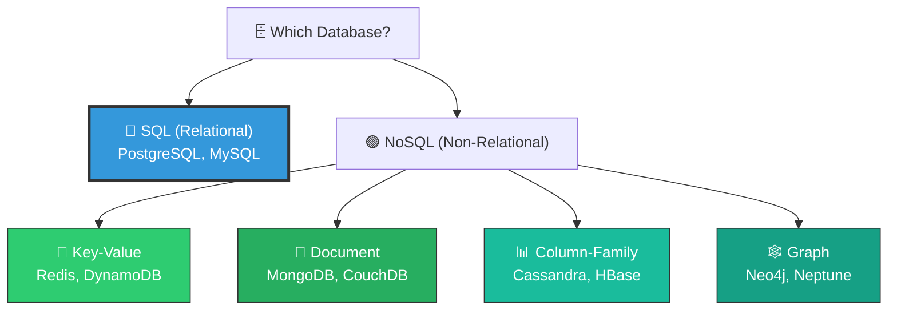
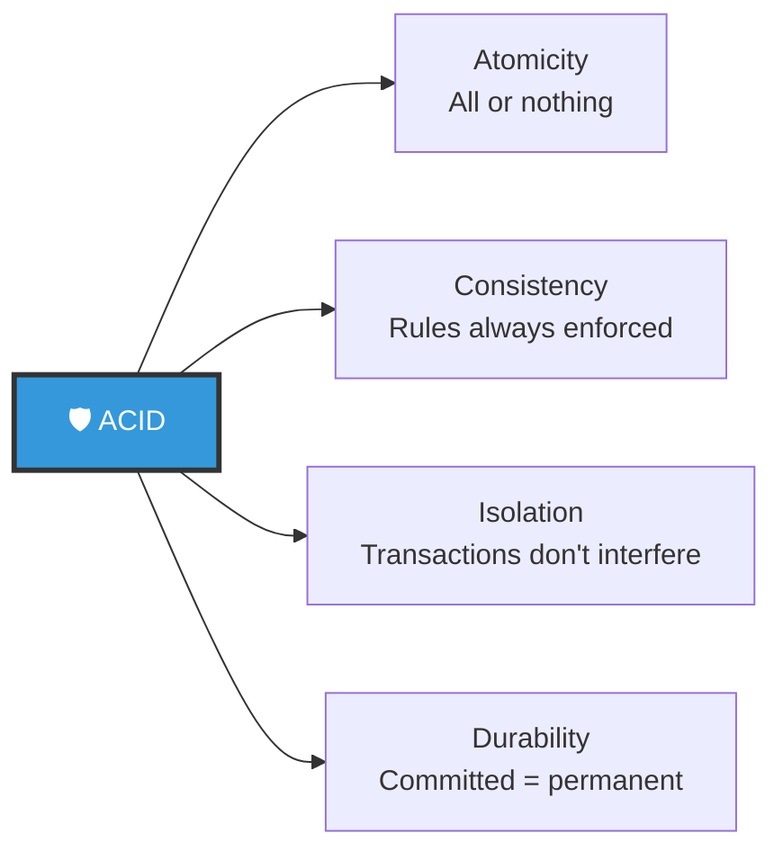
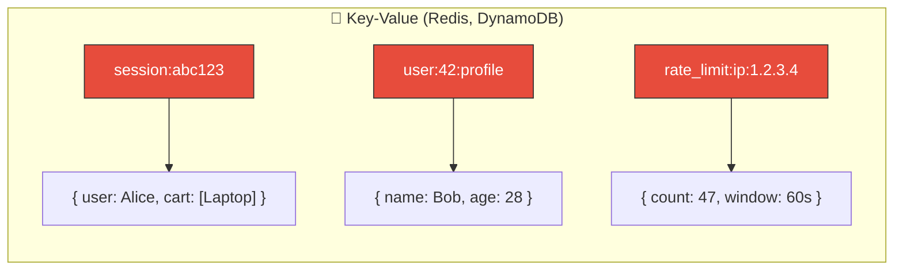
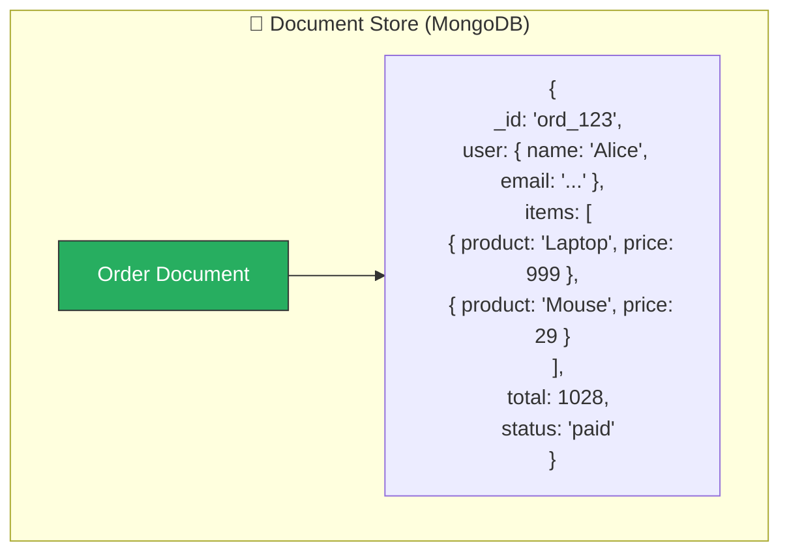
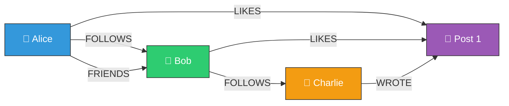
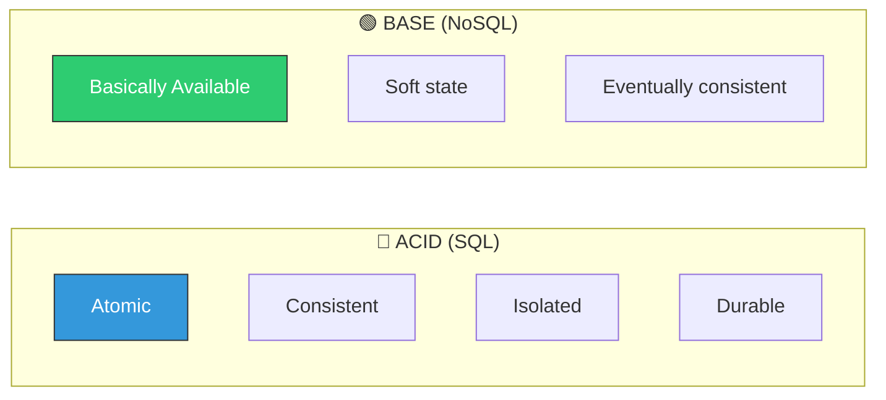
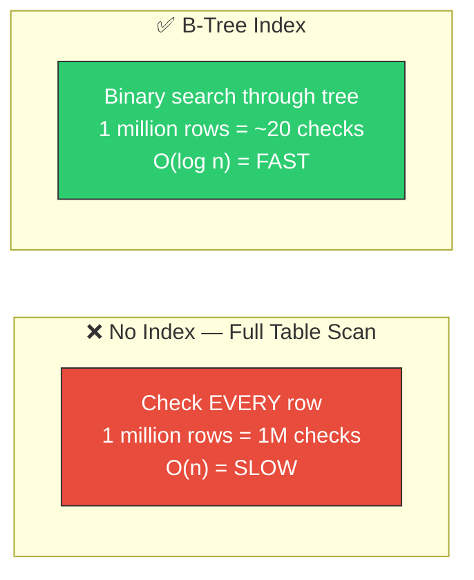
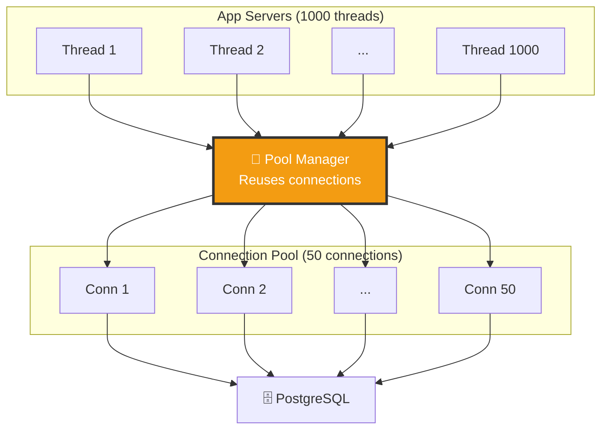
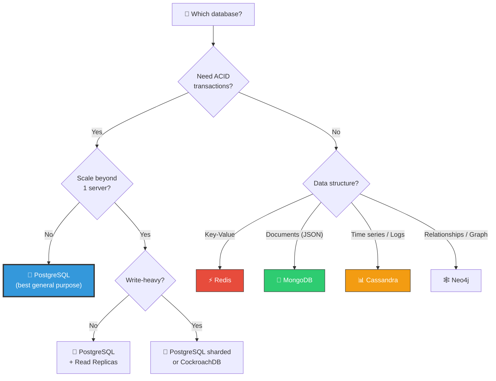

# 🏗️ System Design — Topic 8: Databases Deep Dive — SQL & NoSQL

> **Why this matters**: Choosing the wrong database is the **most expensive mistake** in system design. It affects everything — performance, scalability, consistency, and developer productivity. Migrating databases after launch is like changing the engine of a plane mid-flight. Get it right from the start.

> **Prerequisite**: Topic 1.4 covered SQL basics (ACID, JOINs, indexing, normalization). This topic goes deeper from a **system design perspective**.

> **Code Implementation**: See [code.py](./code.py) for runnable Python simulations

---

## 🧠 SQL vs NoSQL — The Big Decision

### 🎯 Analogy
> - **SQL** is like a **library** — books are organized in strict categories with a card catalog. Finding anything is reliable and consistent, but reorganizing the shelves is painful.
> - **NoSQL** is like a **warehouse** — throw items in labeled bins. Super flexible and fast to store, but finding related items across bins requires more work.



---

## 1️⃣ SQL (Relational) Databases — Deep Dive

### When SQL Shines

```
USE SQL WHEN:
  ✅ Data has clear RELATIONSHIPS (users → orders → products)
  ✅ You need ACID transactions (banking, e-commerce checkout)
  ✅ You need complex JOINs and aggregations
  ✅ Schema is well-defined and stable
  ✅ Data integrity is critical (no orphan records)
  ✅ You need strong consistency

REAL EXAMPLES:
  - Banking systems (transactions MUST be ACID)
  - E-commerce (orders + inventory + payments)
  - User management (roles, permissions, relationships)
  - ERP / CRM systems
```

### ACID — The SQL Guarantee



### Pseudo Code — SQL Schema for E-commerce

```
// Relational schema — data is NORMALIZED (no duplication)

TABLE users:
    id          INTEGER PRIMARY KEY
    name        VARCHAR(100) NOT NULL
    email       VARCHAR(255) UNIQUE NOT NULL
    created_at  TIMESTAMP DEFAULT NOW()

TABLE products:
    id          INTEGER PRIMARY KEY
    name        VARCHAR(200)
    price       DECIMAL(10, 2)
    stock       INTEGER DEFAULT 0

TABLE orders:
    id          INTEGER PRIMARY KEY
    user_id     INTEGER REFERENCES users(id)    // Foreign key!
    total       DECIMAL(10, 2)
    status      ENUM('pending', 'paid', 'shipped')
    created_at  TIMESTAMP DEFAULT NOW()

TABLE order_items:
    id          INTEGER PRIMARY KEY
    order_id    INTEGER REFERENCES orders(id)
    product_id  INTEGER REFERENCES products(id)
    quantity    INTEGER
    price       DECIMAL(10, 2)

// POWER OF SQL: Complex queries across related data
QUERY "Revenue by product last 30 days":
    SELECT p.name, SUM(oi.quantity * oi.price) AS revenue
    FROM order_items oi
    JOIN products p ON oi.product_id = p.id
    JOIN orders o ON oi.order_id = o.id
    WHERE o.created_at > NOW() - 30 DAYS
    AND o.status = 'paid'
    GROUP BY p.name
    ORDER BY revenue DESC
    LIMIT 10
```

---

## 2️⃣ NoSQL — The Four Types

### Type 1: Key-Value Store



```
KEY-VALUE STORES:
  Data model:  Simple key → value pairs
  Speed:       Fastest (O(1) lookups)
  Scale:       Excellent horizontal scaling
  Use cases:   Caching, sessions, rate limiting, leaderboards
  Cannot do:   Complex queries, JOINs, aggregations
  Examples:    Redis, Memcached, DynamoDB, Riak

  Think of it as: A giant hash map / dictionary
```

### Type 2: Document Store



```
DOCUMENT STORES:
  Data model:  JSON/BSON documents (nested, flexible schema)
  Speed:       Fast reads (all data in one document)
  Scale:       Good horizontal scaling
  Use cases:   Product catalogs, CMS, user profiles, events
  Cannot do:   Complex JOINs across collections
  Examples:    MongoDB, CouchDB, Firebase Firestore

  KEY DIFFERENCE FROM SQL:
    SQL:    User data in 'users' table, address in 'addresses' table → JOIN
    NoSQL:  User + address + preferences ALL in one document → no JOIN needed

  DENORMALIZED = Faster reads, harder updates
```

### Type 3: Column-Family Store

```
COLUMN-FAMILY STORES:
  Data model:  Rows with dynamic columns, grouped into column families
  Speed:       Extremely fast writes (append-only)
  Scale:       Best horizontal scaling (linear with nodes)
  Use cases:   Time-series, IoT, logs, analytics, event tracking
  Cannot do:   Ad-hoc queries, JOINs
  Examples:    Cassandra, HBase, ScyllaDB

  HOW IT'S DIFFERENT:
    SQL row:     [id, name, email, age, city, ...]  ← ALL columns stored together
    Column-family: Columns stored SEPARATELY on disk
                   Reading just 'name' doesn't load 'email', 'age', etc.
                   MUCH faster for analytical queries on specific columns
```

### Type 4: Graph Database



```
GRAPH DATABASES:
  Data model:  Nodes + Edges (relationships are first-class)
  Speed:       Fastest for relationship traversal
  Scale:       Moderate (hard to partition graphs)
  Use cases:   Social networks, recommendations, fraud detection, knowledge graphs
  Cannot do:   Aggregate queries, heavy writes
  Examples:    Neo4j, Amazon Neptune, ArangoDB

  WHY NOT SQL FOR GRAPHS?
    SQL: "Find friends of friends of friends" = 3 nested JOINs = SLOW
    Graph: Traverse 3 edges = FAST (regardless of data size)
```

---

## 3️⃣ ACID vs BASE



| Property | ACID (SQL) | BASE (NoSQL) |
|----------|-----------|-------------|
| **Consistency** | Strong — always correct | Eventual — correct *soon* |
| **Availability** | May block during contention | Always responds |
| **Speed** | Slower (locking, coordination) | Faster (no coordination) |
| **Scale** | Vertical (mostly) | Horizontal (designed for it) |
| **Use case** | Banking, orders | Social media, analytics |

---

## 4️⃣ Indexing Deep Dive — How Databases Find Data Fast

### 📊 Without Index vs With Index



### Index Types

```
B-TREE INDEX (default in PostgreSQL, MySQL):
  Structure:   Balanced tree, sorted
  Best for:    Range queries (WHERE age > 25 AND age < 35)
               Equality (WHERE id = 42)
               Sorting (ORDER BY created_at)
  Time:        O(log n) for all operations
  Used by:     PostgreSQL, MySQL, SQLite

HASH INDEX:
  Structure:   Hash table
  Best for:    Exact equality ONLY (WHERE id = 42)
  Cannot do:   Range queries, sorting
  Time:        O(1) average
  Used by:     Redis, Memcached, DynamoDB

LSM TREE (Log-Structured Merge Tree):
  Structure:   In-memory buffer + sorted disk files
  Best for:    WRITE-HEAVY workloads
  Trade-off:   Faster writes, slightly slower reads
  Used by:     Cassandra, RocksDB, LevelDB, ClickHouse

COMPOSITE INDEX:
  CREATE INDEX idx ON users(country, city, age)
  Speeds up:  WHERE country = 'US'
              WHERE country = 'US' AND city = 'NYC'
              WHERE country = 'US' AND city = 'NYC' AND age > 25
  Doesn't help: WHERE city = 'NYC'  (must use leftmost columns!)
```

### Pseudo Code — Index Trade-offs

```
// INDEX TRADE-OFFS — Indexes aren't free!

// BENEFIT: Faster reads
// Without index: SELECT * FROM users WHERE email = ?  → Scan 10M rows (~500ms)
// With index:    SELECT * FROM users WHERE email = ?  → B-tree lookup (~1ms)
// Speedup: 500x!

// COST: Slower writes
// Without index: INSERT INTO users → Just append (~1ms)
// With index:    INSERT INTO users → Append + update B-tree (~5ms)
// Every index adds ~2-5ms to each write

// COST: Storage
// Each index uses ~10-30% of table size
// 5 indexes on a 10GB table = 5-15 GB extra storage

// RULE OF THUMB:
// Read-heavy tables (95% reads): Add many indexes
// Write-heavy tables (logs, events): Minimize indexes
// Max recommended: 5-7 indexes per table
```

---

## 5️⃣ Connection Pooling — Don't Open 10,000 Connections

### The Problem

```
WITHOUT CONNECTION POOL:
  Each request opens a new DB connection (~50ms)
  Each connection uses ~10MB of RAM
  1,000 concurrent users = 1,000 connections = 10 GB RAM!
  PostgreSQL default max: 100 connections → CRASH at 101!

WITH CONNECTION POOL (PgBouncer):
  Pool of 50 reusable connections
  1,000 concurrent requests share 50 connections
  Connection reuse: ~0.1ms (vs 50ms to create new)
  RAM: 500 MB instead of 10 GB
```



---

## 6️⃣ The Database Selection Framework



### The Decision Table

| Requirement | Best Choice | Why |
|------------|-------------|-----|
| General purpose, unsure | **PostgreSQL** | Does everything well, huge ecosystem |
| Caching, sessions, queues | **Redis** | Fastest, rich data structures |
| Flexible schema, rapid iteration | **MongoDB** | Schema-less, easy for prototyping |
| Write-heavy time-series/logs | **Cassandra** | Linear write scaling, append-only |
| Social graph, recommendations | **Neo4j** | O(1) relationship traversal |
| Full-text search | **Elasticsearch** | Inverted index, scoring |
| Analytics, OLAP | **ClickHouse** | Columnar, 100x faster than SQL for analytics |
| Global ACID + horizontal scale | **CockroachDB / Spanner** | Distributed SQL |

---

## 7️⃣ How Real Companies Choose

```
NETFLIX:
  ├── Cassandra    → Viewing history, user activity (write-heavy, AP)
  ├── MySQL        → Billing, accounts (ACID required)
  ├── Elasticsearch → Search catalog
  └── Redis        → Session cache, recommendations cache

UBER:
  ├── MySQL (Schemaless) → Trip data, user data (custom sharding)
  ├── PostgreSQL   → Geospatial queries (PostGIS)
  ├── Redis        → Real-time supply/demand pricing
  └── Cassandra    → Logging, analytics

INSTAGRAM:
  ├── PostgreSQL   → User data, photos metadata (sharded)
  ├── Cassandra    → Feed storage, direct messages
  ├── Redis        → Caching, rate limiting
  └── Elasticsearch → Search (users, hashtags)

LESSON: Big companies use MULTIPLE databases!
  Each database is chosen for what it does BEST.
  This is called "polyglot persistence".
```

---

## 8️⃣ SQL vs NoSQL — The Final Comparison

| Factor | SQL | NoSQL |
|--------|-----|-------|
| **Schema** | Fixed, strict | Flexible, dynamic |
| **Relationships** | ⭐ Excellent (JOINs) | Poor (denormalized) |
| **Transactions** | ⭐ ACID guaranteed | Limited or eventual |
| **Scaling** | Vertical (mostly) | ⭐ Horizontal (native) |
| **Write speed** | Good | ⭐ Excellent (esp. Cassandra) |
| **Query flexibility** | ⭐ SQL is powerful | Limited query language |
| **Schema changes** | Painful (migrations) | ⭐ Easy (just add fields) |
| **Learning curve** | Medium | Low (for basic use) |
| **Maturity** | 40+ years | 10-20 years |
| **Default choice** | ⭐ Start here | When SQL doesn't fit |

---

## 🏋️ Practice Exercises

### Exercise 1: Choose the Database
> For each system, pick the best database(s) and justify:
> - a) Banking system with transfers between accounts
> - b) Real-time chat application (WhatsApp-like)
> - c) IoT platform receiving 100,000 sensor readings/second
> - d) Social network with friend recommendations
> - e) Content management system for a news website

### Exercise 2: Design the Schema
> Design both SQL and NoSQL schemas for a food delivery app (users, restaurants, menus, orders, reviews). Which would you choose for production and why?

### Exercise 3: Index Strategy
> Your `orders` table has 50 million rows. Common queries:
> - Find orders by user_id (90% of queries)
> - Find orders by date range (5%)
> - Find orders by status (3%)
> - Find orders by user_id + status (2%)
> Design the optimal index strategy. How much extra storage?

---

## 🎤 Interview Corner

> **Q: "SQL or NoSQL — how do you decide?"**
>
> **Great answer**: "I start with PostgreSQL as the default — it handles 90% of use cases with ACID transactions, JOINs, and even JSON support. I'd switch to NoSQL only when there's a specific need: Redis for caching and real-time data, Cassandra for write-heavy time-series data, MongoDB when schema flexibility is critical and relationships are minimal, or Neo4j for graph traversal problems. Most production systems are polyglot — using multiple databases for different workloads."

> **Q: "How do you scale a relational database?"**
>
> **Great answer**: "I'd scale in this order: First, add caching with Redis to reduce read load by 80%. Second, add read replicas to spread reads across multiple servers. Third, optimize queries and indexes using EXPLAIN. Fourth, vertical scaling — bigger machine. Only as a last resort would I shard the database, because sharding adds enormous complexity — cross-shard JOINs, distributed transactions, rebalancing. Most companies never need sharding — Netflix, GitHub, and Stack Overflow all run on replicated PostgreSQL."

---

## ✅ Key Takeaways

| Concept | Remember |
|---------|----------|
| **Default choice** | PostgreSQL — does everything well, start here |
| **Key-Value (Redis)** | O(1) lookups, caching, sessions, rate limiting |
| **Document (MongoDB)** | Flexible schema, nested JSON, rapid prototyping |
| **Column-Family (Cassandra)** | Write-heavy, time-series, linear horizontal scale |
| **Graph (Neo4j)** | Relationships are first-class, social networks |
| **ACID vs BASE** | ACID = strong consistency (SQL). BASE = eventual consistency (NoSQL) |
| **B-tree index** | Default, O(log n), good for ranges and equality |
| **Connection pooling** | 50 pooled connections > 1,000 individual connections |
| **Polyglot persistence** | Use multiple databases — each for what it does best |

---

**Next up → [Topic 9: Database Replication](../2.9-Database-Replication/)**
