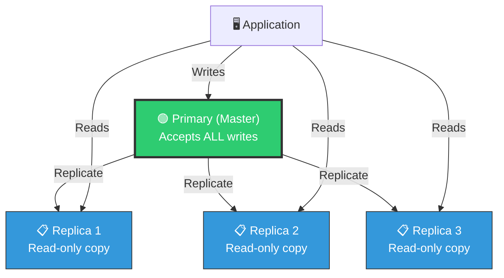
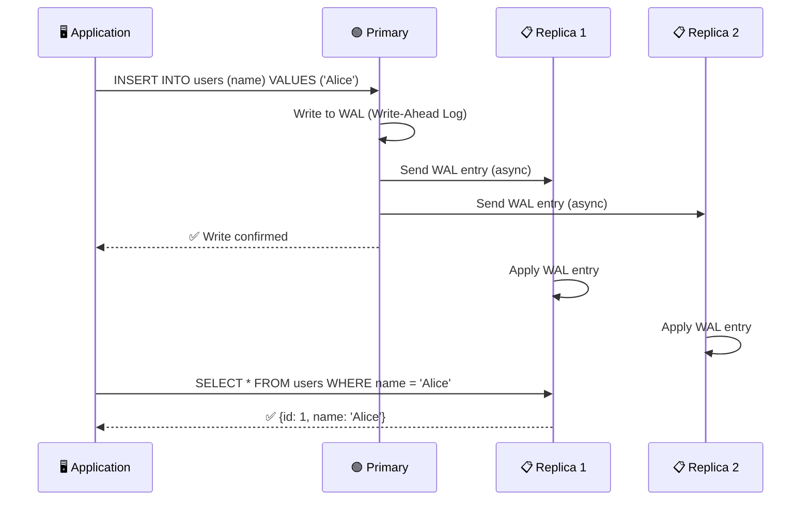
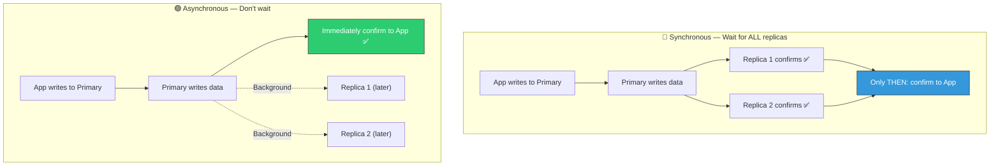
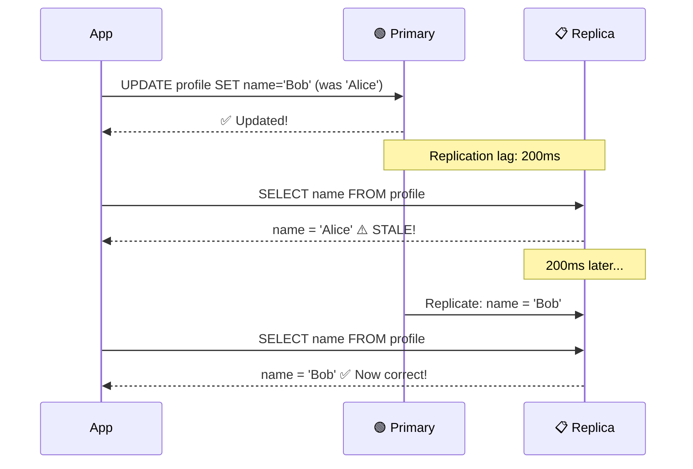
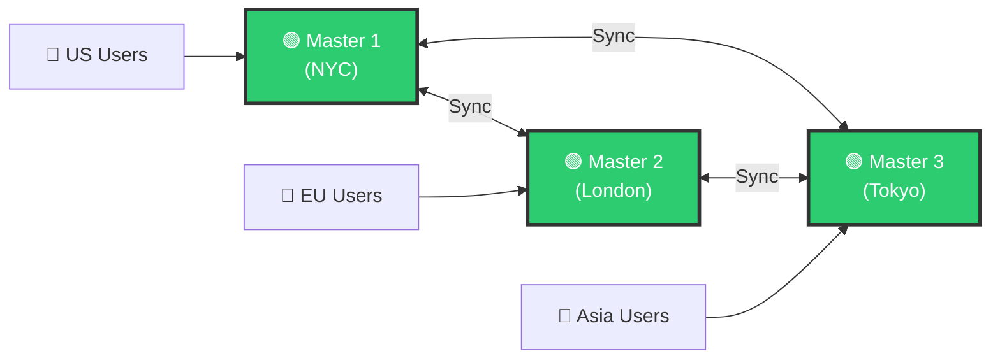
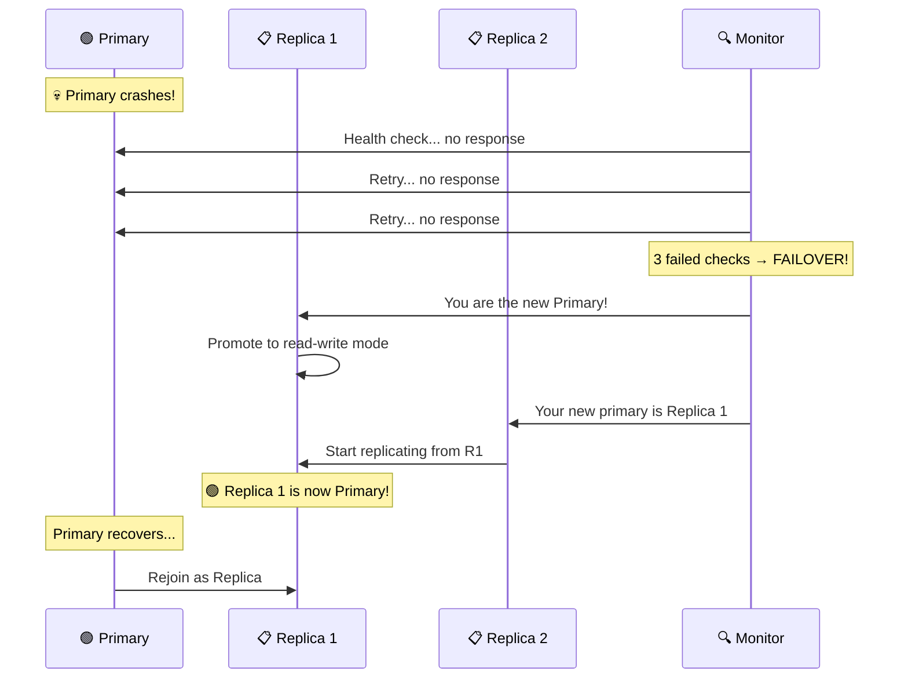
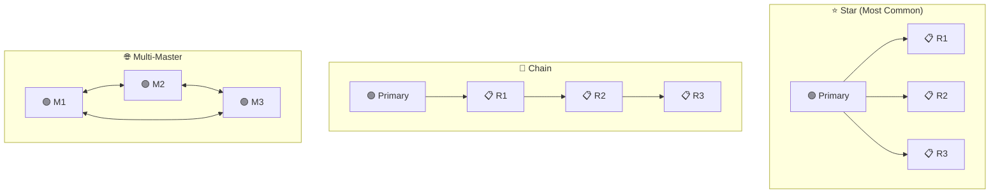

# 🏗️ System Design — Topic 9: Database Replication

> **Why this matters**: A single database server is a **ticking time bomb**. Hard drives fail, data centers lose power, servers crash. Without replication, your entire business goes down — and if the disk is corrupted, your data is **gone forever**. Replication also lets you scale reads by 5-10x by distributing queries across multiple copies.

> **Code Implementation**: See [code.py](./code.py) for runnable Python simulations

---

## 🧠 What Is Database Replication?

> Replication means keeping **copies of the same data** on multiple servers. When the primary server updates data, the changes are propagated to replicas.

### 🎯 Analogy
> Imagine a **teacher writing on a whiteboard** (primary). Three students (replicas) copy everything into their notebooks. If the teacher gets sick, any student can step up and teach from their notebook. If a student's notebook is lost, they can copy from another student.



### Why Replicate?

```
1. HIGH AVAILABILITY   — Primary dies? Replica takes over (failover)
2. READ SCALING        — 1 primary handles writes, 3 replicas handle reads = 4x read capacity
3. DISASTER RECOVERY   — Replica in another data center = survive data center fire
4. LOW LATENCY         — Replica near users = faster reads (NYC users → NYC replica)
5. BACKUP              — Replicas serve as live backups (no downtime for backup)
```

---

## 1️⃣ Primary-Replica (Master-Slave) Replication

### The Most Common Pattern



### Pseudo Code

```
// PRIMARY-REPLICA SETUP

PRIMARY SERVER:
    Accepts: ALL writes (INSERT, UPDATE, DELETE)
    Accepts: Reads (optional, usually sends reads to replicas)
    Produces: WAL (Write-Ahead Log) — stream of every change
    Sends: WAL to all replicas

REPLICA SERVER:
    Accepts: ONLY reads (SELECT)
    Receives: WAL from primary
    Applies: Changes from WAL to stay in sync
    Status: Read-only — rejects any write attempts

APPLICATION LOGIC:
    FUNCTION write(query):
        SEND query TO primary_server

    FUNCTION read(query):
        replica = PICK_RANDOM(replica_servers)
        SEND query TO replica
        // Splits read traffic across all replicas
```

---

## 2️⃣ Synchronous vs Asynchronous Replication

### 📊 The Critical Difference



| Feature | Synchronous | Asynchronous |
|---------|-------------|-------------|
| **Write speed** | 🐌 Slow (waits for replicas) | ⚡ Fast (returns immediately) |
| **Consistency** | ✅ Strong (replicas always in sync) | ⚠️ Eventual (replicas may lag) |
| **Data safety** | ✅ No data loss on primary failure | ❌ May lose recent writes |
| **Availability** | ❌ Replica down = writes blocked | ✅ Replica down = no impact |
| **Use case** | Banking, financial data | Social media, analytics |

### Semi-Synchronous (Best of Both)

```
SEMI-SYNCHRONOUS:
  Wait for at least ONE replica to confirm, then respond.
  Other replicas sync asynchronously.

  PRIMARY writes → Replica 1 confirms ✅ → Respond to app
                 → Replica 2 syncs in background (async)

  BENEFIT: If primary dies, at least ONE replica has ALL data
  COST: Slightly slower than full async (wait for 1 replica)

  PostgreSQL: synchronous_commit = on (for 1 replica)
  MySQL: rpl_semi_sync_master_enabled = 1
```

---

## 3️⃣ Replication Lag — The Silent Killer

### 🎯 Analogy
> The teacher writes "2+2=4" on the whiteboard. Student A copies immediately (1ms lag). Student B is slow and copies 5 seconds later. During those 5 seconds, if you ask Student B "what's 2+2?", they'll say "I don't know yet" — that's **replication lag**.



### The Problems Lag Causes

```
PROBLEM 1: READ-YOUR-OWN-WRITES
  User updates profile photo → immediately refreshes page
  Page reads from replica → still shows OLD photo!
  User: "My update didn't save?!"

  SOLUTION: After a write, read from PRIMARY for that user
            (for a short window, e.g., 10 seconds)

PROBLEM 2: MONOTONIC READS
  User refreshes page twice:
    Request 1 → Replica A (has latest data) → Shows 10 comments
    Request 2 → Replica B (lagging)         → Shows 8 comments
  User: "2 comments just disappeared?!"

  SOLUTION: Pin user to same replica (sticky sessions)

PROBLEM 3: CAUSALITY VIOLATIONS
  Alice writes: "I'm engaged!"
  Bob replies: "Congrats!"
  Reader sees Bob's reply BEFORE Alice's post (if different replicas)

  SOLUTION: Track causal dependencies, ensure order
```

### Pseudo Code — Handling Replication Lag

```
// SOLUTION: Read-your-own-writes
FUNCTION read_profile(user_id, current_user):
    IF user_id == current_user.id:
        // User is reading their OWN profile
        IF current_user.last_write < 10_SECONDS_AGO:
            RETURN PRIMARY.read(user_id)    // Force read from primary
        ELSE:
            RETURN REPLICA.read(user_id)    // Safe to read from replica
    ELSE:
        // Reading someone else's profile — replica is fine
        RETURN REPLICA.read(user_id)


// SOLUTION: Monotonic reads (sticky sessions)
FUNCTION get_replica_for_user(user_id):
    // Same user always reads from same replica
    replica_index = HASH(user_id) % NUM_REPLICAS
    RETURN replicas[replica_index]
```

---

## 4️⃣ Multi-Master Replication



```
MULTI-MASTER: ALL servers accept writes

PROS:
  ✅ Writes are fast (always write to local master)
  ✅ No single point of failure
  ✅ Low latency for global users

CONS:
  ❌ WRITE CONFLICTS — Two masters update same row simultaneously!
  ❌ Conflict resolution is hard (last-write-wins? merge? ask user?)
  ❌ Much more complex to operate

CONFLICT EXAMPLE:
  Master NYC: UPDATE user SET name = 'Bob Smith' WHERE id = 1
  Master LON: UPDATE user SET name = 'Robert S.' WHERE id = 1
  (Both happen at the same time — which one wins?)

WHEN TO USE:
  - Globally distributed apps (users in every continent)
  - Need to accept writes even during network partitions
  - Can tolerate eventual consistency
  - Examples: CouchDB, Cassandra, DynamoDB Global Tables
```

---

## 5️⃣ Failover — When the Primary Dies



### Pseudo Code — Failover Process

```
// AUTOMATIC FAILOVER

MONITOR PROCESS (runs every 5 seconds):
    FOR EACH server IN cluster:
        response = server.health_check()
        IF response IS TIMEOUT:
            server.failure_count += 1
        ELSE:
            server.failure_count = 0

        IF server.is_primary AND server.failure_count >= 3:
            TRIGGER_FAILOVER()

FUNCTION TRIGGER_FAILOVER():
    // 1. Choose the most up-to-date replica
    candidates = [r FOR r IN replicas IF r.is_healthy]
    new_primary = candidate WITH smallest replication_lag

    // 2. Promote replica
    new_primary.promote_to_primary()       // Enable writes
    new_primary.stop_replicating()

    // 3. Redirect other replicas
    FOR EACH other_replica IN candidates:
        IF other_replica != new_primary:
            other_replica.replicate_from(new_primary)

    // 4. Update DNS/load balancer
    DNS.update("db-primary.myapp.com", new_primary.ip)

    // 5. Alert operations team
    ALERT("FAILOVER: {old_primary} → {new_primary}")


// DANGER: Split-brain scenario
// If old primary comes back and STILL thinks it's primary:
// TWO primaries accepting writes = DATA CORRUPTION!
// Solution: Fencing — old primary must be shut down before promoting new one
```

### Failover Risks

```
RISK 1: DATA LOSS
  If async replication, replica may be behind by N transactions.
  Those N transactions are LOST when primary dies.
  Mitigation: Semi-synchronous replication

RISK 2: SPLIT BRAIN
  Old primary comes back, thinks it's still primary.
  Now TWO servers accepting writes = disaster!
  Mitigation: STONITH (Shoot The Other Node In The Head)
             Force-kill old primary before promoting new one.

RISK 3: STALE REPLICAS
  Promoted replica was behind — clients see data "go backward"
  Mitigation: Only promote replicas with zero/minimal lag

RISK 4: CASCADING FAILURE
  Failover redirects all traffic to remaining replicas.
  If they can't handle the load → they crash too!
  Mitigation: Capacity planning — replicas sized for full load
```

---

## 6️⃣ Replication Topologies



| Topology | Pros | Cons | Use Case |
|----------|------|------|----------|
| **Star** ⭐ | Simple, all replicas at same lag | Primary bottleneck | Most apps |
| **Chain** | Less load on primary | Cumulative lag (R3 is very behind) | When primary is weak |
| **Multi-Master** | No single point of failure | Conflict resolution complexity | Global apps |

---

## 7️⃣ Read Replicas at Scale

```
SCALING READS WITH REPLICAS:

  Without replicas:
    1 server = 5,000 QPS read capacity
    10,000 QPS traffic → 💀 OVERLOADED

  With 3 read replicas:
    1 primary (writes only) = 5,000 QPS
    3 replicas (reads)      = 15,000 QPS
    Total read capacity     = 15,000 QPS ← 3x improvement!

  FORMULA:
    Read capacity = num_replicas × per_server_QPS
    5 replicas × 5,000 QPS = 25,000 QPS reads

  REAL EXAMPLES:
    GitHub:     5 PostgreSQL replicas
    Instagram:  12 PostgreSQL replicas per shard
    Pinterest:  8 MySQL replicas per shard
```

---

## 🏋️ Practice Exercises

### Exercise 1: Design Replication
> Your e-commerce app has 50,000 reads/sec and 2,000 writes/sec. Each server handles 5,000 QPS. Design the replication setup: How many replicas? Sync or async? Where should the application route reads vs writes?

### Exercise 2: Handle Replication Lag
> A user updates their profile picture, then immediately views their profile. With async replication (200ms lag), they see the old picture. Design three different solutions to fix this.

### Exercise 3: Failover Scenario
> Your primary database crashes at 2 AM. You have 2 async replicas — one is 100 transactions behind, the other is 500 behind. Walk through the failover decision: which replica do you promote? What data is lost? What do you tell users?

---

## 🎤 Interview Corner

> **Q: "How does database replication work?"**
>
> **Great answer**: "The primary server processes all writes and records changes in a Write-Ahead Log. Replicas receive this log and apply the same changes to stay in sync. Reads can be distributed across replicas to scale read throughput linearly. With async replication, writes are fast but replicas may lag slightly. With sync replication, writes wait for replica confirmation — slower but zero data loss. Most production setups use semi-synchronous: wait for at least one replica, then confirm."

> **Q: "What happens when the primary database fails?"**
>
> **Great answer**: "Automatic failover: A monitor detects the failure after 2-3 missed health checks, selects the replica with the least replication lag, promotes it to primary, redirects other replicas to the new primary, and updates DNS. Key risks include data loss from unsynced transactions, split-brain if the old primary recovers, and cascading failures from sudden load. Mitigations include semi-sync replication, STONITH fencing, and capacity planning so replicas can handle full load."

---

## ✅ Key Takeaways

| Concept | Remember |
|---------|----------|
| **Primary-Replica** | Writes → primary only. Reads → distributed across replicas |
| **Sync replication** | No data loss, but slower writes. Use for critical data |
| **Async replication** | Fast writes, but replicas may lag. Use for most apps |
| **Semi-sync** | Wait for 1 replica — best balance of safety and speed |
| **Replication lag** | Can cause stale reads — use read-your-writes and sticky sessions |
| **Failover** | Promote most up-to-date replica. Watch for split-brain! |
| **Multi-master** | All nodes accept writes. Complex conflict resolution |
| **Read scaling** | N replicas = Nx read capacity. Linear scaling! |

---

**Next up → [Topic 10: Database Sharding & Partitioning](../2.10-Database-Sharding/)**
