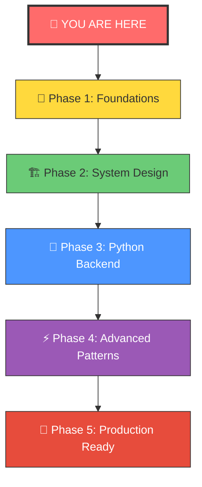

# 🚀 Your Journey to Becoming a Skilled Software Developer

> **How to use**: Each phase has its own folder with topic lessons inside. Follow the order below for the best learning experience.

---

## 🗺️ The Complete Learning Roadmap



---

## 📂 Folder Structure

```
Study/
├── 01-Foundations/
│   ├── 1.1-Data-Structures/
│   ├── 1.2-Algorithms-BigO/
│   ├── 1.3-How-Internet-Works/
│   ├── 1.4-Database-Fundamentals/
│   └── 1.5-Python-Deep-Dive/
├── 02-System-Design/
│   ├── 2.1-Scalability/
│   ├── 2.2-CAP-Theorem/
│   ├── 2.3-Load-Balancing/
│   ├── 2.4-Caching/
│   ├── 2.5-Database-Sharding-Replication/
│   ├── 2.6-Message-Queues-Event-Driven/
│   ├── 2.7-Microservices-vs-Monolith/
│   ├── 2.8-Design-URL-Shortener/
│   ├── 2.9-Design-Chat-System/
│   └── 2.10-Design-Rate-Limiter/
├── 03-Python-Backend/
│   ├── 3.1-FastAPI-First-API/
│   ├── 3.2-REST-API-Design/
│   ├── 3.3-SQLAlchemy-ORM/
│   ├── 3.4-Authentication-JWT-OAuth/
│   ├── 3.5-Async-Python/
│   ├── 3.6-Caching-Redis/
│   ├── 3.7-Background-Tasks-Celery/
│   ├── 3.8-Testing-Pytest/
│   ├── 3.9-Docker/
│   └── 3.10-Logging-Monitoring/
├── 04-Advanced-Patterns/
│   ├── 4.1-Design-Patterns-Python/
│   ├── 4.2-Clean-Architecture/
│   ├── 4.3-Domain-Driven-Design/
│   ├── 4.4-CQRS-Event-Sourcing/
│   └── 4.5-Distributed-Systems/
└── 05-Production-Ready/
    ├── 5.1-Production-Checklist/
    ├── 5.2-CICD-Pipeline/
    ├── 5.3-Security-Hardening/
    ├── 5.4-Performance-Optimization/
    └── 5.5-Kubernetes/
```

---

## 📈 Recommended Learning Order

```mermaid
graph LR
    A["1. Python Core<br/>⏱️ 2 weeks"] --> B["2. Networking<br/>& HTTP<br/>⏱️ 1 week"]
    B --> C["3. Databases<br/>⏱️ 2 weeks"]
    C --> D["4. FastAPI<br/>⏱️ 2 weeks"]
    D --> E["5. System Design<br/>Basics<br/>⏱️ 3 weeks"]
    E --> F["6. Advanced<br/>Backend<br/>⏱️ 3 weeks"]
    F --> G["7. Advanced<br/>System Design<br/>⏱️ 4 weeks"]
    G --> H["8. Production<br/>Skills<br/>⏱️ 3 weeks"]

    style A fill:#ff6b6b,stroke:#333,color:#fff
    style B fill:#ffa07a,stroke:#333,color:#fff
    style C fill:#ffd93d,stroke:#333,color:#333
    style D fill:#98d8c8,stroke:#333,color:#333
    style E fill:#6bcb77,stroke:#333,color:#fff
    style F fill:#4d96ff,stroke:#333,color:#fff
    style G fill:#9b59b6,stroke:#333,color:#fff
    style H fill:#e74c3c,stroke:#333,color:#fff
```



> **Total estimated time: ~20 weeks** (at ~2 hours/day)

---

## 🏆 Milestone Projects

| Phase | Project | Skills Practiced |
|-------|---------|-----------------|
| 🧱 Foundations | CLI Task Manager | Python OOP, File I/O, Data Structures |
| 🏗️ System Design | Design a URL Shortener (on paper) | Scalability, Databases, Caching |
| 🐍 Backend | REST API for a Blog Platform | FastAPI, SQLAlchemy, Auth, Testing |
| ⚡ Advanced | Real-time Chat Application | WebSockets, Redis, Message Queues |
| 🚀 Production | Deploy a Microservices App | Docker, CI/CD, Monitoring, K8s |

---

## ✅ Progress Tracker

### Phase 1: Foundations
- [x] 1.1 Data Structures & When to Use Them
- [x] 1.2 Algorithm Thinking & Big-O Notation
- [x] 1.3 How the Internet Actually Works
- [x] 1.4 Database Fundamentals
- [x] 1.5 Python Deep Dive

### Phase 2: System Design

**Stage 1 — Foundation**
- [x] 2.1 What Is System Design & Why It Matters
- [x] 2.2 Scalability — Vertical vs Horizontal
- [x] 2.3 CAP Theorem & Trade-offs
- [x] 2.4 Latency, Throughput & Estimation

**Stage 2 — Core Building Blocks**
- [x] 2.5 DNS & Content Delivery Networks (CDN)
- [x] 2.6 Load Balancers — Distributing Traffic
- [ ] 2.7 Caching — The Speed Layer
- [ ] 2.8 Databases Deep Dive — SQL & NoSQL
- [ ] 2.9 Database Replication
- [ ] 2.10 Database Sharding & Partitioning
- [ ] 2.11 Message Queues & Async Processing
- [ ] 2.12 API Design & Protocols

**Stage 3 — Advanced Patterns**
- [ ] 2.13 Microservices Architecture
- [ ] 2.14 Consistent Hashing Deep Dive
- [ ] 2.15 Distributed Systems Fundamentals
- [ ] 2.16 Observability & Reliability
- [ ] 2.17 Security & Authentication at Scale

**Stage 4 — Real-World Design Problems**
- [ ] 2.18 Design a URL Shortener (bit.ly)
- [ ] 2.19 Design a Chat System (WhatsApp)
- [ ] 2.20 Design a Rate Limiter

### Phase 3: Python Backend
- [ ] 3.1 – 3.10 (10 topics)

### Phase 4: Advanced Patterns
- [ ] 4.1 – 4.5 (5 topics)

### Phase 5: Production Ready
- [ ] 5.1 – 5.5 (5 topics)
